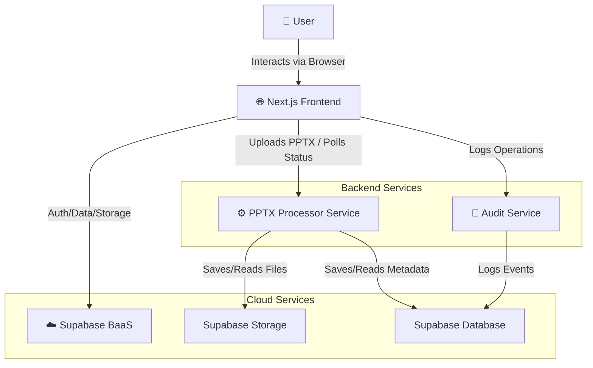

# PowerPoint Translator

A web application for translating PowerPoint presentations while preserving formatting and enabling collaboration.

## Overview

This application addresses the challenges of translating PowerPoint presentations by:

- **Preserving Visual Fidelity:** Converts slides to high-quality SVG images, ensuring that layouts, fonts, and visual elements are maintained. Text is overlaid for translation, minimizing disruption.
- **Streamlining Translation:** Offers a centralized platform for managing translation projects from upload to a visual editor.
- **Facilitating Collaboration:** Allows users to comment directly on text elements within the slide context (future feature).
- **Increasing Efficiency:** Reduces the manual effort involved in traditional translation methods.

## Docker Setup

This project is fully containerized for easy development and deployment. You can use Docker and Docker Compose to run all services together.

### Prerequisites

- [Docker](https://docs.docker.com/get-docker/)
- [Docker Compose](https://docs.docker.com/compose/install/)
- [Node.js](https://nodejs.org/) (for running helper scripts)
- [Bun](https://bun.sh/) (preferred package manager)

### Quick Start

1. Clone the repository:
   ```bash
   git clone <repository-url>
   cd pptxTransed
   ```

2. Set up environment variables:
   ```bash
   node scripts/utils/setup-env.js
   ```
   This will create a `.env` file in the project root. Edit this file to add your Supabase credentials.

3. Start all services:
   ```bash
   node scripts/docker-manager.js start
   ```

4. Access the application:
   - Frontend: http://localhost:3000
   - Audit Service: http://localhost:4006
   - PPTX Processor: http://localhost:8000
   - Share Service: http://localhost:3001

### Docker Manager Script

For convenience, we provide a Docker manager script that simplifies working with Docker:

**Unix/Linux/macOS:**
```bash
# Start all services
node scripts/docker-manager.js start

# Stop all services
node scripts/docker-manager.js stop

# Other commands: restart, rebuild, logs, ps, shell, env, help
```

**Windows:**
```cmd
# Start all services
scripts\docker-manager.bat start

# Stop all services
scripts\docker-manager.bat stop

# Other commands: restart, rebuild, logs, ps, shell, env, help
```

### Individual Service Scripts

You can also start each service individually using the scripts in the `scripts/services/` directory:

**Unix/Linux/macOS:**
```bash
# Start Audit Service
./scripts/services/audit/start.sh

# Start PPTX Processor
./scripts/services/pptx/start.sh

# Start Share Service
./scripts/services/share/start.sh
```

**Windows:**
```cmd
# Start Audit Service
.\scripts\services\audit\start.bat

# Start PPTX Processor
.\scripts\services\pptx\start.bat

# Start Share Service
.\scripts\services\share\start.bat
```

## Development Workflow

### With Docker (Recommended)

1. Start all services with Docker Compose
2. Make code changes in any service
3. Rebuild and restart the affected service:
   ```bash
   node scripts/docker-manager.js rebuild
   node scripts/docker-manager.js restart
   ```

### Without Docker

Each service can be started independently using the scripts in `scripts/services/`.

## Directory Structure

The project consists of the following components:

- `app/` - Next.js frontend application
- `services/` - Microservices
  - `audit-service/` - Go service for audit functionality
  - `pptx-processor/` - Python service for PPTX processing
  - `share-service/` - Bun service for sharing functionality
- `scripts/` - Utility scripts for development

## Repository Structure

```
pptxTransed/
├── app/                    # Next.js app directory (App Router)
├── components/            # Shared React components
├── lib/                   # Shared utilities and services
├── services/             # Microservices
│   ├── pptx-processor/   # PPTX processing service
│   └── audit-service/    # Audit logging service
├── types/                # TypeScript type definitions
├── docs/                 # Technical documentation
├── memory-bank/          # Project context and decisions
└── scripts/              # Utility scripts
```

## Key Features

- **User Authentication:** Secure login and signup using Supabase Auth.
- **Dashboard:** Manage translation sessions, view progress, and initiate new translations.
- **PPTX Upload & Configuration:** A multi-step wizard to:
  - Upload `.pptx` files.
  - Name translation sessions.
  - Select source and target languages.
- **Slide Editor:**
  - High-fidelity visual representation of slides (server-side SVG conversion).
  - Interactive text elements overlaid on slide images for easy translation.
  - Slide navigator with thumbnails.
  - Text editing interface (popup/inline) showing original and translated text.
- **Comments & Collaboration (Planned):** Attach comments to text elements, reply, and resolve.
- **Export (Planned):** Export the translated presentation, aiming to reconstruct a PPTX file with translated text.

## Architecture

The application follows a microservice-inspired architecture:



1. **Next.js Frontend:**
   - Handles all user interface interactions, client-side logic, and authentication.
   - Communicates with Supabase for data and auth.
   - Sends PPTX files to the Processor Service for conversion.

2. **PPTX Processor Service:**
   - A separate microservice dedicated to processing PowerPoint files.
   - Converts slides to SVG images.
   - Extracts text content and positional data.
   - Stores processed SVGs and data into Supabase.

3. **Audit Service:**
   - Provides audit logging and tracking for all operations.
   - Tracks user activity and system events.
   - Stores audit data in Supabase.

4. **Supabase:**
   - Acts as the central BaaS provider.
   - Manages user authentication.
   - Stores all application data.
   - Provides file storage for original PPTX files and generated SVG slide images.

## Technology Stack

- **Frontend:**
  - Next.js 14 (App Router)
  - TypeScript
  - React
  - Tailwind CSS
  - shadcn/ui
  - Zustand (State Management)

- **Backend-as-a-Service:**
  - Supabase (Auth, Database, Storage)

- **Microservices:**
  - PPTX Processor Service (Python FastAPI)
  - Audit Service (Go)

## Getting Started

### Prerequisites

- Node.js (version 18 or higher)
- npm/yarn/bun (this project uses `bun`)
- Python 3.10+ & `pip` (for PPTX Processor Service)
- Go 1.21+ (for Audit Service)
- LibreOffice (for PPTX Processor Service)
- A Supabase project

### Setup

1. Install dependencies:
   ```bash
   npm install
   ```

2. Set up environment variables:
   ```bash
   cp .env.example .env
   ```

3. Start the development server:
   ```bash
   npm run dev
   ```

4. Start required services:
   ```bash
   # Start PPTX processor
   ./scripts/services/pptx/start.sh

   # Start audit service
   ./scripts/services/audit/start.sh
   ```

### Supabase Setup

Refer to the service documentation for details on setting up the required Supabase resources:
- Database tables
- Storage buckets
- Authentication configuration
- Row Level Security (RLS) policies

## Environment Variables

| Variable | Description | Default |
|----------|-------------|---------|
| `NEXT_PUBLIC_SUPABASE_URL` | Your Supabase project URL | - |
| `NEXT_PUBLIC_SUPABASE_ANON_KEY` | Your Supabase anonymous key | - |
| `NEXT_PUBLIC_AUDIT_SERVICE_URL` | URL of the audit service | http://localhost:4006 |

## Development

- Frontend: Next.js 14 with App Router
- State Management: Zustand
- Styling: Tailwind CSS
- UI Components: shadcn/ui
- Backend: Supabase
- Services: Microservices (Python, Go)

## Documentation

- Technical docs: `docs/`
- Project context: `memory-bank/`
- Service docs: `services/*/README.md`
- Integration guides: 
  - [Frontend Service Integration Guide](docs/service-integration.md)
  - [PPTX Processor Service Integration Guide](services/pptx-processor/docs/integration-guide.md)
  - [Audit Service Integration Guide](services/audit-service/docs/integration-guide.md)

## Testing

Run tests using the provided scripts:
```bash
# Run PPTX integration tests
node scripts/tests/test-pptx-integration.js

# Run audit service tests
node scripts/tests/test-audit-service.js
```

## Contributing

1. Create a feature branch
2. Make your changes
3. Run tests
4. Submit a pull request

## License

[Your License Here]
