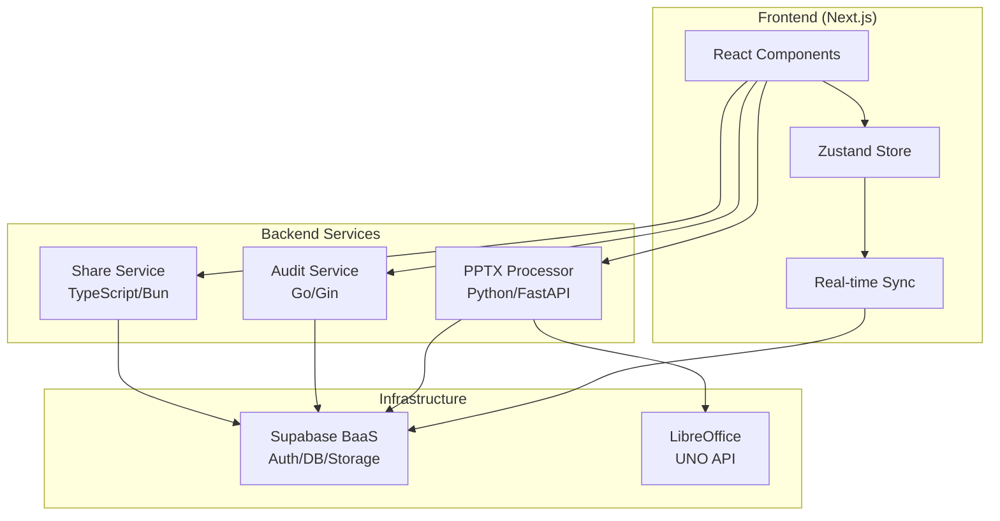

# PowerPoint Translator

A modern, production-ready web application for translating PowerPoint presentations while preserving formatting and enabling real-time collaboration.

## 🚀 Project Status

**Current Status**: Production-Ready MVP with Advanced Features
- ✅ **Complete Frontend**: Advanced Next.js application with Zustand state management
- ✅ **PPTX Processing**: Production-ready Python service with LibreOffice/UNO API integration
- ✅ **Audit Logging**: Go-based audit service with 88.2% test coverage
- ✅ **Share Service**: TypeScript/Bun.js sharing functionality (testing phase)
- ✅ **Export Functionality**: Full PPTX export with translated content
- ✅ **Comprehensive Documentation**: Organized knowledge base with role-based navigation
- ✅ **Docker Deployment**: Production-ready containerized architecture

## Overview

This application addresses the challenges of translating PowerPoint presentations by:

- **Preserving Visual Fidelity:** Converts slides to high-quality SVG images using LibreOffice/UNO API, ensuring layouts, fonts, and visual elements are maintained
- **Advanced State Management:** Comprehensive Zustand store with real-time synchronization, offline queue, and selective subscriptions
- **Streamlining Translation:** Centralized platform with visual editor, drag-and-drop reordering, and collaborative features
- **Export Capabilities:** Complete PPTX export functionality with background job processing and secure downloads
- **Professional Documentation:** Organized knowledge base with quick start guides, API documentation, and deployment instructions
- **Production Architecture:** Microservices with Docker containerization, comprehensive testing, and monitoring

## 🎯 Key Features

### ✅ Completed Features

- **🔐 User Authentication:** Secure login/signup with Supabase Auth and JWT validation
- **📊 Advanced Dashboard:** Session management with filtering, sorting, and drag-and-drop reordering
- **📤 PPTX Upload & Processing:** Multi-step wizard with real-time progress tracking
- **🎨 Visual Slide Editor:**
  - High-fidelity SVG rendering with interactive text overlays
  - Real-time collaborative editing with optimistic updates
  - Comprehensive audit logging and session status management
  - Advanced text editing with translation workflow
- **📋 State Management:** Zustand with persistence, migration system, and offline capabilities
- **💬 Comments System:** Slide and shape-level commenting with notifications (ready for implementation)
- **🔗 Session Sharing:** Secure token-based sharing with configurable permissions
- **📤 PPTX Export:** Complete export functionality with background processing and secure downloads
- **📚 Comprehensive Documentation:** Organized knowledge base with role-based navigation

### 🔄 Advanced Technical Features

- **Real-time Synchronization:** Supabase real-time with selective subscriptions for performance
- **Offline Queue:** Automatic operation queueing during network outages with retry logic
- **Schema Migrations:** Store evolution system for seamless updates
- **Comprehensive Error Handling:** Standardized error states with user-friendly recovery
- **Production Monitoring:** Health checks, structured logging, and audit trails

## 🚀 Quick Start

### Prerequisites

- [Docker](https://docs.docker.com/get-docker/) & [Docker Compose](https://docs.docker.com/compose/install/)
- [Node.js 18+](https://nodejs.org/) & [Bun](https://bun.sh/) (recommended)

### 5-Minute Setup

1. **Clone and setup:**
   ```bash
   git clone <repository-url>
   cd pptxTransed
   node scripts/utils/setup-env.js
   ```

2. **Configure environment:**
   Edit `.env` with your Supabase credentials

3. **Start all services:**
   ```bash
   node scripts/docker-manager.js start
   ```

4. **Access the application:**
   - **Frontend**: http://localhost:3000
   - **API Documentation**: http://localhost:8000/docs (PPTX Processor)
   - **Audit Service**: http://localhost:4006/docs

For detailed setup instructions, see our [📚 Documentation](./docs/README.md).

## 🏗️ Architecture



### Service Overview

| Service | Technology | Status | Purpose |
|---------|------------|--------|---------|
| **Frontend** | Next.js 14, TypeScript, Zustand | ✅ Production | User interface and state management |
| **PPTX Processor** | Python, FastAPI, LibreOffice | ✅ Production | Slide processing and export |
| **Audit Service** | Go, Gin, 88.2% coverage | ✅ Production | Activity logging and monitoring |
| **Share Service** | TypeScript, Bun.js, Hono | 🧪 Testing | Session sharing and collaboration |

## 📚 Documentation

Our comprehensive documentation is organized for different user types:

### 🔗 Quick Navigation

| **For Developers** | **For DevOps** | **For API Users** |
|-------------------|----------------|-------------------|
| [Quick Start Guide](./docs/setup/quick-start.md) | [Docker Setup](./DOCKER_SETUP.md) | [API Overview](./docs/api/overview.md) |
| [Development Setup](./docs/setup/development.md) | [Production Deploy](./docs/deployment/production.md) | [Service APIs](./docs/api/) |
| [Testing Guide](./docs/testing/testing-guide.md) | [Monitoring Setup](./docs/deployment/monitoring.md) | [Authentication](./docs/architecture/security.md) |

### 📋 Documentation Structure

```
docs/
├── setup/           # Setup and configuration guides
├── integration/     # Service integration patterns
├── testing/         # Testing strategies and examples
├── api/            # Complete API documentation
├── architecture/   # System design and patterns
└── deployment/     # Production deployment guides
```

See the complete [📚 Documentation Index](./docs/README.md) for detailed navigation.

## 🧪 Development

### 🐳 Docker Development (Recommended)

```bash
# Start all services
node scripts/docker-manager.js start

# View logs
node scripts/docker-manager.js logs

# Rebuild after changes
node scripts/docker-manager.js rebuild
```

### 🔧 Local Development

Each service can run independently. See [Development Environment](./docs/setup/development.md) for detailed setup.

### 🧪 Testing

Comprehensive testing with high coverage:

```bash
# Run all tests
bun test

# Service-specific testing
cd services/audit-service && go test ./... -v
cd services/pptx-processor && python -m pytest
```

See our [Testing Guide](./docs/testing/testing-guide.md) for complete testing strategies.

## 🚀 Deployment

### 🐳 Production Docker

```bash
# Production deployment
docker-compose -f docker-compose.prod.yml up -d

# Environment management
node scripts/docker-manager.js env production
```

See [Production Deployment Guide](./docs/deployment/production.md) for complete instructions.

## 📊 Project Statistics

- **Frontend**: Next.js 14 with TypeScript, 60+ components
- **Backend**: 3 microservices, 15+ API endpoints
- **Testing**: 88.2% coverage (Audit Service), comprehensive test suites
- **Documentation**: 20+ guides, complete API documentation
- **Architecture**: Production-ready with monitoring and logging

## 🤝 Contributing

1. **Setup**: Follow [Development Environment](./docs/setup/development.md)
2. **Testing**: Ensure tests pass with `bun test`
3. **Documentation**: Update relevant docs with changes
4. **Code Style**: Follow established patterns in `.cursorrules`

See our [Testing Guide](./docs/testing/testing-guide.md) for contribution workflows.

## 📞 Support & Resources

- **📚 Complete Documentation**: [./docs/README.md](./docs/README.md)
- **🚀 Quick Start**: [5-minute setup guide](./docs/setup/quick-start.md)
- **🔧 Development**: [Local development setup](./docs/setup/development.md)
- **🐛 Issues**: Use GitHub issues for bug reports
- **💬 Discussions**: Project discussion forum

## 🏷️ Technology Stack

### Frontend
- **Framework**: Next.js 14 (App Router), React, TypeScript
- **Styling**: Tailwind CSS, shadcn/ui components
- **State**: Zustand with persistence, migrations, real-time sync
- **Auth**: Supabase Auth with JWT

### Backend
- **PPTX Processing**: Python, FastAPI, LibreOffice/UNO API
- **Audit Logging**: Go, Gin, structured logging
- **Session Sharing**: TypeScript, Bun.js, Hono.js
- **Database**: Supabase (PostgreSQL), real-time subscriptions

### Infrastructure
- **Deployment**: Docker, Docker Compose
- **Monitoring**: Health checks, structured logging
- **Testing**: Jest, Go testing, Python pytest
- **Documentation**: Organized knowledge base

---

**Status**: Production-Ready MVP  
**Version**: 1.0.0  
**Last Updated**: Current  
**Maintainer**: Development Team
