# PowerPoint Translator

A web application for translating PowerPoint presentations while preserving formatting and enabling collaboration.

## Overview

This application addresses the challenges of translating PowerPoint presentations by:

- **Preserving Visual Fidelity:** Converts slides to high-quality SVG images, ensuring that layouts, fonts, and visual elements are maintained. Text is overlaid for translation, minimizing disruption.
- **Streamlining Translation:** Offers a centralized platform for managing translation projects from upload to a visual editor.
- **Facilitating Collaboration:** Allows users to comment directly on text elements within the slide context (future feature).
- **Increasing Efficiency:** Reduces the manual effort involved in traditional translation methods.

## Repository Structure

```
pptxTransed/
├── app/                    # Next.js app directory (App Router)
├── components/            # Shared React components
├── lib/                   # Shared utilities and services
├── services/             # Microservices
│   ├── pptx-processor/   # PPTX processing service
│   └── audit-service/    # Audit logging service
├── types/                # TypeScript type definitions
├── docs/                 # Technical documentation
├── memory-bank/          # Project context and decisions
└── scripts/              # Utility scripts
```

## Key Features

- **User Authentication:** Secure login and signup using Supabase Auth.
- **Dashboard:** Manage translation sessions, view progress, and initiate new translations.
- **PPTX Upload & Configuration:** A multi-step wizard to:
  - Upload `.pptx` files.
  - Name translation sessions.
  - Select source and target languages.
- **Slide Editor:**
  - High-fidelity visual representation of slides (server-side SVG conversion).
  - Interactive text elements overlaid on slide images for easy translation.
  - Slide navigator with thumbnails.
  - Text editing interface (popup/inline) showing original and translated text.
- **Comments & Collaboration (Planned):** Attach comments to text elements, reply, and resolve.
- **Export (Planned):** Export the translated presentation, aiming to reconstruct a PPTX file with translated text.

## Architecture

The application follows a microservice-inspired architecture:

```mermaid
graph TD
    User[👤 User] -- Interacts via Browser --> Frontend[🌐 Next.js Frontend]

    Frontend -- Auth/Data/Storage --> Supabase[☁️ Supabase BaaS]
    Frontend -- Uploads PPTX / Polls Status --> ProcessorService[⚙️ PPTX Processor Service]
    Frontend -- Logs Operations --> AuditService[📝 Audit Service]

    ProcessorService -- Saves/Reads Files --> SupabaseStorage[Supabase Storage]
    ProcessorService -- Saves/Reads Metadata --> SupabaseDB[Supabase Database]
    
    AuditService -- Logs Events --> SupabaseDB

    subgraph "Cloud Services"
        Supabase
        SupabaseStorage
        SupabaseDB
    end

    subgraph "Backend Services"
        ProcessorService
        AuditService
    end
```



1. **Next.js Frontend:**
   - Handles all user interface interactions, client-side logic, and authentication.
   - Communicates with Supabase for data and auth.
   - Sends PPTX files to the Processor Service for conversion.

2. **PPTX Processor Service:**
   - A separate microservice dedicated to processing PowerPoint files.
   - Converts slides to SVG images.
   - Extracts text content and positional data.
   - Stores processed SVGs and data into Supabase.

3. **Audit Service:**
   - Provides audit logging and tracking for all operations.
   - Tracks user activity and system events.
   - Stores audit data in Supabase.

4. **Supabase:**
   - Acts as the central BaaS provider.
   - Manages user authentication.
   - Stores all application data.
   - Provides file storage for original PPTX files and generated SVG slide images.

## Technology Stack

- **Frontend:**
  - Next.js 14 (App Router)
  - TypeScript
  - React
  - Tailwind CSS
  - shadcn/ui
  - Zustand (State Management)

- **Backend-as-a-Service:**
  - Supabase (Auth, Database, Storage)

- **Microservices:**
  - PPTX Processor Service (Python FastAPI)
  - Audit Service (Go)

## Getting Started

### Prerequisites

- Node.js (version 18 or higher)
- npm/yarn/bun (this project uses `bun`)
- Python 3.10+ & `pip` (for PPTX Processor Service)
- Go 1.21+ (for Audit Service)
- LibreOffice (for PPTX Processor Service)
- A Supabase project

### Setup

1. Install dependencies:
   ```bash
   npm install
   ```

2. Set up environment variables:
   ```bash
   cp .env.example .env
   ```

3. Start the development server:
   ```bash
   npm run dev
   ```

4. Start required services:
   ```bash
   # Start PPTX processor
   ./scripts/services/pptx/start.sh

   # Start audit service
   ./scripts/services/audit/start.sh
   ```

### Supabase Setup

Refer to the service documentation for details on setting up the required Supabase resources:
- Database tables
- Storage buckets
- Authentication configuration
- Row Level Security (RLS) policies

## Environment Variables

| Variable | Description | Default |
|----------|-------------|---------|
| `NEXT_PUBLIC_SUPABASE_URL` | Your Supabase project URL | - |
| `NEXT_PUBLIC_SUPABASE_ANON_KEY` | Your Supabase anonymous key | - |
| `NEXT_PUBLIC_AUDIT_SERVICE_URL` | URL of the audit service | http://localhost:4006 |

## Development

- Frontend: Next.js 14 with App Router
- State Management: Zustand
- Styling: Tailwind CSS
- UI Components: shadcn/ui
- Backend: Supabase
- Services: Microservices (Python, Go)

## Documentation

- Technical docs: `docs/`
- Project context: `memory-bank/`
- Service docs: `services/*/README.md`
- Integration guides: 
  - [Frontend Service Integration Guide](docs/service-integration.md)
  - [PPTX Processor Service Integration Guide](services/pptx-processor/docs/integration-guide.md)
  - [Audit Service Integration Guide](services/audit-service/docs/integration-guide.md)

## Testing

Run tests using the provided scripts:
```bash
# Run PPTX integration tests
node scripts/tests/test-pptx-integration.js

# Run audit service tests
node scripts/tests/test-audit-service.js
```

## Contributing

1. Create a feature branch
2. Make your changes
3. Run tests
4. Submit a pull request

## License

[Your License Here]
