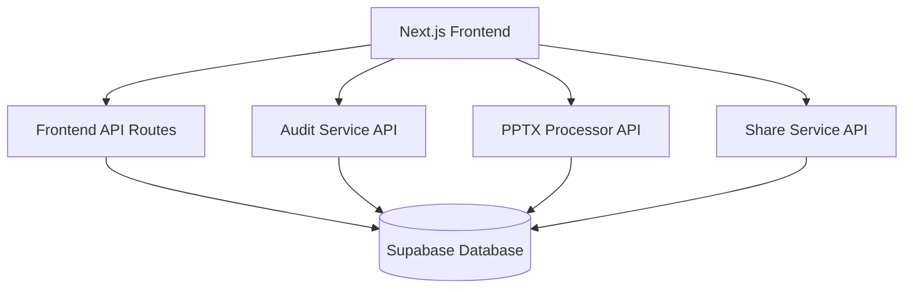

# API Overview

Complete API documentation for the PowerPoint Translator App microservices architecture.

## Service Architecture

The application consists of multiple services, each with their own API:



## Service Endpoints

### Frontend API Routes (Next.js)
**Base URL**: `http://localhost:3000/api`

| Endpoint | Method | Description |
|----------|--------|-------------|
| `/api/auth/*` | Various | Authentication routes |
| `/api/sessions` | GET, POST | Session management |
| `/api/sessions/[id]` | GET, PUT, DELETE | Individual session operations |
| `/api/process-pptx` | POST | Initiate PPTX processing |
| `/api/health` | GET | Health check |

### PPTX Processor Service
**Base URL**: `http://localhost:8000`

| Endpoint | Method | Description |
|----------|--------|-------------|
| `/v1/process` | POST | Upload and process PPTX file |
| `/v1/status/{jobId}` | GET | Check processing status |
| `/v1/results/{sessionId}` | GET | Get processing results |
| `/v1/retry/{jobId}` | POST | Retry failed processing |
| `/v1/export/{sessionId}` | POST | Export translated PPTX |
| `/v1/health` | GET | Health check |

### Audit Service
**Base URL**: `http://localhost:4006`

| Endpoint | Method | Description |
|----------|--------|-------------|
| `/api/v1/events` | POST | Create audit event |
| `/api/v1/events/{sessionId}` | GET | Get session events |
| `/api/v1/events/{sessionId}/summary` | GET | Get event summary |
| `/health` | GET | Health check |

### Share Service
**Base URL**: `http://localhost:3001`

| Endpoint | Method | Description |
|----------|--------|-------------|
| `/api/shares` | POST | Create session share |
| `/api/shares/{token}` | GET | Get share details |
| `/api/shares/{token}/access` | POST | Access shared session |
| `/health` | GET | Health check |

## Authentication

### JWT Token Format

All authenticated requests require a JWT token in the Authorization header:

```
Authorization: Bearer <jwt-token>
```

### Token Structure

```json
{
  "sub": "user-uuid",
  "email": "user@example.com",
  "role": "authenticated",
  "iat": 1640995200,
  "exp": 1641081600
}
```

## Common Response Formats

### Success Response

```json
{
  "success": true,
  "data": {
    // Response data
  },
  "message": "Operation completed successfully"
}
```

### Error Response

```json
{
  "success": false,
  "error": {
    "code": "ERROR_CODE",
    "message": "Human readable error message",
    "details": {
      // Additional error context
    }
  }
}
```

### Pagination Response

```json
{
  "success": true,
  "data": [
    // Array of items
  ],
  "pagination": {
    "page": 1,
    "limit": 20,
    "total": 100,
    "totalPages": 5,
    "hasNext": true,
    "hasPrev": false
  }
}
```

## Status Codes

| Code | Description | Usage |
|------|-------------|-------|
| 200 | OK | Successful GET, PUT requests |
| 201 | Created | Successful POST requests |
| 204 | No Content | Successful DELETE requests |
| 400 | Bad Request | Invalid request data |
| 401 | Unauthorized | Missing or invalid authentication |
| 403 | Forbidden | Insufficient permissions |
| 404 | Not Found | Resource not found |
| 409 | Conflict | Resource already exists |
| 422 | Unprocessable Entity | Validation errors |
| 500 | Internal Server Error | Server-side errors |

## Rate Limiting

### Default Limits

- **Frontend API**: 100 requests per minute per IP
- **PPTX Processor**: 10 file uploads per hour per user
- **Audit Service**: 1000 events per minute per session
- **Share Service**: 50 requests per minute per user

### Rate Limit Headers

```
X-RateLimit-Limit: 100
X-RateLimit-Remaining: 95
X-RateLimit-Reset: 1640995200
```

## CORS Configuration

### Allowed Origins

- Development: `http://localhost:3000`
- Production: Your domain(s)

### Allowed Methods

- GET, POST, PUT, DELETE, OPTIONS

### Allowed Headers

- Authorization, Content-Type, X-Requested-With

## WebSocket Connections

### Real-time Updates

Some services support WebSocket connections for real-time updates:

```javascript
// Connect to audit service for real-time events
const ws = new WebSocket('ws://localhost:4006/ws/events/session-id');

ws.onmessage = (event) => {
  const auditEvent = JSON.parse(event.data);
  // Handle real-time audit event
};
```

## API Versioning

### Version Strategy

- **URL Versioning**: `/v1/`, `/v2/`, etc.
- **Header Versioning**: `API-Version: v1`

### Backward Compatibility

- v1 APIs maintained for 12 months after v2 release
- Deprecation warnings in response headers
- Migration guides provided for breaking changes

## Error Handling

### Common Error Codes

| Code | Description | Resolution |
|------|-------------|------------|
| `INVALID_FILE_TYPE` | Unsupported file format | Upload PPTX files only |
| `FILE_TOO_LARGE` | File exceeds size limit | Reduce file size |
| `SESSION_NOT_FOUND` | Session doesn't exist | Verify session ID |
| `PROCESSING_FAILED` | PPTX processing error | Check file integrity |
| `INSUFFICIENT_PERMISSIONS` | Access denied | Check user permissions |

### Retry Logic

Implement exponential backoff for retryable errors:

```javascript
async function apiCallWithRetry(apiCall, maxRetries = 3) {
  for (let i = 0; i < maxRetries; i++) {
    try {
      return await apiCall();
    } catch (error) {
      if (error.status >= 500 && i < maxRetries - 1) {
        await new Promise(resolve => setTimeout(resolve, Math.pow(2, i) * 1000));
        continue;
      }
      throw error;
    }
  }
}
```

## Testing APIs

### Health Checks

```bash
# Check all services
curl http://localhost:3000/api/health
curl http://localhost:8000/v1/health
curl http://localhost:4006/health
curl http://localhost:3001/health
```

### Authentication Testing

```bash
# Get JWT token (example)
curl -X POST http://localhost:3000/api/auth/login \
  -H "Content-Type: application/json" \
  -d '{"email": "test@example.com", "password": "password"}'

# Use token in requests
curl -H "Authorization: Bearer <token>" \
  http://localhost:3000/api/sessions
```

## Service-Specific Documentation

For detailed API documentation for each service:

- [Frontend APIs](./frontend.md) - Next.js API routes
- [PPTX Processor API](./pptx-processor.md) - File processing endpoints
- [Audit Service API](./audit-service.md) - Audit logging endpoints
- [Share Service API](./share-service.md) - Sharing and collaboration endpoints

## Development Tools

### API Testing Tools

- **Postman**: Collection available in `/docs/postman/`
- **Insomnia**: Workspace file in `/docs/insomnia/`
- **curl**: Examples throughout documentation
- **HTTPie**: Alternative to curl with better syntax

### API Documentation Tools

- **OpenAPI/Swagger**: Available at `/docs/openapi.yaml`
- **Redoc**: Interactive docs at `http://localhost:8000/docs`
- **Postman Docs**: Auto-generated from collections

## Monitoring and Observability

### Metrics

- Request count and duration
- Error rates by endpoint
- Authentication success/failure rates
- File processing metrics

### Logging

- Structured JSON logs
- Request/response correlation IDs
- Error stack traces
- Performance metrics

### Health Monitoring

- Service health endpoints
- Database connectivity checks
- External service dependencies
- Resource utilization metrics 