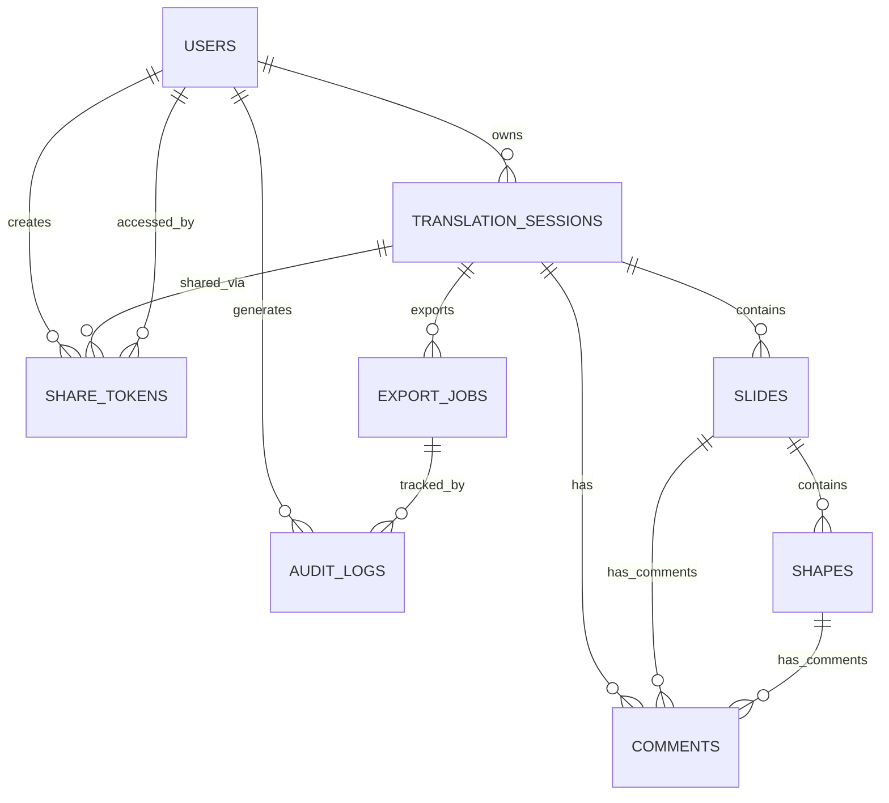

# Database Schema & Data Architecture

This document provides a comprehensive overview of the database schema, data models, and data architecture patterns used in the PowerPoint Translator App.

## 🗄️ Database Overview

The application uses **PostgreSQL** as the primary database, hosted and managed by **Supabase**. This provides:

- **Reliability**: ACID compliance and data consistency
- **Scalability**: Horizontal read scaling and connection pooling
- **Real-time**: Built-in real-time subscriptions
- **Security**: Row Level Security (RLS) and encryption
- **Backup**: Automated backups and point-in-time recovery

## 📊 Schema Overview



## 🏗️ Core Entities

### Users Table
**Purpose**: User authentication and profile management (managed by Supabase Auth)

```sql
-- This table is managed by Supabase Auth
-- Extended with custom profile data
CREATE TABLE user_profiles (
    id UUID REFERENCES auth.users(id) PRIMARY KEY,
    email TEXT NOT NULL,
    full_name TEXT,
    avatar_url TEXT,
    preferences JSONB DEFAULT '{}',
    created_at TIMESTAMPTZ DEFAULT NOW(),
    updated_at TIMESTAMPTZ DEFAULT NOW()
);
```

**Key Features**:
- UUID primary key for security
- JSONB preferences for flexible user settings
- Automatic timestamps
- RLS enabled for data isolation

### Translation Sessions Table
**Purpose**: Core entity representing a PowerPoint translation project

```sql
CREATE TABLE translation_sessions (
    id UUID DEFAULT gen_random_uuid() PRIMARY KEY,
    user_id UUID REFERENCES user_profiles(id) NOT NULL,
    title TEXT NOT NULL,
    description TEXT,
    original_filename TEXT NOT NULL,
    file_url TEXT, -- Supabase Storage URL
    status translation_session_status DEFAULT 'uploading',
    slide_count INTEGER DEFAULT 0,
    created_at TIMESTAMPTZ DEFAULT NOW(),
    updated_at TIMESTAMPTZ DEFAULT NOW(),
    completed_at TIMESTAMPTZ,
    metadata JSONB DEFAULT '{}'
);

-- Enum for session status
CREATE TYPE translation_session_status AS ENUM (
    'uploading',
    'processing',
    'ready',
    'completed',
    'error',
    'archived'
);
```

**Key Features**:
- Status tracking for processing workflow
- Metadata JSONB for flexible session data
- File URL pointing to Supabase Storage
- Audit trail with timestamps

### Slides Table
**Purpose**: Individual slides within a translation session

```sql
CREATE TABLE slides (
    id UUID DEFAULT gen_random_uuid() PRIMARY KEY,
    session_id UUID REFERENCES translation_sessions(id) ON DELETE CASCADE,
    slide_number INTEGER NOT NULL,
    title TEXT,
    svg_content TEXT, -- SVG representation
    svg_url TEXT, -- Supabase Storage URL for SVG
    thumbnail_url TEXT,
    slide_order INTEGER NOT NULL,
    metadata JSONB DEFAULT '{}',
    created_at TIMESTAMPTZ DEFAULT NOW(),
    updated_at TIMESTAMPTZ DEFAULT NOW(),
    
    UNIQUE(session_id, slide_number),
    UNIQUE(session_id, slide_order)
);
```

**Key Features**:
- SVG content for high-fidelity rendering
- Flexible ordering with slide_order
- Cascading deletes for data consistency
- Metadata for additional slide properties

### Shapes Table
**Purpose**: Text shapes and elements within slides

```sql
CREATE TABLE shapes (
    id UUID DEFAULT gen_random_uuid() PRIMARY KEY,
    slide_id UUID REFERENCES slides(id) ON DELETE CASCADE,
    shape_type shape_type_enum DEFAULT 'text',
    original_text TEXT,
    translated_text TEXT,
    position_data JSONB NOT NULL, -- x, y, width, height, rotation
    style_data JSONB DEFAULT '{}', -- font, color, size, etc.
    translation_status translation_status_enum DEFAULT 'pending',
    created_at TIMESTAMPTZ DEFAULT NOW(),
    updated_at TIMESTAMPTZ DEFAULT NOW()
);

-- Shape type enumeration
CREATE TYPE shape_type_enum AS ENUM (
    'text',
    'title',
    'subtitle',
    'bullet_point',
    'table_cell',
    'chart_label'
);

-- Translation status enumeration
CREATE TYPE translation_status_enum AS ENUM (
    'pending',
    'in_progress',
    'completed',
    'reviewed',
    'approved'
);
```

**Key Features**:
- Coordinate-based positioning data
- Flexible styling with JSONB
- Translation workflow status
- Type classification for different text elements

### Comments Table
**Purpose**: Collaborative commenting system

```sql
CREATE TABLE comments (
    id UUID DEFAULT gen_random_uuid() PRIMARY KEY,
    user_id UUID REFERENCES user_profiles(id) NOT NULL,
    session_id UUID REFERENCES translation_sessions(id) ON DELETE CASCADE,
    slide_id UUID REFERENCES slides(id) ON DELETE CASCADE NULL,
    shape_id UUID REFERENCES shapes(id) ON DELETE CASCADE NULL,
    content TEXT NOT NULL,
    comment_type comment_type_enum DEFAULT 'general',
    status comment_status_enum DEFAULT 'open',
    parent_id UUID REFERENCES comments(id) NULL, -- For threaded comments
    created_at TIMESTAMPTZ DEFAULT NOW(),
    updated_at TIMESTAMPTZ DEFAULT NOW(),
    resolved_at TIMESTAMPTZ,
    resolved_by UUID REFERENCES user_profiles(id) NULL
);

-- Comment type enumeration
CREATE TYPE comment_type_enum AS ENUM (
    'general',
    'translation_suggestion',
    'formatting_issue',
    'approval_request',
    'revision_needed'
);

-- Comment status enumeration
CREATE TYPE comment_status_enum AS ENUM (
    'open',
    'resolved',
    'archived'
);
```

**Key Features**:
- Hierarchical comments with parent_id
- Multiple comment types for different workflows
- Resolution tracking with timestamps
- Flexible targeting (session, slide, or shape level)

### Share Tokens Table
**Purpose**: Secure session sharing mechanism

```sql
CREATE TABLE share_tokens (
    id UUID DEFAULT gen_random_uuid() PRIMARY KEY,
    session_id UUID REFERENCES translation_sessions(id) ON DELETE CASCADE,
    created_by UUID REFERENCES user_profiles(id) NOT NULL,
    token_hash TEXT NOT NULL UNIQUE, -- Hashed sharing token
    permissions JSONB NOT NULL DEFAULT '{"read": true, "comment": false, "edit": false}',
    expires_at TIMESTAMPTZ,
    access_count INTEGER DEFAULT 0,
    last_accessed_at TIMESTAMPTZ,
    last_accessed_by INET,
    is_active BOOLEAN DEFAULT true,
    created_at TIMESTAMPTZ DEFAULT NOW()
);
```

**Key Features**:
- Hashed tokens for security
- Granular permissions with JSONB
- Access tracking and analytics
- Expiration and deactivation controls

### Export Jobs Table
**Purpose**: Background job processing for PPTX exports

```sql
CREATE TABLE export_jobs (
    id UUID DEFAULT gen_random_uuid() PRIMARY KEY,
    session_id UUID REFERENCES translation_sessions(id) ON DELETE CASCADE,
    user_id UUID REFERENCES user_profiles(id) NOT NULL,
    job_type export_job_type DEFAULT 'pptx_export',
    status job_status DEFAULT 'pending',
    parameters JSONB DEFAULT '{}',
    result_data JSONB,
    download_url TEXT,
    download_expires_at TIMESTAMPTZ,
    error_message TEXT,
    started_at TIMESTAMPTZ,
    completed_at TIMESTAMPTZ,
    created_at TIMESTAMPTZ DEFAULT NOW()
);

-- Export job type enumeration
CREATE TYPE export_job_type AS ENUM (
    'pptx_export',
    'pdf_export',
    'images_export'
);

-- Job status enumeration
CREATE TYPE job_status AS ENUM (
    'pending',
    'running',
    'completed',
    'failed',
    'cancelled'
);
```

**Key Features**:
- Async job processing workflow
- Secure download URLs with expiration
- Error tracking and debugging
- Extensible job types

### Audit Logs Table
**Purpose**: Comprehensive activity tracking and compliance

```sql
CREATE TABLE audit_logs (
    id UUID DEFAULT gen_random_uuid() PRIMARY KEY,
    user_id UUID REFERENCES user_profiles(id),
    session_id UUID REFERENCES translation_sessions(id),
    action audit_action_enum NOT NULL,
    resource_type TEXT,
    resource_id UUID,
    old_values JSONB,
    new_values JSONB,
    metadata JSONB DEFAULT '{}',
    ip_address INET,
    user_agent TEXT,
    created_at TIMESTAMPTZ DEFAULT NOW()
);

-- Audit action enumeration
CREATE TYPE audit_action_enum AS ENUM (
    'create',
    'read',
    'update',
    'delete',
    'login',
    'logout',
    'share',
    'export',
    'comment'
);
```

**Key Features**:
- Complete audit trail for compliance
- Before/after value tracking
- User context and session tracking
- Flexible metadata for custom data

## 🔐 Security & Access Control

### Row Level Security (RLS)

All tables implement RLS policies to ensure data isolation:

```sql
-- Enable RLS on all tables
ALTER TABLE translation_sessions ENABLE ROW LEVEL SECURITY;
ALTER TABLE slides ENABLE ROW LEVEL SECURITY;
ALTER TABLE shapes ENABLE ROW LEVEL SECURITY;
ALTER TABLE comments ENABLE ROW LEVEL SECURITY;
ALTER TABLE share_tokens ENABLE ROW LEVEL SECURITY;
ALTER TABLE export_jobs ENABLE ROW LEVEL SECURITY;
ALTER TABLE audit_logs ENABLE ROW LEVEL SECURITY;

-- Example policy for translation_sessions
CREATE POLICY "Users can access their own sessions" ON translation_sessions
    FOR ALL USING (auth.uid() = user_id);

-- Example policy for shared sessions
CREATE POLICY "Users can access shared sessions" ON translation_sessions
    FOR SELECT USING (
        id IN (
            SELECT session_id FROM share_tokens 
            WHERE is_active = true 
            AND (expires_at IS NULL OR expires_at > NOW())
        )
    );
```

### Data Encryption

- **At Rest**: Supabase provides transparent encryption
- **In Transit**: All connections use TLS 1.2+
- **Application Level**: Sensitive data hashed before storage

## 📈 Performance Optimization

### Indexing Strategy

```sql
-- Primary performance indexes
CREATE INDEX idx_translation_sessions_user_id ON translation_sessions(user_id);
CREATE INDEX idx_translation_sessions_status ON translation_sessions(status);
CREATE INDEX idx_slides_session_id ON slides(session_id);
CREATE INDEX idx_slides_order ON slides(session_id, slide_order);
CREATE INDEX idx_shapes_slide_id ON shapes(slide_id);
CREATE INDEX idx_shapes_translation_status ON shapes(translation_status);
CREATE INDEX idx_comments_session_id ON comments(session_id);
CREATE INDEX idx_comments_slide_id ON comments(slide_id);
CREATE INDEX idx_share_tokens_token_hash ON share_tokens(token_hash);
CREATE INDEX idx_export_jobs_user_id ON export_jobs(user_id);
CREATE INDEX idx_export_jobs_status ON export_jobs(status);
CREATE INDEX idx_audit_logs_user_id ON audit_logs(user_id);
CREATE INDEX idx_audit_logs_session_id ON audit_logs(session_id);
CREATE INDEX idx_audit_logs_created_at ON audit_logs(created_at);

-- Composite indexes for common queries
CREATE INDEX idx_slides_session_status ON slides(session_id, slide_order);
CREATE INDEX idx_shapes_slide_translation ON shapes(slide_id, translation_status);
CREATE INDEX idx_comments_target ON comments(session_id, slide_id, shape_id);
```

### Query Optimization

- **Prepared Statements**: All queries use prepared statements
- **Connection Pooling**: Supabase manages connection pooling
- **Query Caching**: Application-level caching for frequently accessed data
- **Pagination**: Cursor-based pagination for large result sets

## 🔄 Data Consistency & Transactions

### ACID Compliance

- **Atomicity**: Operations complete fully or not at all
- **Consistency**: Database constraints maintain data integrity
- **Isolation**: Concurrent operations don't interfere
- **Durability**: Committed data persists through system failures

### Transaction Patterns

```sql
-- Example: Creating a new translation session
BEGIN;
    INSERT INTO translation_sessions (...) VALUES (...);
    INSERT INTO audit_logs (action, resource_type, ...) VALUES ('create', 'translation_session', ...);
COMMIT;

-- Example: Updating slide order
BEGIN;
    UPDATE slides SET slide_order = new_order WHERE id = slide_id;
    INSERT INTO audit_logs (action, old_values, new_values, ...) VALUES (...);
COMMIT;
```

## 📊 Data Migration & Versioning

### Schema Migrations

```sql
-- Migration tracking table
CREATE TABLE schema_migrations (
    version INTEGER PRIMARY KEY,
    applied_at TIMESTAMPTZ DEFAULT NOW(),
    checksum TEXT NOT NULL
);

-- Example migration: Adding new column
-- Migration 001_add_metadata_to_sessions.sql
ALTER TABLE translation_sessions ADD COLUMN metadata JSONB DEFAULT '{}';
INSERT INTO schema_migrations (version, checksum) VALUES (1, 'checksum_here');
```

### Data Versioning

- **Soft Deletes**: Important entities use `deleted_at` instead of hard deletes
- **Audit Trail**: Complete change history in audit_logs
- **Backup Strategy**: Daily automated backups with 30-day retention

## 🔍 Monitoring & Analytics

### Database Metrics

```sql
-- Performance monitoring views
CREATE VIEW session_stats AS
SELECT 
    DATE_TRUNC('day', created_at) as date,
    COUNT(*) as sessions_created,
    AVG(slide_count) as avg_slides
FROM translation_sessions
GROUP BY DATE_TRUNC('day', created_at);

CREATE VIEW user_activity AS
SELECT
    user_id,
    COUNT(DISTINCT session_id) as total_sessions,
    MAX(created_at) as last_activity
FROM audit_logs
GROUP BY user_id;
```

### Health Checks

- **Connection Health**: Monitor active connections
- **Query Performance**: Track slow queries
- **Storage Usage**: Monitor disk usage and growth
- **Backup Status**: Verify backup completion

## 🚀 Future Considerations

### Scalability Improvements

- **Read Replicas**: For read-heavy workloads
- **Partitioning**: Time-based partitioning for audit logs
- **Caching Layer**: Redis for session state caching
- **Archive Strategy**: Move old data to cold storage

### Feature Extensions

- **Multi-tenancy**: Organization-level data isolation
- **Versioning**: Full version control for documents
- **Search**: Full-text search with indexing
- **Analytics**: Data warehouse for business intelligence

### Technology Evolution

- **Vector Storage**: For AI/ML features
- **Time Series**: For detailed analytics
- **Graph Database**: For complex relationships
- **Event Sourcing**: For complete audit trails

---

**Last Updated**: Current  
**Version**: 1.0.0  
**Next Review**: Next Major Release 