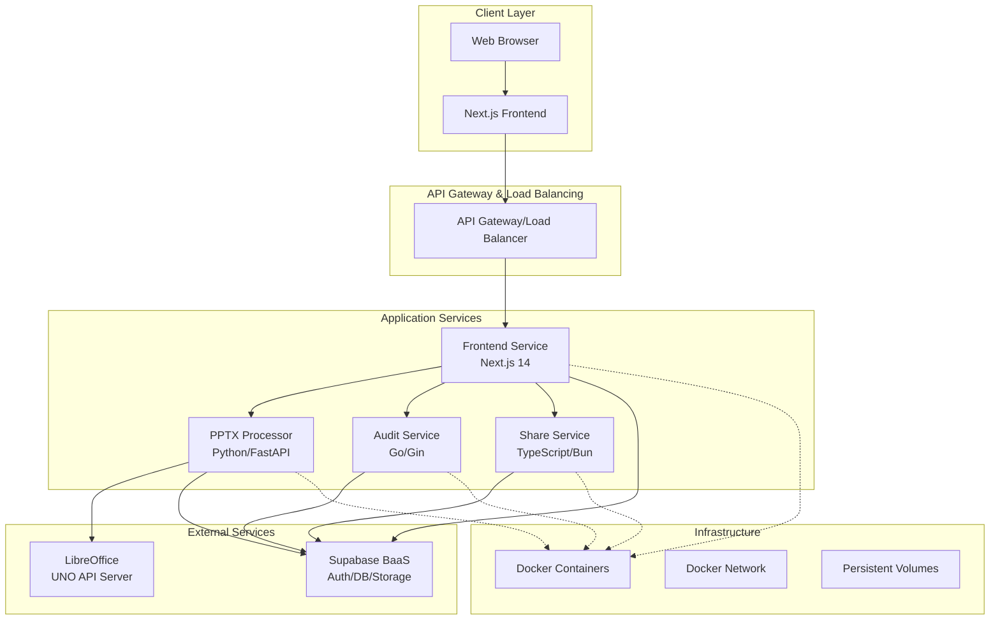
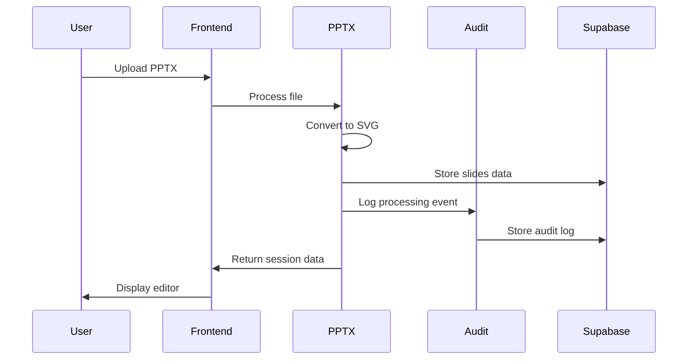
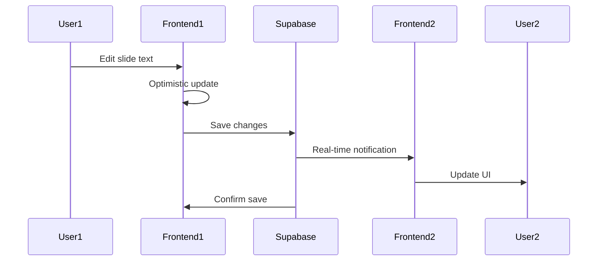
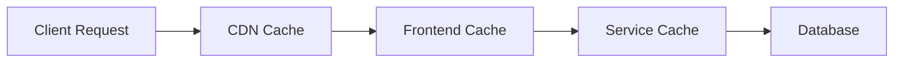
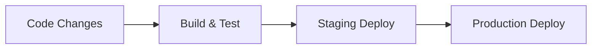

# System Architecture Overview

The PowerPoint Translator App is built as a modern, microservices-based architecture designed for scalability, maintainability, and high performance. This document provides a comprehensive overview of the system design, component interactions, and architectural decisions.

## 🏗️ High-Level Architecture

## 🎯 Architectural Principles

### 1. **Microservices Architecture**
- **Service Separation**: Each service has a single responsibility
- **Independent Deployment**: Services can be deployed and scaled independently
- **Technology Diversity**: Each service uses the most appropriate technology stack
- **Fault Isolation**: Failure in one service doesn't cascade to others

### 2. **Domain-Driven Design**
- **Business-Aligned Services**: Services map to business capabilities
- **Clear Boundaries**: Well-defined service interfaces and contracts
- **Data Ownership**: Each service owns its data and business logic

### 3. **Scalability & Performance**
- **Horizontal Scaling**: Services designed for horizontal scaling
- **Caching Strategies**: Multi-level caching for performance optimization
- **Asynchronous Processing**: Background jobs for long-running operations
- **Resource Efficiency**: Optimized resource usage and connection pooling

### 4. **Security by Design**
- **Zero Trust**: No implicit trust between services
- **Authentication & Authorization**: JWT-based auth with role-based access
- **Data Protection**: Encryption at rest and in transit
- **Audit Logging**: Comprehensive audit trails for compliance

## 🏛️ Service Architecture

### Frontend Service (Next.js 14)
**Technology**: Next.js 14, React, TypeScript, Zustand
**Port**: 3000
**Purpose**: User interface and client-side state management

**Key Features**:
- Server-Side Rendering (SSR) for SEO and performance
- Advanced state management with Zustand
- Real-time synchronization with Supabase
- Progressive Web App (PWA) capabilities
- Optimistic UI updates

**Architecture Patterns**:
- App Router for modern routing and layouts
- Component composition with shadcn/ui
- Custom hooks for reusable business logic
- Type-safe API clients with proper error handling

### PPTX Processor Service (Python/FastAPI)
**Technology**: Python 3.11, FastAPI, LibreOffice UNO API
**Port**: 8000
**Purpose**: PowerPoint file processing and conversion

**Key Features**:
- PPTX to SVG conversion using LibreOffice
- Text extraction with coordinate mapping
- Background job processing with status tracking
- PPTX export with translated content
- File validation and security scanning

**Architecture Patterns**:
- Domain-driven design with clear service layers
- Factory pattern for different processing strategies
- Observer pattern for job status notifications
- Repository pattern for data access

### Audit Service (Go/Gin)
**Technology**: Go 1.21, Gin Framework
**Port**: 4006
**Purpose**: Activity logging, monitoring, and compliance

**Key Features**:
- High-performance audit log ingestion
- 88.2% test coverage with comprehensive testing
- JWT validation and user context tracking
- Structured logging with correlation IDs
- Compliance reporting and data retention

**Architecture Patterns**:
- Clean architecture with dependency injection
- Middleware pipeline for request processing
- Repository pattern with interface abstractions
- Error handling with proper status codes

### Share Service (TypeScript/Bun)
**Technology**: TypeScript, Bun.js, Hono Framework
**Port**: 3001
**Purpose**: Session sharing and collaboration features

**Key Features**:
- Secure token-based sharing
- Configurable permission levels
- Real-time collaboration features
- Session access management
- Invitation system

**Architecture Patterns**:
- Functional programming patterns
- Type-safe service interfaces
- Middleware composition
- Event-driven architecture

## 🔄 Data Flow Architecture

### Primary Data Flow

### Real-time Synchronization

## 🗄️ Data Architecture

### Database Design
- **Primary Database**: PostgreSQL via Supabase
- **Real-time**: Supabase Real-time for live updates
- **Storage**: Supabase Storage for file assets
- **Caching**: In-memory caching in services

### Data Ownership
- **Frontend**: UI state, user preferences
- **PPTX Processor**: File processing jobs, slide data
- **Audit Service**: Activity logs, compliance data
- **Share Service**: Sharing tokens, permissions

### Data Consistency
- **Eventual Consistency**: For non-critical real-time updates
- **Strong Consistency**: For critical business operations
- **Optimistic Locking**: For concurrent editing scenarios

## 🔐 Security Architecture

### Authentication Flow
1. User authenticates with Supabase Auth
2. JWT token issued with user claims
3. Services validate JWT on each request
4. User context propagated through audit logs

### Authorization Model
- **Role-Based Access Control (RBAC)**
- **Resource-Level Permissions**
- **API Rate Limiting**
- **CORS Configuration**

### Data Protection
- **Encryption at Rest**: Supabase encryption
- **Encryption in Transit**: HTTPS/TLS
- **File Validation**: Virus scanning and format validation
- **Data Retention**: Automated cleanup policies

## 🚀 Deployment Architecture

### Containerization Strategy
- **Docker Containers**: Each service in isolated container
- **Docker Compose**: Development and testing orchestration
- **Multi-stage Builds**: Optimized production images
- **Health Checks**: Container health monitoring

### Network Architecture
- **Bridge Network**: Isolated service communication
- **Service Discovery**: DNS-based service discovery
- **Load Balancing**: Container-level load balancing
- **Port Isolation**: Minimal exposed ports

### Volume Management
- **Persistent Storage**: File uploads and processing
- **Temporary Storage**: Processing workspace
- **Database Storage**: External Supabase

## 📊 Performance Architecture

### Caching Strategy

### Scalability Patterns
- **Horizontal Scaling**: Service replication
- **Vertical Scaling**: Resource optimization
- **Auto-scaling**: Dynamic resource allocation
- **Circuit Breaker**: Fault tolerance

## 🔍 Monitoring & Observability

### Logging Strategy
- **Structured Logging**: JSON format with correlation IDs
- **Log Aggregation**: Centralized log collection
- **Log Levels**: Configurable verbosity
- **Audit Trails**: Comprehensive activity tracking

### Metrics & Monitoring
- **Health Checks**: Service availability monitoring
- **Performance Metrics**: Response time, throughput
- **Error Tracking**: Error rates and stack traces
- **Business Metrics**: User activity, session success rates

### Alerting
- **Service Alerts**: Availability and performance
- **Error Alerts**: Critical error notifications
- **Business Alerts**: Unusual activity patterns
- **Capacity Alerts**: Resource utilization warnings

## 🔄 Development & Deployment Pipeline

### CI/CD Architecture

### Environment Strategy
- **Development**: Local Docker environment
- **Staging**: Production-like testing environment
- **Production**: High-availability deployment
- **Feature Branches**: Isolated feature testing

## 📋 Technology Decisions

### Frontend Technology Choices
- **Next.js 14**: Modern React framework with App Router
- **Zustand**: Lightweight state management
- **TypeScript**: Type safety and developer experience
- **Tailwind CSS**: Utility-first styling

### Backend Technology Choices
- **Python/FastAPI**: PPTX processing with LibreOffice integration
- **Go/Gin**: High-performance audit service
- **TypeScript/Bun**: Modern JavaScript runtime for sharing
- **Supabase**: Managed backend services

### Infrastructure Choices
- **Docker**: Containerization for consistency
- **PostgreSQL**: Reliable relational database
- **LibreOffice**: Open-source office suite integration
- **GitHub Actions**: CI/CD automation

## 🔮 Future Architecture Considerations

### Scalability Improvements
- **Message Queue**: Asynchronous job processing
- **API Gateway**: Centralized API management
- **Kubernetes**: Container orchestration
- **CDN Integration**: Global content delivery

### Feature Extensions
- **Multi-tenancy**: Organization-level isolation
- **Plugin System**: Extensible functionality
- **Mobile App**: Native mobile applications
- **Offline Support**: Progressive Web App features

### Technology Evolution
- **WebAssembly**: Client-side processing
- **GraphQL**: Flexible API layer
- **Microfront-ends**: Frontend modularity
- **Edge Computing**: Reduced latency

---

**Last Updated**: Current  
**Version**: 1.0.0  
**Next Review**: Next Major Release 