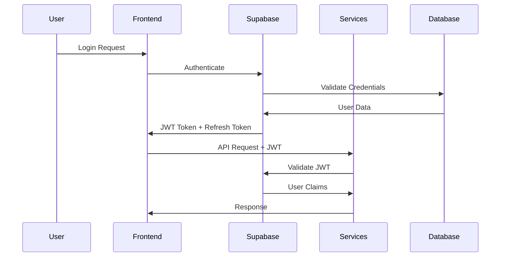
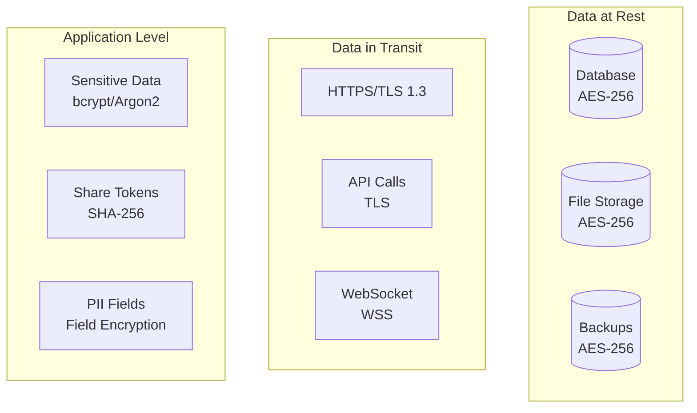

# Security Architecture

This document outlines the comprehensive security architecture, threat model, and security controls implemented in the PowerPoint Translator App.

## 🛡️ Security Overview

The application implements a **defense-in-depth** security strategy with multiple layers of protection:

- **Identity & Access Management**: Supabase Auth with JWT tokens
- **Network Security**: HTTPS/TLS, CORS, Rate Limiting
- **Data Protection**: Encryption at rest and in transit
- **Application Security**: Input validation, output encoding, secure coding practices
- **Infrastructure Security**: Container isolation, secret management
- **Audit & Monitoring**: Comprehensive logging and anomaly detection

## 🔐 Authentication Architecture

### Authentication Flow



### JWT Token Structure

```typescript
interface JWTPayload {
  sub: string;          // User ID (UUID)
  email: string;        // User email
  role: string;         // User role
  aud: string;          // Audience (application identifier)
  iss: string;          // Issuer (Supabase)
  iat: number;          // Issued at timestamp
  exp: number;          // Expiration timestamp
  jti: string;          // JWT ID for tracking
}

// Custom claims for application-specific data
interface CustomClaims {
  app_metadata: {
    provider: string;
    providers: string[];
  };
  user_metadata: {
    full_name?: string;
    avatar_url?: string;
    preferences?: object;
  };
}
```

### Token Validation Strategy

```typescript
// Service-side JWT validation
class JWTValidator {
  constructor(
    private jwtSecret: string,
    private supabaseClient: SupabaseClient
  ) {}

  async validateToken(token: string): Promise<UserContext> {
    try {
      // Verify JWT signature and claims
      const payload = jwt.verify(token, this.jwtSecret) as JWTPayload;
      
      // Additional validation
      if (payload.exp < Date.now() / 1000) {
        throw new Error('Token expired');
      }
      
      // Optional: Verify with Supabase for real-time status
      const { data: user, error } = await this.supabaseClient.auth.getUser(token);
      if (error || !user) {
        throw new Error('Invalid token');
      }
      
      return {
        userId: payload.sub,
        email: payload.email,
        role: payload.role,
        claims: payload
      };
    } catch (error) {
      throw new AuthenticationError('Invalid token');
    }
  }
}
```

### Multi-Factor Authentication (MFA)

```typescript
// MFA implementation strategy
interface MFAConfig {
  enabled: boolean;
  methods: ('totp' | 'sms' | 'email')[];
  requiredForActions: string[];
  gracePeriod: number; // seconds
}

// MFA verification flow
class MFAService {
  async requireMFA(userId: string, action: string): Promise<boolean> {
    const config = await this.getMFAConfig(userId);
    return config.enabled && config.requiredForActions.includes(action);
  }
  
  async verifyMFA(userId: string, code: string, method: string): Promise<boolean> {
    switch (method) {
      case 'totp':
        return this.verifyTOTP(userId, code);
      case 'sms':
        return this.verifySMS(userId, code);
      case 'email':
        return this.verifyEmail(userId, code);
      default:
        throw new Error('Unsupported MFA method');
    }
  }
}
```

## 🔑 Authorization Architecture

### Role-Based Access Control (RBAC)

```typescript
// Role definitions
enum UserRole {
  ADMIN = 'admin',
  EDITOR = 'editor',
  VIEWER = 'viewer',
  COLLABORATOR = 'collaborator'
}

// Permission definitions
enum Permission {
  // Session permissions
  SESSION_CREATE = 'session:create',
  SESSION_READ = 'session:read',
  SESSION_UPDATE = 'session:update',
  SESSION_DELETE = 'session:delete',
  SESSION_SHARE = 'session:share',
  SESSION_EXPORT = 'session:export',
  
  // Slide permissions
  SLIDE_READ = 'slide:read',
  SLIDE_UPDATE = 'slide:update',
  SLIDE_REORDER = 'slide:reorder',
  
  // Comment permissions
  COMMENT_CREATE = 'comment:create',
  COMMENT_READ = 'comment:read',
  COMMENT_UPDATE = 'comment:update',
  COMMENT_DELETE = 'comment:delete',
  
  // Admin permissions
  USER_MANAGE = 'user:manage',
  AUDIT_READ = 'audit:read',
  SYSTEM_CONFIGURE = 'system:configure'
}

// Role-permission mapping
const ROLE_PERMISSIONS: Record<UserRole, Permission[]> = {
  [UserRole.ADMIN]: [
    ...Object.values(Permission) // All permissions
  ],
  [UserRole.EDITOR]: [
    Permission.SESSION_CREATE,
    Permission.SESSION_READ,
    Permission.SESSION_UPDATE,
    Permission.SESSION_SHARE,
    Permission.SESSION_EXPORT,
    Permission.SLIDE_READ,
    Permission.SLIDE_UPDATE,
    Permission.SLIDE_REORDER,
    Permission.COMMENT_CREATE,
    Permission.COMMENT_READ,
    Permission.COMMENT_UPDATE
  ],
  [UserRole.VIEWER]: [
    Permission.SESSION_READ,
    Permission.SLIDE_READ,
    Permission.COMMENT_READ
  ],
  [UserRole.COLLABORATOR]: [
    Permission.SESSION_READ,
    Permission.SLIDE_READ,
    Permission.COMMENT_CREATE,
    Permission.COMMENT_READ,
    Permission.COMMENT_UPDATE
  ]
};
```

### Resource-Level Authorization

```typescript
// Resource ownership and access control
interface ResourceAccess {
  userId: string;
  resourceType: string;
  resourceId: string;
  permissions: Permission[];
  grantedBy?: string;
  expiresAt?: Date;
}

class AuthorizationService {
  async checkPermission(
    userId: string,
    resource: string,
    action: Permission
  ): Promise<boolean> {
    // Check user role permissions
    const user = await this.getUserWithRole(userId);
    const rolePermissions = ROLE_PERMISSIONS[user.role];
    
    if (rolePermissions.includes(action)) {
      return true;
    }
    
    // Check resource-specific permissions
    const resourceAccess = await this.getResourceAccess(userId, resource);
    return resourceAccess.permissions.includes(action);
  }
  
  async grantAccess(
    userId: string,
    resourceId: string,
    permissions: Permission[],
    grantedBy: string,
    expiresAt?: Date
  ): Promise<void> {
    const access: ResourceAccess = {
      userId,
      resourceType: this.getResourceType(resourceId),
      resourceId,
      permissions,
      grantedBy,
      expiresAt
    };
    
    await this.saveResourceAccess(access);
    await this.auditAccessGrant(access);
  }
}
```

### Row Level Security (RLS)

```sql
-- Enable RLS on all sensitive tables
ALTER TABLE translation_sessions ENABLE ROW LEVEL SECURITY;
ALTER TABLE slides ENABLE ROW LEVEL SECURITY;
ALTER TABLE shapes ENABLE ROW LEVEL SECURITY;
ALTER TABLE comments ENABLE ROW LEVEL SECURITY;

-- Users can only access their own sessions
CREATE POLICY "session_owner_policy" ON translation_sessions
  FOR ALL USING (auth.uid() = user_id);

-- Users can access sessions shared with them
CREATE POLICY "session_shared_policy" ON translation_sessions
  FOR SELECT USING (
    id IN (
      SELECT session_id 
      FROM share_tokens 
      WHERE is_active = true 
        AND (expires_at IS NULL OR expires_at > NOW())
        AND token_hash IN (
          SELECT token_hash FROM active_share_access 
          WHERE user_id = auth.uid()
        )
    )
  );

-- Cascading access for slides
CREATE POLICY "slide_access_policy" ON slides
  FOR ALL USING (
    session_id IN (
      SELECT id FROM translation_sessions 
      WHERE auth.uid() = user_id
    )
  );
```

## 🔒 Data Protection

### Encryption Strategy



### Sensitive Data Handling

```typescript
// Field-level encryption for sensitive data
class EncryptionService {
  private algorithm = 'aes-256-gcm';
  private keyDerivation = 'pbkdf2';
  
  async encryptField(data: string, context: string): Promise<EncryptedField> {
    const salt = crypto.randomBytes(16);
    const iv = crypto.randomBytes(12);
    
    // Derive key from master key + context
    const key = crypto.pbkdf2Sync(
      this.masterKey,
      Buffer.concat([salt, Buffer.from(context)]),
      100000,
      32,
      'sha256'
    );
    
    const cipher = crypto.createCipher(this.algorithm, key, iv);
    const encrypted = Buffer.concat([
      cipher.update(data, 'utf8'),
      cipher.final()
    ]);
    
    const tag = cipher.getAuthTag();
    
    return {
      data: encrypted.toString('base64'),
      salt: salt.toString('base64'),
      iv: iv.toString('base64'),
      tag: tag.toString('base64'),
      algorithm: this.algorithm
    };
  }
  
  async decryptField(encrypted: EncryptedField, context: string): Promise<string> {
    const key = crypto.pbkdf2Sync(
      this.masterKey,
      Buffer.concat([
        Buffer.from(encrypted.salt, 'base64'),
        Buffer.from(context)
      ]),
      100000,
      32,
      'sha256'
    );
    
    const decipher = crypto.createDecipher(
      encrypted.algorithm,
      key,
      Buffer.from(encrypted.iv, 'base64')
    );
    
    decipher.setAuthTag(Buffer.from(encrypted.tag, 'base64'));
    
    const decrypted = Buffer.concat([
      decipher.update(Buffer.from(encrypted.data, 'base64')),
      decipher.final()
    ]);
    
    return decrypted.toString('utf8');
  }
}
```

### Secure File Handling

```python
# File upload security
class SecureFileHandler:
    ALLOWED_EXTENSIONS = {'.pptx', '.ppt'}
    MAX_FILE_SIZE = 50 * 1024 * 1024  # 50MB
    SCAN_TIMEOUT = 30  # seconds
    
    async def validate_file(self, file: UploadFile) -> FileValidationResult:
        # Size validation
        if file.size > self.MAX_FILE_SIZE:
            raise FileValidationError(f"File too large: {file.size}")
        
        # Extension validation
        file_ext = Path(file.filename).suffix.lower()
        if file_ext not in self.ALLOWED_EXTENSIONS:
            raise FileValidationError(f"Unsupported file type: {file_ext}")
        
        # Content validation
        content = await file.read()
        await file.seek(0)
        
        # Magic number validation
        if not self.validate_file_magic(content, file_ext):
            raise FileValidationError("File content doesn't match extension")
        
        # Virus scanning
        scan_result = await self.scan_for_malware(content)
        if not scan_result.is_clean:
            raise SecurityError(f"Malware detected: {scan_result.threat}")
        
        return FileValidationResult(valid=True, size=file.size, type=file_ext)
    
    def validate_file_magic(self, content: bytes, expected_ext: str) -> bool:
        """Validate file content matches expected format"""
        magic_signatures = {
            '.pptx': b'PK\x03\x04',  # ZIP signature for PPTX
            '.ppt': b'\xd0\xcf\x11\xe0\xa1\xb1\x1a\xe1'  # OLE signature for PPT
        }
        
        expected_magic = magic_signatures.get(expected_ext)
        if not expected_magic:
            return False
            
        return content.startswith(expected_magic)
```

## 🌐 Network Security

### HTTPS/TLS Configuration

```typescript
// TLS configuration for production
const tlsConfig = {
  minVersion: 'TLSv1.2',
  maxVersion: 'TLSv1.3',
  ciphers: [
    'ECDHE-RSA-AES128-GCM-SHA256',
    'ECDHE-RSA-AES256-GCM-SHA384',
    'ECDHE-RSA-AES128-SHA256',
    'ECDHE-RSA-AES256-SHA384'
  ],
  honorCipherOrder: true,
  secureProtocol: 'TLS_method'
};

// HTTPS redirect middleware
const enforceHTTPS = (req: Request, res: Response, next: NextFunction) => {
  if (req.header('x-forwarded-proto') !== 'https') {
    return res.redirect(`https://${req.header('host')}${req.url}`);
  }
  next();
};
```

### CORS Configuration

```typescript
// CORS policy implementation
const corsConfig = {
  origin: (origin: string, callback: Function) => {
    const allowedOrigins = [
      'https://app.pptxtranslator.com',
      'https://staging.pptxtranslator.com',
      ...(process.env.NODE_ENV === 'development' ? ['http://localhost:3000'] : [])
    ];
    
    if (!origin || allowedOrigins.includes(origin)) {
      callback(null, true);
    } else {
      callback(new Error('Not allowed by CORS'));
    }
  },
  credentials: true,
  methods: ['GET', 'POST', 'PUT', 'DELETE', 'PATCH', 'OPTIONS'],
  allowedHeaders: [
    'Origin',
    'X-Requested-With',
    'Content-Type',
    'Accept',
    'Authorization',
    'X-Request-ID'
  ],
  exposedHeaders: ['X-Request-ID', 'X-RateLimit-Remaining'],
  maxAge: 86400 // 24 hours
};
```

### Rate Limiting

```typescript
// Multi-tier rate limiting
class RateLimiter {
  private redis: RedisClient;
  
  constructor(redis: RedisClient) {
    this.redis = redis;
  }
  
  async checkLimit(
    identifier: string,
    window: number,
    maxRequests: number,
    tier: string = 'default'
  ): Promise<RateLimitResult> {
    const key = `rate_limit:${tier}:${identifier}`;
    const now = Date.now();
    const windowStart = now - window * 1000;
    
    // Remove old entries
    await this.redis.zremrangebyscore(key, '-inf', windowStart);
    
    // Count current requests
    const current = await this.redis.zcard(key);
    
    if (current >= maxRequests) {
      const oldestRequest = await this.redis.zrange(key, 0, 0, 'WITHSCORES');
      const resetTime = oldestRequest[1] + window * 1000;
      
      return {
        allowed: false,
        remaining: 0,
        resetTime,
        total: maxRequests
      };
    }
    
    // Add current request
    await this.redis.zadd(key, now, `${now}-${Math.random()}`);
    await this.redis.expire(key, window);
    
    return {
      allowed: true,
      remaining: maxRequests - current - 1,
      resetTime: now + window * 1000,
      total: maxRequests
    };
  }
}

// Rate limiting middleware
const rateLimitMiddleware = async (req: Request, res: Response, next: NextFunction) => {
  const identifier = req.ip || 'unknown';
  const tier = req.user?.tier || 'anonymous';
  
  const limits = {
    anonymous: { window: 60, max: 60 },      // 60 req/min
    basic: { window: 60, max: 120 },         // 120 req/min
    premium: { window: 60, max: 300 },       // 300 req/min
    admin: { window: 60, max: 1000 }         // 1000 req/min
  };
  
  const limit = limits[tier] || limits.anonymous;
  const result = await rateLimiter.checkLimit(identifier, limit.window, limit.max, tier);
  
  res.setHeader('X-RateLimit-Limit', limit.max);
  res.setHeader('X-RateLimit-Remaining', result.remaining);
  res.setHeader('X-RateLimit-Reset', result.resetTime);
  
  if (!result.allowed) {
    return res.status(429).json({
      error: 'Rate limit exceeded',
      retryAfter: Math.ceil((result.resetTime - Date.now()) / 1000)
    });
  }
  
  next();
};
```

## 🛡️ Application Security

### Input Validation & Sanitization

```typescript
// Comprehensive input validation
import { z } from 'zod';
import DOMPurify from 'dompurify';

// Schema validation for API inputs
const TranslationSessionSchema = z.object({
  title: z.string()
    .min(1, 'Title is required')
    .max(200, 'Title too long')
    .regex(/^[a-zA-Z0-9\s\-_\.]+$/, 'Invalid characters'),
  description: z.string()
    .max(1000, 'Description too long')
    .optional(),
  filename: z.string()
    .regex(/^[\w\-. ]+\.pptx?$/i, 'Invalid filename')
});

const CommentSchema = z.object({
  content: z.string()
    .min(1, 'Comment cannot be empty')
    .max(2000, 'Comment too long'),
  type: z.enum(['general', 'translation_suggestion', 'formatting_issue']),
  sessionId: z.string().uuid(),
  slideId: z.string().uuid().optional(),
  shapeId: z.string().uuid().optional()
});

// Sanitization utilities
class InputSanitizer {
  static sanitizeHTML(input: string): string {
    return DOMPurify.sanitize(input, {
      ALLOWED_TAGS: ['b', 'i', 'u', 'em', 'strong'],
      ALLOWED_ATTR: []
    });
  }
  
  static sanitizeText(input: string): string {
    return input
      .replace(/[<>]/g, '') // Remove potential HTML
      .replace(/javascript:/gi, '') // Remove javascript: URIs
      .trim();
  }
  
  static sanitizeFilename(filename: string): string {
    return filename
      .replace(/[^a-zA-Z0-9\-_.]/g, '_') // Replace invalid chars
      .replace(/_{2,}/g, '_') // Remove duplicate underscores
      .substring(0, 100); // Limit length
  }
}

// Validation middleware
const validateInput = (schema: z.ZodSchema) => {
  return (req: Request, res: Response, next: NextFunction) => {
    try {
      const validated = schema.parse(req.body);
      req.body = validated;
      next();
    } catch (error) {
      if (error instanceof z.ZodError) {
        return res.status(400).json({
          error: 'Validation failed',
          details: error.errors
        });
      }
      next(error);
    }
  };
};
```

### SQL Injection Prevention

```typescript
// Parameterized queries with type safety
class DatabaseClient {
  async findSession(id: string, userId: string): Promise<TranslationSession | null> {
    // Using parameterized query - safe from SQL injection
    const query = `
      SELECT * FROM translation_sessions 
      WHERE id = $1 AND user_id = $2
    `;
    
    const result = await this.db.query(query, [id, userId]);
    return result.rows[0] || null;
  }
  
  async searchSessions(
    userId: string, 
    searchTerm: string, 
    filters: SessionFilters
  ): Promise<TranslationSession[]> {
    // Build dynamic query safely
    const conditions = ['user_id = $1'];
    const params = [userId];
    let paramIndex = 2;
    
    if (searchTerm) {
      conditions.push(`title ILIKE $${paramIndex}`);
      params.push(`%${searchTerm}%`);
      paramIndex++;
    }
    
    if (filters.status) {
      conditions.push(`status = $${paramIndex}`);
      params.push(filters.status);
      paramIndex++;
    }
    
    const query = `
      SELECT * FROM translation_sessions 
      WHERE ${conditions.join(' AND ')}
      ORDER BY updated_at DESC
      LIMIT $${paramIndex}
    `;
    params.push(filters.limit || 50);
    
    const result = await this.db.query(query, params);
    return result.rows;
  }
}
```

### Cross-Site Scripting (XSS) Prevention

```typescript
// Output encoding and CSP headers
const securityHeaders = (req: Request, res: Response, next: NextFunction) => {
  // Content Security Policy
  res.setHeader('Content-Security-Policy', [
    "default-src 'self'",
    "script-src 'self' 'unsafe-inline' https://cdn.jsdelivr.net",
    "style-src 'self' 'unsafe-inline' https://fonts.googleapis.com",
    "font-src 'self' https://fonts.gstatic.com",
    "img-src 'self' data: https:",
    "connect-src 'self' https://*.supabase.co wss://*.supabase.co",
    "frame-src 'none'",
    "object-src 'none'"
  ].join('; '));
  
  // Additional security headers
  res.setHeader('X-Content-Type-Options', 'nosniff');
  res.setHeader('X-Frame-Options', 'DENY');
  res.setHeader('X-XSS-Protection', '1; mode=block');
  res.setHeader('Referrer-Policy', 'strict-origin-when-cross-origin');
  res.setHeader('Permissions-Policy', 'camera=(), microphone=(), geolocation=()');
  
  next();
};

// Safe HTML rendering
const SafeHTML: React.FC<{ content: string }> = ({ content }) => {
  const sanitizedHTML = DOMPurify.sanitize(content, {
    ALLOWED_TAGS: ['b', 'i', 'u', 'em', 'strong', 'p', 'br'],
    ALLOWED_ATTR: []
  });
  
  return <div dangerouslySetInnerHTML={{ __html: sanitizedHTML }} />;
};
```

## 🔍 Security Monitoring & Incident Response

### Security Event Logging

```typescript
// Security event types
enum SecurityEventType {
  LOGIN_SUCCESS = 'login_success',
  LOGIN_FAILURE = 'login_failure',
  LOGIN_BRUTE_FORCE = 'login_brute_force',
  UNAUTHORIZED_ACCESS = 'unauthorized_access',
  PRIVILEGE_ESCALATION = 'privilege_escalation',
  DATA_EXPORT = 'data_export',
  SUSPICIOUS_ACTIVITY = 'suspicious_activity',
  SECURITY_SCAN_DETECTED = 'security_scan_detected'
}

interface SecurityEvent {
  type: SecurityEventType;
  userId?: string;
  sessionId?: string;
  ipAddress: string;
  userAgent: string;
  resource?: string;
  action?: string;
  severity: 'low' | 'medium' | 'high' | 'critical';
  metadata: object;
  timestamp: Date;
}

class SecurityMonitor {
  async logSecurityEvent(event: SecurityEvent): Promise<void> {
    // Log to audit system
    await this.auditService.logEvent({
      type: 'security_event',
      data: event
    });
    
    // Send to SIEM system
    await this.siemClient.sendEvent(event);
    
    // Alert on high severity events
    if (event.severity === 'high' || event.severity === 'critical') {
      await this.alertingService.sendAlert({
        title: `Security Event: ${event.type}`,
        description: `High severity security event detected`,
        event,
        urgency: event.severity
      });
    }
  }
  
  async detectBruteForce(ipAddress: string): Promise<boolean> {
    const failedAttempts = await this.redis.get(`failed_logins:${ipAddress}`);
    return parseInt(failedAttempts || '0') > 5;
  }
  
  async detectSuspiciousActivity(userId: string): Promise<boolean> {
    // Check for unusual patterns
    const recentSessions = await this.getRecentUserSessions(userId);
    
    // Multiple simultaneous sessions from different locations
    const uniqueLocations = new Set(recentSessions.map(s => s.ipAddress));
    if (uniqueLocations.size > 3) {
      return true;
    }
    
    // Unusual time patterns
    const unusualHours = recentSessions.filter(s => {
      const hour = new Date(s.timestamp).getHours();
      return hour < 6 || hour > 23; // Outside normal hours
    });
    
    return unusualHours.length > 2;
  }
}
```

### Incident Response Procedures

```typescript
// Automated incident response
class IncidentResponse {
  async handleSecurityIncident(incident: SecurityIncident): Promise<void> {
    // 1. Immediate containment
    if (incident.severity === 'critical') {
      await this.containThreat(incident);
    }
    
    // 2. Evidence collection
    await this.collectEvidence(incident);
    
    // 3. Notification
    await this.notifyStakeholders(incident);
    
    // 4. Remediation
    await this.beginRemediation(incident);
  }
  
  private async containThreat(incident: SecurityIncident): Promise<void> {
    switch (incident.type) {
      case 'compromised_account':
        await this.disableUser(incident.userId);
        await this.revokeAllTokens(incident.userId);
        break;
        
      case 'data_breach':
        await this.enableReadOnlyMode();
        await this.blockSuspiciousIPs(incident.sourceIPs);
        break;
        
      case 'malware_detected':
        await this.quarantineFile(incident.fileId);
        await this.scanAllFiles();
        break;
    }
  }
}
```

## 🔄 Security Best Practices

### Secure Development Lifecycle

1. **Threat Modeling**: Regular threat assessment and risk analysis
2. **Security Reviews**: Code reviews with security focus
3. **Dependency Scanning**: Automated vulnerability scanning
4. **Security Testing**: SAST, DAST, and penetration testing
5. **Security Training**: Regular security awareness training

### Security Checklist

- [ ] **Authentication**: Strong password policies, MFA, secure session management
- [ ] **Authorization**: Principle of least privilege, RBAC implementation
- [ ] **Data Protection**: Encryption at rest and in transit, secure key management
- [ ] **Input Validation**: Comprehensive input validation and sanitization
- [ ] **Output Encoding**: XSS prevention, safe HTML rendering
- [ ] **Error Handling**: Secure error messages, no information disclosure
- [ ] **Logging**: Comprehensive audit logging, security event monitoring
- [ ] **Dependencies**: Regular security updates, vulnerability scanning
- [ ] **Infrastructure**: Secure configuration, network segmentation
- [ ] **Incident Response**: Automated detection, response procedures

### Security Configuration

```yaml
# Security configuration template
security:
  authentication:
    jwt_expiration: 3600  # 1 hour
    refresh_token_expiration: 2592000  # 30 days
    max_failed_attempts: 5
    lockout_duration: 900  # 15 minutes
    
  authorization:
    default_role: "viewer"
    session_timeout: 3600  # 1 hour
    
  encryption:
    algorithm: "aes-256-gcm"
    key_rotation_days: 90
    
  rate_limiting:
    anonymous: 60  # requests per minute
    authenticated: 300
    admin: 1000
    
  file_upload:
    max_size: 52428800  # 50MB
    allowed_types: [".pptx", ".ppt"]
    virus_scanning: true
    
  monitoring:
    failed_login_threshold: 5
    suspicious_activity_threshold: 3
    log_retention_days: 365
```

---

**Last Updated**: Current  
**Version**: 1.0.0  
**Next Review**: Quarterly Security Review 