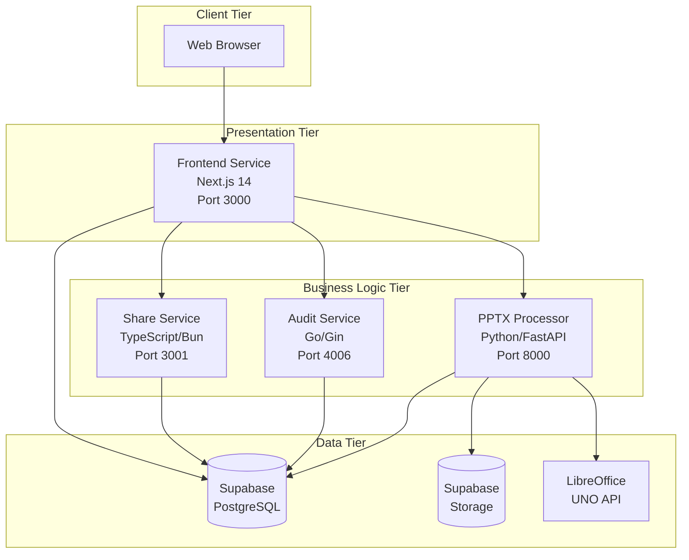
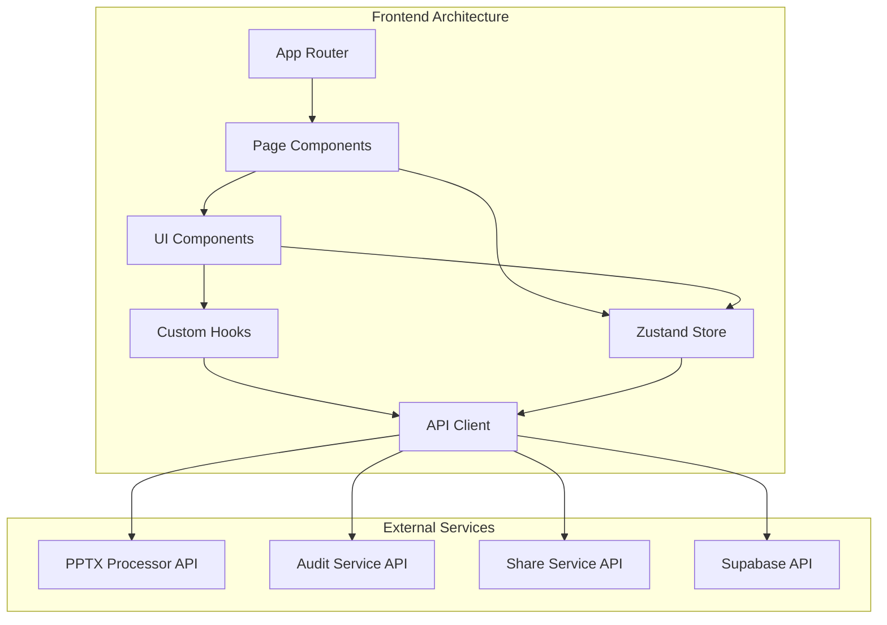
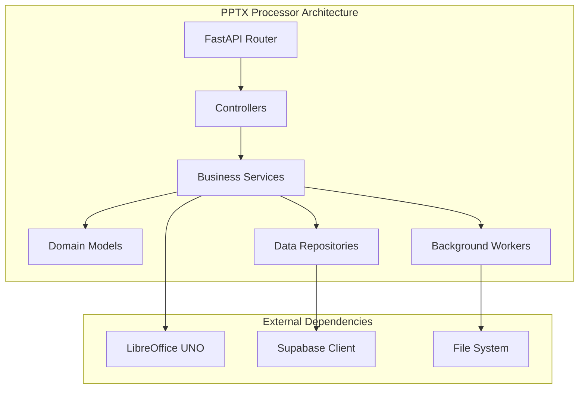
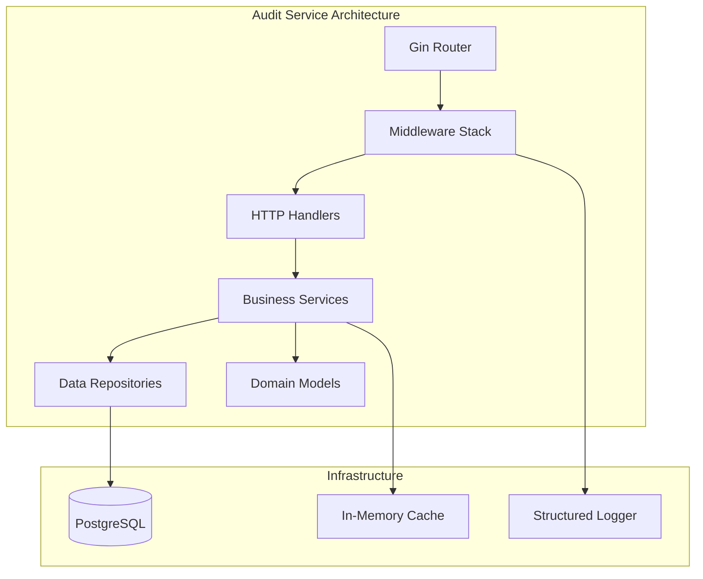
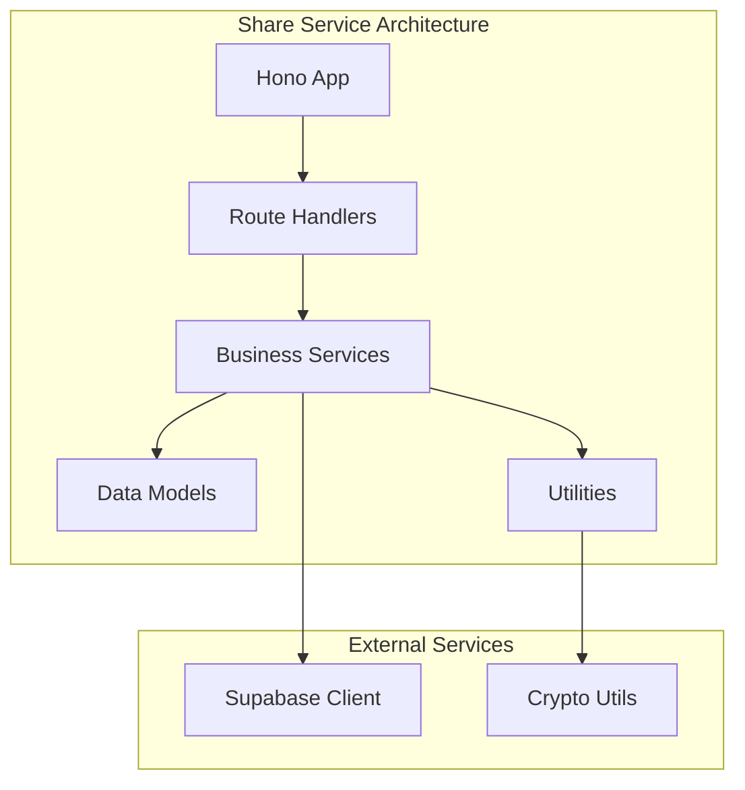
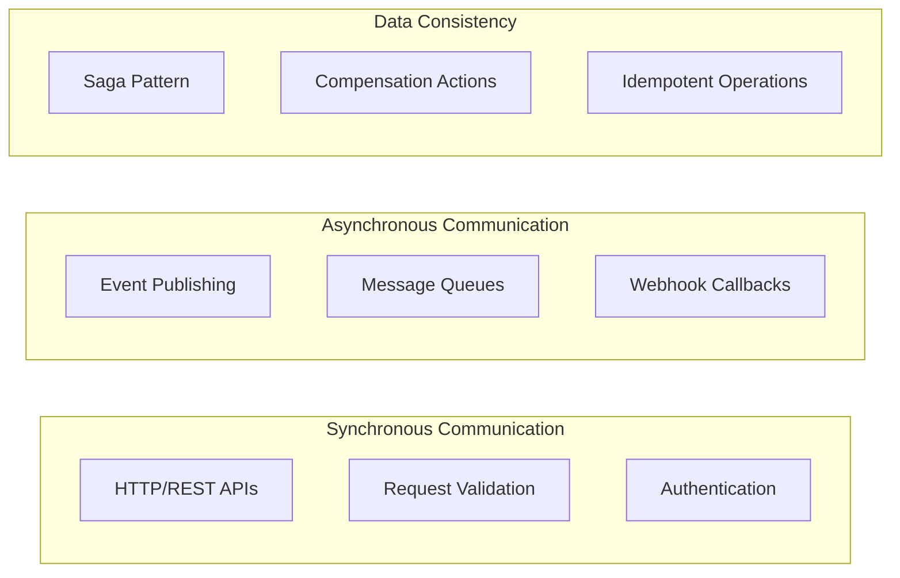

# Microservices Architecture

This document details the microservices architecture, service design patterns, inter-service communication strategies, and service-specific architectural decisions for the PowerPoint Translator App.

## 🏗️ Service Architecture Overview

The application follows a **microservices architecture** with four main services, each designed with specific responsibilities and technology stacks optimized for their use cases.



## 🎯 Service Design Principles

### 1. **Single Responsibility Principle**
Each service has a clearly defined business capability:
- **Frontend**: User interface and experience
- **PPTX Processor**: File processing and conversion
- **Audit Service**: Activity logging and compliance
- **Share Service**: Collaboration and sharing

### 2. **Domain-Driven Design**
Services are organized around business domains:
- **Presentation Domain**: Frontend service
- **Processing Domain**: PPTX processor service
- **Compliance Domain**: Audit service
- **Collaboration Domain**: Share service

### 3. **Technology Diversity**
Each service uses the most appropriate technology stack:
- **Performance Critical**: Go for audit service
- **ML/Processing**: Python for PPTX processing
- **Modern Web**: TypeScript/Bun for sharing
- **User Experience**: Next.js for frontend

### 4. **Data Ownership**
Each service owns its data and business logic:
- No direct database access between services
- Clear API boundaries and contracts
- Event-driven communication for loose coupling

## 🌐 Service Detailed Architecture

### Frontend Service (Next.js 14)

**Purpose**: User interface, client-side logic, and state management
**Technology Stack**: Next.js 14, React 18, TypeScript, Zustand
**Port**: 3000

#### Architecture Patterns



#### Key Components

**State Management (Zustand)**:
```typescript
// Store architecture with slices
interface AppStore {
  session: SessionSlice;
  slides: SlidesSlice;
  editor: EditorSlice;
  comments: CommentsSlice;
  notifications: NotificationsSlice;
  merge: MergeSlice;
}

// Slice pattern for modular state
const createSessionSlice = (set, get) => ({
  sessions: [],
  currentSession: null,
  loadSession: async (id) => { /* implementation */ },
  updateSession: (updates) => { /* implementation */ }
});
```

**API Client Pattern**:
```typescript
// Type-safe API client with error handling
class APIClient {
  private baseURL: string;
  private defaultHeaders: Record<string, string>;
  
  async request<T>(endpoint: string, options: RequestInit): Promise<T> {
    // Error handling, retries, logging
  }
}

// Service-specific clients
const pptxProcessorClient = new APIClient(PPTX_PROCESSOR_URL);
const auditServiceClient = new APIClient(AUDIT_SERVICE_URL);
```

**Component Architecture**:
- **Atomic Design**: Atoms, molecules, organisms, templates
- **Composition Pattern**: Flexible component composition
- **Error Boundaries**: Graceful error handling
- **Suspense**: Loading states and data fetching

### PPTX Processor Service (Python/FastAPI)

**Purpose**: PowerPoint file processing, conversion, and export
**Technology Stack**: Python 3.11, FastAPI, LibreOffice UNO API
**Port**: 8000

#### Architecture Patterns



#### Key Components

**Domain Services**:
```python
# Processing service with factory pattern
class PPTXProcessorService:
    def __init__(self, converter_factory: ConverterFactory):
        self.converter_factory = converter_factory
    
    async def process_file(self, file_data: FileData) -> ProcessingResult:
        converter = self.converter_factory.create_converter(file_data.type)
        return await converter.convert(file_data)

# Factory pattern for different converters
class ConverterFactory:
    def create_converter(self, file_type: str) -> Converter:
        if file_type == "pptx":
            return PPTXConverter()
        elif file_type == "ppt":
            return PPTConverter()
        else:
            raise UnsupportedFileTypeError(file_type)
```

**Background Job Processing**:
```python
# Job processing with status tracking
class JobProcessor:
    async def process_job(self, job: ProcessingJob):
        try:
            await self.update_job_status(job.id, JobStatus.RUNNING)
            result = await self.execute_job(job)
            await self.update_job_status(job.id, JobStatus.COMPLETED, result)
        except Exception as e:
            await self.update_job_status(job.id, JobStatus.FAILED, error=str(e))

# Observer pattern for status notifications
class JobStatusNotifier:
    def __init__(self):
        self.observers = []
    
    def notify_status_change(self, job_id: str, status: JobStatus):
        for observer in self.observers:
            observer.on_status_change(job_id, status)
```

**LibreOffice Integration**:
```python
# UNO API wrapper with connection management
class LibreOfficeConverter:
    def __init__(self):
        self.connection_manager = UNOConnectionManager()
    
    async def convert_to_svg(self, file_path: str) -> List[SVGSlide]:
        with self.connection_manager.get_connection() as uno_service:
            document = uno_service.load_document(file_path)
            slides = []
            for slide in document.slides:
                svg_content = slide.export_as_svg()
                slides.append(SVGSlide(content=svg_content))
            return slides
```

### Audit Service (Go/Gin)

**Purpose**: Activity logging, monitoring, and compliance tracking
**Technology Stack**: Go 1.21, Gin Framework, PostgreSQL
**Port**: 4006

#### Architecture Patterns



#### Key Components

**Clean Architecture Implementation**:
```go
// Domain entities
type AuditLog struct {
    ID          uuid.UUID   `json:"id" db:"id"`
    UserID      *uuid.UUID  `json:"user_id" db:"user_id"`
    SessionID   *uuid.UUID  `json:"session_id" db:"session_id"`
    Action      string      `json:"action" db:"action"`
    ResourceID  *uuid.UUID  `json:"resource_id" db:"resource_id"`
    OldValues   *string     `json:"old_values" db:"old_values"`
    NewValues   *string     `json:"new_values" db:"new_values"`
    Metadata    *string     `json:"metadata" db:"metadata"`
    IPAddress   *string     `json:"ip_address" db:"ip_address"`
    UserAgent   *string     `json:"user_agent" db:"user_agent"`
    CreatedAt   time.Time   `json:"created_at" db:"created_at"`
}

// Repository interface
type AuditRepository interface {
    Create(ctx context.Context, log *AuditLog) error
    GetByUserID(ctx context.Context, userID uuid.UUID, pagination PaginationParams) ([]*AuditLog, error)
    GetBySessionID(ctx context.Context, sessionID uuid.UUID, pagination PaginationParams) ([]*AuditLog, error)
}

// Service implementation
type AuditService struct {
    repo   AuditRepository
    cache  cache.Cache
    logger logger.Logger
}

func (s *AuditService) LogAction(ctx context.Context, log *AuditLog) error {
    // Validation, enrichment, and persistence
    if err := s.validateLog(log); err != nil {
        return err
    }
    
    s.enrichLogWithContext(ctx, log)
    
    if err := s.repo.Create(ctx, log); err != nil {
        s.logger.Error("Failed to create audit log", "error", err)
        return err
    }
    
    // Async cache invalidation
    go s.invalidateCache(log.UserID, log.SessionID)
    
    return nil
}
```

**Middleware Stack**:
```go
// Request processing pipeline
func (s *Server) setupMiddleware() {
    s.router.Use(
        middleware.Logger(s.logger),
        middleware.Recovery(),
        middleware.CORS(s.config.CORS),
        middleware.RateLimiter(s.rateLimiter),
        middleware.Auth(s.authService),
        middleware.RequestID(),
        middleware.Timeout(30 * time.Second),
    )
}

// Authentication middleware
func Auth(authService AuthService) gin.HandlerFunc {
    return func(c *gin.Context) {
        token := extractToken(c.Request)
        if token == "" {
            c.AbortWithStatusJSON(401, gin.H{"error": "Missing authorization token"})
            return
        }
        
        user, err := authService.ValidateToken(c.Request.Context(), token)
        if err != nil {
            c.AbortWithStatusJSON(401, gin.H{"error": "Invalid token"})
            return
        }
        
        c.Set("user", user)
        c.Next()
    }
}
```

### Share Service (TypeScript/Bun)

**Purpose**: Session sharing, collaboration, and permission management
**Technology Stack**: TypeScript, Bun.js, Hono Framework
**Port**: 3001

#### Architecture Patterns



#### Key Components

**Functional Service Design**:
```typescript
// Type-safe service interfaces
interface ShareService {
  createShareToken(sessionId: string, permissions: SharePermissions, expiresAt?: Date): Promise<ShareToken>;
  validateShareToken(token: string): Promise<ShareTokenValidation>;
  revokeShareToken(tokenId: string): Promise<void>;
  getSharedSessions(userId: string): Promise<SharedSession[]>;
}

// Immutable data structures
interface ShareToken {
  readonly id: string;
  readonly sessionId: string;
  readonly tokenHash: string;
  readonly permissions: SharePermissions;
  readonly expiresAt?: Date;
  readonly createdAt: Date;
  readonly createdBy: string;
}

// Pure functions for business logic
const generateSecureToken = (): string => {
  return crypto.randomBytes(32).toString('hex');
};

const hashToken = (token: string): string => {
  return crypto.createHash('sha256').update(token).digest('hex');
};

const validatePermissions = (
  userPermissions: SharePermissions,
  requiredPermissions: SharePermissions
): boolean => {
  return Object.entries(requiredPermissions).every(
    ([key, required]) => !required || userPermissions[key as keyof SharePermissions]
  );
};
```

**Event-Driven Architecture**:
```typescript
// Event system for loose coupling
interface ShareEvent {
  type: string;
  sessionId: string;
  userId: string;
  timestamp: Date;
  data: any;
}

class ShareEventEmitter {
  private listeners: Map<string, Function[]> = new Map();
  
  emit(event: ShareEvent): void {
    const listeners = this.listeners.get(event.type) || [];
    listeners.forEach(listener => listener(event));
  }
  
  on(eventType: string, listener: Function): void {
    const listeners = this.listeners.get(eventType) || [];
    listeners.push(listener);
    this.listeners.set(eventType, listeners);
  }
}

// Event handlers
const shareEventHandlers = {
  'share.created': async (event: ShareEvent) => {
    await auditService.logAction({
      action: 'share_created',
      sessionId: event.sessionId,
      userId: event.userId,
      metadata: event.data
    });
  },
  
  'share.accessed': async (event: ShareEvent) => {
    await analyticsService.trackAccess(event.sessionId, event.data.accessInfo);
  }
};
```

## 🔄 Inter-Service Communication

### Communication Patterns



### API Communication Standards

**Request/Response Format**:
```typescript
// Standard API response format
interface APIResponse<T> {
  success: boolean;
  data?: T;
  error?: {
    code: string;
    message: string;
    details?: any;
  };
  metadata?: {
    timestamp: string;
    requestId: string;
    version: string;
  };
}

// Error handling across services
class ServiceError extends Error {
  constructor(
    public code: string,
    public message: string,
    public statusCode: number = 500,
    public details?: any
  ) {
    super(message);
  }
}
```

**Circuit Breaker Pattern**:
```typescript
class CircuitBreaker {
  private failureCount = 0;
  private state: 'CLOSED' | 'OPEN' | 'HALF_OPEN' = 'CLOSED';
  private nextAttempt = Date.now();
  
  async execute<T>(operation: () => Promise<T>): Promise<T> {
    if (this.state === 'OPEN') {
      if (Date.now() < this.nextAttempt) {
        throw new Error('Circuit breaker is OPEN');
      }
      this.state = 'HALF_OPEN';
    }
    
    try {
      const result = await operation();
      this.onSuccess();
      return result;
    } catch (error) {
      this.onFailure();
      throw error;
    }
  }
  
  private onSuccess(): void {
    this.failureCount = 0;
    this.state = 'CLOSED';
  }
  
  private onFailure(): void {
    this.failureCount++;
    if (this.failureCount >= this.threshold) {
      this.state = 'OPEN';
      this.nextAttempt = Date.now() + this.timeout;
    }
  }
}
```

### Service Discovery & Configuration

**Environment-Based Configuration**:
```yaml
# Service configuration
services:
  frontend:
    url: "http://frontend:3000"
    health_check: "/api/health"
    timeout: 30s
    
  pptx-processor:
    url: "http://pptx-processor:8000"
    health_check: "/v1/health"
    timeout: 120s # Longer timeout for processing
    
  audit-service:
    url: "http://audit-service:4006"
    health_check: "/health"
    timeout: 10s
    
  share-service:
    url: "http://share-service:3001"
    health_check: "/health"
    timeout: 15s
```

## 🔧 Service-Specific Patterns

### Frontend Service Patterns

**Component Composition**:
```typescript
// Higher-order component pattern
const withErrorBoundary = <P extends object>(
  Component: React.ComponentType<P>
) => {
  return (props: P) => (
    <ErrorBoundary>
      <Component {...props} />
    </ErrorBoundary>
  );
};

// Custom hooks for service integration
const useAuditLogger = () => {
  const auditClient = useAPIClient('audit');
  
  return useCallback(async (action: AuditAction) => {
    try {
      await auditClient.post('/logs', action);
    } catch (error) {
      console.error('Failed to log audit action:', error);
      // Don't throw - audit logging shouldn't break user flows
    }
  }, [auditClient]);
};
```

### PPTX Processor Patterns

**Repository Pattern**:
```python
# Abstract repository
class Repository(ABC):
    @abstractmethod
    async def save(self, entity: Any) -> Any:
        pass
    
    @abstractmethod
    async def find_by_id(self, id: str) -> Optional[Any]:
        pass

# Concrete implementation
class SupabaseSessionRepository(Repository):
    def __init__(self, client: SupabaseClient):
        self.client = client
    
    async def save(self, session: TranslationSession) -> TranslationSession:
        result = await self.client.table('translation_sessions').insert(
            session.dict()
        ).execute()
        return TranslationSession(**result.data[0])
```

### Audit Service Patterns

**Dependency Injection**:
```go
// Service container
type Container struct {
    logger     logger.Logger
    config     *Config
    db         *sql.DB
    cache      cache.Cache
    repository AuditRepository
    service    AuditService
}

func NewContainer(config *Config) (*Container, error) {
    c := &Container{config: config}
    
    // Initialize dependencies in order
    if err := c.initLogger(); err != nil {
        return nil, err
    }
    
    if err := c.initDatabase(); err != nil {
        return nil, err
    }
    
    if err := c.initCache(); err != nil {
        return nil, err
    }
    
    c.initRepository()
    c.initService()
    
    return c, nil
}
```

### Share Service Patterns

**Middleware Composition**:
```typescript
// Composable middleware
const compose = (...middlewares: Middleware[]) => {
  return (handler: Handler) => {
    return middlewares.reduceRight(
      (next, middleware) => middleware(next),
      handler
    );
  };
};

// Authentication middleware
const authMiddleware: Middleware = (next) => async (c) => {
  const token = c.req.header('Authorization')?.replace('Bearer ', '');
  if (!token) {
    return c.json({ error: 'Unauthorized' }, 401);
  }
  
  const user = await validateToken(token);
  c.set('user', user);
  return next(c);
};

// Rate limiting middleware
const rateLimitMiddleware: Middleware = (next) => async (c) => {
  const key = c.req.header('X-Forwarded-For') || 'unknown';
  const isAllowed = await checkRateLimit(key);
  
  if (!isAllowed) {
    return c.json({ error: 'Rate limit exceeded' }, 429);
  }
  
  return next(c);
};
```

## 🔍 Monitoring & Health Checks

### Service Health Endpoints

Each service implements standardized health check endpoints:

```typescript
// Standard health check response
interface HealthCheck {
  status: 'healthy' | 'degraded' | 'unhealthy';
  timestamp: string;
  uptime: number;
  version: string;
  dependencies: {
    [key: string]: {
      status: 'healthy' | 'unhealthy';
      responseTime?: number;
      error?: string;
    };
  };
}
```

### Distributed Tracing

```typescript
// Request correlation IDs
const requestIdMiddleware = (req: Request, res: Response, next: NextFunction) => {
  const requestId = req.headers['x-request-id'] || generateUUID();
  req.requestId = requestId;
  res.setHeader('x-request-id', requestId);
  next();
};

// Service-to-service correlation
const serviceClient = {
  async request(url: string, options: RequestInit) {
    const headers = {
      ...options.headers,
      'x-request-id': getCurrentRequestId(),
      'x-service-name': 'frontend',
      'x-service-version': process.env.npm_package_version
    };
    
    return fetch(url, { ...options, headers });
  }
};
```

## 🚀 Deployment & Scaling

### Container Orchestration

```yaml
# Docker Compose service definition
version: '3.8'
services:
  pptx-processor:
    image: pptx-processor:latest
    deploy:
      replicas: 3
      resources:
        limits:
          cpus: '2.0'
          memory: 2G
        reservations:
          cpus: '1.0'
          memory: 1G
    healthcheck:
      test: ["CMD", "curl", "-f", "http://localhost:8000/v1/health"]
      interval: 30s
      timeout: 10s
      retries: 3
```

### Auto-Scaling Strategies

- **CPU-based scaling**: Scale based on CPU utilization
- **Memory-based scaling**: Scale based on memory usage
- **Request-based scaling**: Scale based on request volume
- **Custom metrics**: Scale based on business metrics

---

**Last Updated**: Current  
**Version**: 1.0.0  
**Next Review**: Next Major Release 