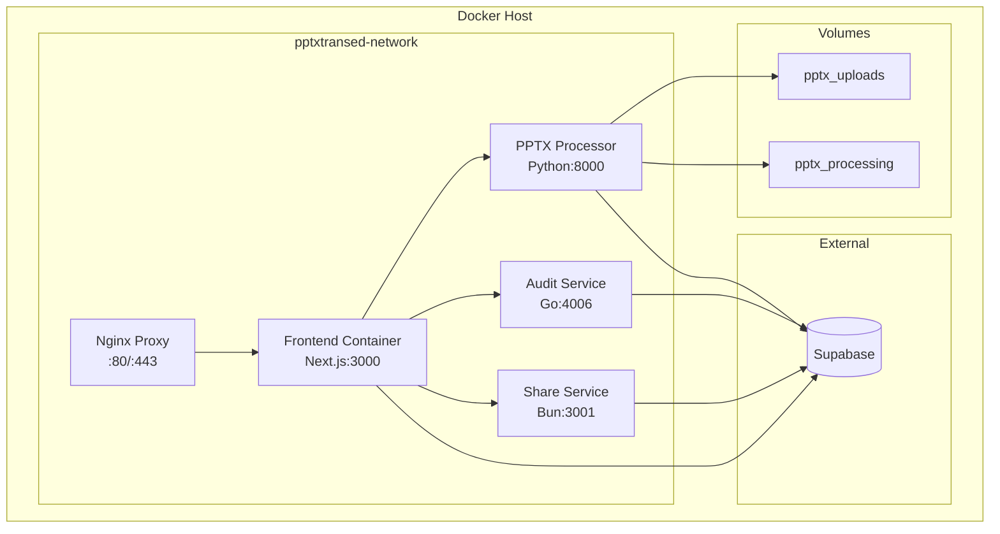

# Docker Deployment Guide

This guide covers Docker containerization strategies, Docker Compose configurations, container management, and best practices for deploying the PowerPoint Translator App using Docker.

## 🐳 Docker Overview

The application uses a **multi-container architecture** with Docker Compose orchestration:

- **Frontend Container**: Next.js application (Node.js 18 Alpine)
- **PPTX Processor Container**: Python FastAPI with LibreOffice (Python 3.11 Slim)
- **Audit Service Container**: Go application (Go 1.21 Alpine)
- **Share Service Container**: Bun.js application (Bun Alpine)
- **Reverse Proxy Container**: Nginx (Optional for production)

## 🏗️ Container Architecture



## 📦 Container Configurations

### Frontend Container (Next.js)

**Dockerfile:**
```dockerfile
# Multi-stage build for optimized production image
FROM node:18-alpine AS base

# Install dependencies only when needed
FROM base AS deps
RUN apk add --no-cache libc6-compat
WORKDIR /app

# Install dependencies
COPY package.json bun.lockb ./
RUN npm install -g bun && bun install --frozen-lockfile

# Rebuild the source code only when needed
FROM base AS builder
WORKDIR /app
COPY --from=deps /app/node_modules ./node_modules
COPY . .

# Build the application
RUN npm install -g bun && bun run build

# Production image, copy all the files and run next
FROM base AS runner
WORKDIR /app

ENV NODE_ENV production

# Add non-root user for security
RUN addgroup --system --gid 1001 nodejs
RUN adduser --system --uid 1001 nextjs

# Copy built application
COPY --from=builder /app/public ./public
COPY --from=builder --chown=nextjs:nodejs /app/.next/standalone ./
COPY --from=builder --chown=nextjs:nodejs /app/.next/static ./.next/static

USER nextjs

EXPOSE 3000

ENV PORT 3000
ENV HOSTNAME "0.0.0.0"

# Health check
HEALTHCHECK --interval=30s --timeout=10s --start-period=60s --retries=3 \
  CMD curl -f http://localhost:3000/api/health || exit 1

CMD ["node", "server.js"]
```

**Docker Compose Service:**
```yaml
frontend:
  build:
    context: .
    dockerfile: Dockerfile
    target: runner
  container_name: pptxtransed-frontend
  restart: unless-stopped
  ports:
    - "3000:3000"
  environment:
    - NODE_ENV=${NODE_ENV:-development}
    - NEXT_PUBLIC_SUPABASE_URL=${SUPABASE_URL}
    - NEXT_PUBLIC_SUPABASE_ANON_KEY=${SUPABASE_ANON_KEY}
    - NEXT_PUBLIC_AUDIT_SERVICE_URL=http://audit-service:4006
    - NEXT_PUBLIC_PPTX_PROCESSOR_URL=http://pptx-processor:8000
    - NEXT_PUBLIC_SHARE_SERVICE_URL=http://share-service:3001
  depends_on:
    audit-service:
      condition: service_healthy
    pptx-processor:
      condition: service_healthy
  networks:
    - pptxtransed-network
  healthcheck:
    test: ["CMD", "curl", "-f", "http://localhost:3000/api/health"]
    interval: 30s
    timeout: 10s
    retries: 3
    start_period: 60s
```

### PPTX Processor Container (Python)

**Dockerfile:**
```dockerfile
FROM python:3.11-slim

# Install system dependencies
RUN apt-get update && apt-get install -y \
    libreoffice \
    libreoffice-writer \
    libreoffice-calc \
    libreoffice-impress \
    curl \
    fonts-liberation \
    fonts-dejavu \
    && rm -rf /var/lib/apt/lists/*

# Set LibreOffice environment
ENV LIBREOFFICE_PATH=/usr/bin/soffice

WORKDIR /app

# Install Python dependencies
COPY requirements.txt .
RUN pip install --no-cache-dir -r requirements.txt

# Copy application code
COPY . .

# Create non-root user
RUN useradd --create-home --shell /bin/bash app
RUN chown -R app:app /app
USER app

# Create necessary directories
RUN mkdir -p /app/uploads /app/processing /app/logs

EXPOSE 8000

# Health check
HEALTHCHECK --interval=30s --timeout=15s --start-period=90s --retries=3 \
  CMD curl -f http://localhost:8000/v1/health || exit 1

CMD ["uvicorn", "app.main:app", "--host", "0.0.0.0", "--port", "8000"]
```

**Docker Compose Service:**
```yaml
pptx-processor:
  build:
    context: ./services/pptx-processor
    dockerfile: Dockerfile
  container_name: pptxtransed-pptx-processor
  restart: unless-stopped
  ports:
    - "8000:8000"
  environment:
    - API_ENV=${NODE_ENV:-development}
    - API_PORT=8000
    - API_HOST=0.0.0.0
    - LOG_LEVEL=${LOG_LEVEL:-debug}
    - LIBREOFFICE_PATH=/usr/bin/soffice
    - TEMP_UPLOAD_DIR=/app/uploads
    - TEMP_PROCESSING_DIR=/app/processing
    - SUPABASE_URL=${SUPABASE_URL}
    - SUPABASE_KEY=${SUPABASE_ANON_KEY}
    - CORS_ORIGIN=http://localhost:3000
  volumes:
    - pptx_uploads:/app/uploads
    - pptx_processing:/app/processing
  networks:
    - pptxtransed-network
  healthcheck:
    test: ["CMD", "curl", "-f", "http://localhost:8000/v1/health"]
    interval: 30s
    timeout: 15s
    retries: 3
    start_period: 90s
```

### Audit Service Container (Go)

**Dockerfile:**
```dockerfile
# Build stage
FROM golang:1.21-alpine AS builder

WORKDIR /app

# Install dependencies
COPY go.mod go.sum ./
RUN go mod download

# Copy source code
COPY . .

# Build the application
RUN CGO_ENABLED=0 GOOS=linux go build -a -installsuffix cgo -o main ./cmd/server

# Final stage
FROM alpine:latest

# Install ca-certificates for HTTPS requests
RUN apk --no-cache add ca-certificates wget

WORKDIR /root/

# Copy the binary from builder stage
COPY --from=builder /app/main .

# Create non-root user
RUN adduser -D -s /bin/sh appuser
USER appuser

EXPOSE 4006

# Health check
HEALTHCHECK --interval=30s --timeout=10s --start-period=40s --retries=3 \
  CMD wget --no-verbose --tries=1 --spider http://localhost:4006/health || exit 1

CMD ["./main"]
```

**Docker Compose Service:**
```yaml
audit-service:
  build:
    context: ./services/audit-service
    dockerfile: Dockerfile
  container_name: pptxtransed-audit-service
  restart: unless-stopped
  ports:
    - "4006:4006"
  environment:
    - PORT=4006
    - LOG_LEVEL=${LOG_LEVEL:-debug}
    - JWT_SECRET=${JWT_SECRET:-local-development-secret-key}
    - CORS_ORIGIN=http://localhost:3000
    - SUPABASE_URL=${SUPABASE_URL}
    - SUPABASE_SERVICE_ROLE_KEY=${SUPABASE_SERVICE_ROLE_KEY}
    - SUPABASE_JWT_SECRET=${SUPABASE_JWT_SECRET}
  networks:
    - pptxtransed-network
  healthcheck:
    test: ["CMD", "wget", "--spider", "http://localhost:4006/health"]
    interval: 30s
    timeout: 10s
    retries: 3
    start_period: 40s
```

### Share Service Container (Bun)

**Dockerfile:**
```dockerfile
FROM oven/bun:alpine

WORKDIR /app

# Copy package files
COPY package.json bun.lockb ./

# Install dependencies
RUN bun install --frozen-lockfile

# Copy source code
COPY . .

# Create non-root user
RUN adduser -D -s /bin/sh appuser
RUN chown -R appuser:appuser /app
USER appuser

EXPOSE 3001

# Health check
HEALTHCHECK --interval=30s --timeout=10s --start-period=30s --retries=3 \
  CMD curl -f http://localhost:3001/health || exit 1

CMD ["bun", "run", "start"]
```

**Docker Compose Service:**
```yaml
share-service:
  build:
    context: ./services/share-service
    dockerfile: Dockerfile
  container_name: pptxtransed-share-service
  restart: unless-stopped
  ports:
    - "3001:3001"
  environment:
    - PORT=3001
    - NODE_ENV=${NODE_ENV:-development}
    - CORS_ORIGIN=http://localhost:3000
    - SUPABASE_URL=${SUPABASE_URL}
    - SUPABASE_KEY=${SUPABASE_ANON_KEY}
    - SUPABASE_SERVICE_ROLE_KEY=${SUPABASE_SERVICE_ROLE_KEY}
  networks:
    - pptxtransed-network
  healthcheck:
    test: ["CMD", "curl", "-f", "http://localhost:3001/health"]
    interval: 30s
    timeout: 10s
    retries: 3
    start_period: 30s
```

## 📋 Complete Docker Compose Configurations

### Development Configuration

**docker-compose.yml:**
```yaml
version: '3.8'

services:
  frontend:
    build:
      context: .
      dockerfile: Dockerfile
      target: runner
    container_name: pptxtransed-frontend
    ports:
      - "3000:3000"
    environment:
      - NODE_ENV=development
      - NEXT_PUBLIC_SUPABASE_URL=${SUPABASE_URL}
      - NEXT_PUBLIC_SUPABASE_ANON_KEY=${SUPABASE_ANON_KEY}
      - NEXT_PUBLIC_AUDIT_SERVICE_URL=http://audit-service:4006
      - NEXT_PUBLIC_PPTX_PROCESSOR_URL=http://pptx-processor:8000
      - NEXT_PUBLIC_SHARE_SERVICE_URL=http://share-service:3001
    volumes:
      - ./:/app
      - /app/node_modules
      - /app/.next
    depends_on:
      audit-service:
        condition: service_healthy
      pptx-processor:
        condition: service_healthy
    networks:
      - pptxtransed-network
    restart: unless-stopped

  pptx-processor:
    build:
      context: ./services/pptx-processor
      dockerfile: Dockerfile
    container_name: pptxtransed-pptx-processor
    ports:
      - "8000:8000"
    environment:
      - API_ENV=development
      - API_PORT=8000
      - LOG_LEVEL=debug
      - SUPABASE_URL=${SUPABASE_URL}
      - SUPABASE_KEY=${SUPABASE_ANON_KEY}
    volumes:
      - pptx_uploads:/app/uploads
      - pptx_processing:/app/processing
      - ./services/pptx-processor:/app
    networks:
      - pptxtransed-network
    restart: unless-stopped
    healthcheck:
      test: ["CMD", "curl", "-f", "http://localhost:8000/v1/health"]
      interval: 30s
      timeout: 15s
      retries: 3
      start_period: 90s

  audit-service:
    build:
      context: ./services/audit-service
      dockerfile: Dockerfile
    container_name: pptxtransed-audit-service
    ports:
      - "4006:4006"
    environment:
      - PORT=4006
      - LOG_LEVEL=debug
      - JWT_SECRET=${JWT_SECRET}
      - SUPABASE_URL=${SUPABASE_URL}
      - SUPABASE_SERVICE_ROLE_KEY=${SUPABASE_SERVICE_ROLE_KEY}
    volumes:
      - ./services/audit-service:/app
    networks:
      - pptxtransed-network
    restart: unless-stopped
    healthcheck:
      test: ["CMD", "wget", "--spider", "http://localhost:4006/health"]
      interval: 30s
      timeout: 10s
      retries: 3
      start_period: 40s

  share-service:
    build:
      context: ./services/share-service
      dockerfile: Dockerfile
    container_name: pptxtransed-share-service
    ports:
      - "3001:3001"
    environment:
      - PORT=3001
      - NODE_ENV=development
      - SUPABASE_URL=${SUPABASE_URL}
      - SUPABASE_KEY=${SUPABASE_ANON_KEY}
    volumes:
      - ./services/share-service:/app
    networks:
      - pptxtransed-network
    restart: unless-stopped

networks:
  pptxtransed-network:
    driver: bridge

volumes:
  pptx_uploads:
    name: pptxtransed_pptx_uploads
  pptx_processing:
    name: pptxtransed_pptx_processing
```

### Production Configuration

**docker-compose.prod.yml:**
```yaml
version: '3.8'

services:
  nginx:
    image: nginx:alpine
    container_name: pptxtransed-nginx
    ports:
      - "80:80"
      - "443:443"
    volumes:
      - ./nginx/nginx.conf:/etc/nginx/nginx.conf:ro
      - ./nginx/ssl:/etc/nginx/ssl:ro
      - nginx_logs:/var/log/nginx
    depends_on:
      - frontend
    networks:
      - pptxtransed-network
    restart: unless-stopped

  frontend:
    image: pptxtransed/frontend:${VERSION:-latest}
    deploy:
      replicas: 2
      resources:
        limits:
          cpus: '1.0'
          memory: 1G
        reservations:
          cpus: '0.5'
          memory: 512M
    environment:
      - NODE_ENV=production
      - NEXT_PUBLIC_SUPABASE_URL=${SUPABASE_URL}
      - NEXT_PUBLIC_SUPABASE_ANON_KEY=${SUPABASE_ANON_KEY}
    networks:
      - pptxtransed-network
    restart: unless-stopped

  pptx-processor:
    image: pptxtransed/pptx-processor:${VERSION:-latest}
    deploy:
      replicas: 3
      resources:
        limits:
          cpus: '2.0'
          memory: 3G
        reservations:
          cpus: '1.0'
          memory: 1.5G
    environment:
      - API_ENV=production
      - LOG_LEVEL=info
      - SUPABASE_URL=${SUPABASE_URL}
      - SUPABASE_KEY=${SUPABASE_SERVICE_ROLE_KEY}
    volumes:
      - pptx_uploads:/app/uploads
      - pptx_processing:/app/processing
    networks:
      - pptxtransed-network
    restart: unless-stopped

  audit-service:
    image: pptxtransed/audit-service:${VERSION:-latest}
    deploy:
      replicas: 1
      resources:
        limits:
          cpus: '0.5'
          memory: 512M
    environment:
      - PORT=4006
      - LOG_LEVEL=info
      - JWT_SECRET=${JWT_SECRET}
      - SUPABASE_URL=${SUPABASE_URL}
      - SUPABASE_SERVICE_ROLE_KEY=${SUPABASE_SERVICE_ROLE_KEY}
    networks:
      - pptxtransed-network
    restart: unless-stopped

  share-service:
    image: pptxtransed/share-service:${VERSION:-latest}
    deploy:
      replicas: 1
      resources:
        limits:
          cpus: '0.5'
          memory: 512M
    environment:
      - PORT=3001
      - NODE_ENV=production
      - SUPABASE_URL=${SUPABASE_URL}
      - SUPABASE_KEY=${SUPABASE_ANON_KEY}
    networks:
      - pptxtransed-network
    restart: unless-stopped

networks:
  pptxtransed-network:
    driver: bridge
    ipam:
      config:
        - subnet: 172.20.0.0/16

volumes:
  pptx_uploads:
    driver: local
    driver_opts:
      type: none
      device: /opt/pptxtransed/uploads
      o: bind
  pptx_processing:
    driver: local
    driver_opts:
      type: none
      device: /opt/pptxtransed/processing
      o: bind
  nginx_logs:
    driver: local
```

## 🔧 Container Management Scripts

### Build Script

**scripts/build.sh:**
```bash
#!/bin/bash
set -e

VERSION=${1:-latest}
REGISTRY=${2:-pptxtransed}

echo "Building Docker images version: $VERSION"

# Build all images
docker build -t $REGISTRY/frontend:$VERSION .
docker build -t $REGISTRY/pptx-processor:$VERSION ./services/pptx-processor
docker build -t $REGISTRY/audit-service:$VERSION ./services/audit-service
docker build -t $REGISTRY/share-service:$VERSION ./services/share-service

# Tag as latest if version specified
if [ "$VERSION" != "latest" ]; then
    docker tag $REGISTRY/frontend:$VERSION $REGISTRY/frontend:latest
    docker tag $REGISTRY/pptx-processor:$VERSION $REGISTRY/pptx-processor:latest
    docker tag $REGISTRY/audit-service:$VERSION $REGISTRY/audit-service:latest
    docker tag $REGISTRY/share-service:$VERSION $REGISTRY/share-service:latest
fi

echo "Build completed successfully!"
```

### Docker Manager Script

**scripts/docker-manager.js:**
```javascript
#!/usr/bin/env node

const { execSync } = require('child_process');
const fs = require('fs');
const path = require('path');

class DockerManager {
  constructor() {
    this.composeFile = process.env.NODE_ENV === 'production' 
      ? 'docker-compose.prod.yml' 
      : 'docker-compose.yml';
  }

  execute(command) {
    try {
      return execSync(command, { stdio: 'inherit' });
    } catch (error) {
      console.error(`Command failed: ${command}`);
      process.exit(1);
    }
  }

  start() {
    console.log('🚀 Starting all services...');
    this.execute(`docker-compose -f ${this.composeFile} up -d`);
    console.log('✅ All services started');
  }

  stop() {
    console.log('🛑 Stopping all services...');
    this.execute(`docker-compose -f ${this.composeFile} down`);
    console.log('✅ All services stopped');
  }

  restart() {
    console.log('🔄 Restarting all services...');
    this.stop();
    this.start();
  }

  rebuild(service = '') {
    console.log(`🔨 Rebuilding ${service || 'all services'}...`);
    const buildCmd = service 
      ? `docker-compose -f ${this.composeFile} up -d --build ${service}`
      : `docker-compose -f ${this.composeFile} up -d --build`;
    this.execute(buildCmd);
    console.log('✅ Rebuild completed');
  }

  logs(service = '', follow = false) {
    const followFlag = follow ? '-f' : '';
    const logCmd = service 
      ? `docker-compose -f ${this.composeFile} logs ${followFlag} ${service}`
      : `docker-compose -f ${this.composeFile} logs ${followFlag}`;
    this.execute(logCmd);
  }

  status() {
    console.log('📊 Service Status:');
    this.execute(`docker-compose -f ${this.composeFile} ps`);
  }

  shell(service) {
    if (!service) {
      console.error('❌ Service name required for shell access');
      process.exit(1);
    }
    console.log(`🐚 Opening shell for ${service}...`);
    this.execute(`docker-compose -f ${this.composeFile} exec ${service} /bin/sh`);
  }

  cleanup() {
    console.log('🧹 Cleaning up Docker resources...');
    this.execute('docker system prune -f');
    this.execute('docker volume prune -f');
    console.log('✅ Cleanup completed');
  }

  backup() {
    console.log('💾 Creating backup...');
    const date = new Date().toISOString().split('T')[0];
    const backupDir = `./backups/${date}`;
    
    if (!fs.existsSync(backupDir)) {
      fs.mkdirSync(backupDir, { recursive: true });
    }

    // Backup volumes
    this.execute(`docker run --rm -v pptxtransed_pptx_uploads:/source:ro -v ${path.resolve(backupDir)}:/backup alpine tar czf /backup/uploads.tar.gz -C /source .`);
    this.execute(`docker run --rm -v pptxtransed_pptx_processing:/source:ro -v ${path.resolve(backupDir)}:/backup alpine tar czf /backup/processing.tar.gz -C /source .`);
    
    console.log(`✅ Backup created in ${backupDir}`);
  }

  health() {
    console.log('🏥 Health Check:');
    const services = ['frontend', 'pptx-processor', 'audit-service', 'share-service'];
    
    services.forEach(service => {
      try {
        execSync(`docker-compose -f ${this.composeFile} exec -T ${service} curl -f http://localhost:$(docker port pptxtransed-${service} | cut -d: -f2)/health`, { stdio: 'pipe' });
        console.log(`✅ ${service}: Healthy`);
      } catch (error) {
        console.log(`❌ ${service}: Unhealthy`);
      }
    });
  }
}

// CLI Interface
const manager = new DockerManager();
const command = process.argv[2];
const args = process.argv.slice(3);

switch (command) {
  case 'start':
    manager.start();
    break;
  case 'stop':
    manager.stop();
    break;
  case 'restart':
    manager.restart();
    break;
  case 'rebuild':
    manager.rebuild(args[0]);
    break;
  case 'logs':
    manager.logs(args[0], args.includes('-f') || args.includes('--follow'));
    break;
  case 'status':
    manager.status();
    break;
  case 'shell':
    manager.shell(args[0]);
    break;
  case 'cleanup':
    manager.cleanup();
    break;
  case 'backup':
    manager.backup();
    break;
  case 'health':
    manager.health();
    break;
  default:
    console.log(`
Usage: node scripts/docker-manager.js <command> [options]

Commands:
  start                 Start all services
  stop                  Stop all services
  restart               Restart all services
  rebuild [service]     Rebuild and restart service(s)
  logs [service] [-f]   View logs (optionally follow)
  status                Show service status
  shell <service>       Open shell in service container
  cleanup               Clean up Docker resources
  backup                Create backup of volumes
  health                Check service health

Examples:
  node scripts/docker-manager.js start
  node scripts/docker-manager.js logs frontend -f
  node scripts/docker-manager.js rebuild pptx-processor
  node scripts/docker-manager.js shell audit-service
    `);
}
```

## 📊 Container Monitoring

### Resource Monitoring Script

**scripts/monitor.sh:**
```bash
#!/bin/bash

echo "🔍 Docker Container Monitoring"
echo "================================"

# Container status
echo "📊 Container Status:"
docker-compose ps

echo ""
echo "💾 Resource Usage:"
docker stats --no-stream --format "table {{.Name}}\t{{.CPUPerc}}\t{{.MemUsage}}\t{{.NetIO}}\t{{.BlockIO}}"

echo ""
echo "📦 Volume Usage:"
docker system df -v | grep -E "(VOLUME NAME|pptxtransed)"

echo ""
echo "🌐 Network Status:"
docker network ls | grep pptxtransed

echo ""
echo "🏥 Health Status:"
for service in frontend pptx-processor audit-service share-service; do
    health=$(docker inspect --format='{{.State.Health.Status}}' pptxtransed-$service 2>/dev/null || echo "no health check")
    echo "$service: $health"
done
```

## 🔧 Troubleshooting

### Common Issues and Solutions

**Container won't start:**
```bash
# Check logs
docker-compose logs <service-name>

# Check container status
docker-compose ps

# Rebuild container
docker-compose up -d --build <service-name>
```

**Out of disk space:**
```bash
# Clean up unused resources
docker system prune -a -f

# Remove unused volumes
docker volume prune -f

# Check disk usage
docker system df
```

**Network connectivity issues:**
```bash
# Recreate network
docker-compose down
docker network prune -f
docker-compose up -d

# Check network connectivity
docker-compose exec frontend ping pptx-processor
```

**Performance issues:**
```bash
# Monitor resource usage
docker stats

# Check service health
docker-compose exec <service> curl -f http://localhost:<port>/health

# Scale up services
docker-compose up -d --scale pptx-processor=3
```

### Debug Mode

**Enable debug logging:**
```bash
# Set debug environment
export LOG_LEVEL=debug

# Restart with verbose logging
docker-compose down
docker-compose up -d

# Follow logs
docker-compose logs -f
```

---

**Last Updated**: Current  
**Version**: 1.0.0  
**Next Review**: Next Major Release 