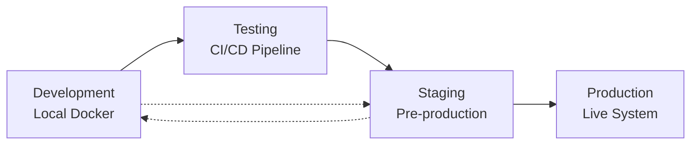

# Environment Management

This guide covers environment configuration, management strategies, and deployment patterns for different environments in the PowerPoint Translator App.

## 🌍 Environment Overview

The application supports multiple deployment environments with distinct configurations:

- **Development**: Local development with hot reloading and debug features
- **Staging**: Production-like environment for testing and QA
- **Production**: Live environment with optimized performance and security
- **Testing**: Automated testing environment for CI/CD pipelines



## ⚙️ Environment Configuration

### Configuration Hierarchy

```
Environment Configuration Priority (highest to lowest):
1. Command line arguments
2. Environment variables
3. .env files (.env.local > .env.production > .env.development > .env)
4. Default values in code
```

### Base Configuration (.env.example)

```bash
# Application Environment
NODE_ENV=development
VERSION=1.0.0
PORT=3000

# Supabase Configuration (Required)
SUPABASE_URL=https://your-project.supabase.co
SUPABASE_ANON_KEY=your-anon-key
SUPABASE_SERVICE_ROLE_KEY=your-service-role-key
SUPABASE_JWT_SECRET=your-jwt-secret

# Security (Required)
JWT_SECRET=your-super-secure-jwt-secret-min-32-chars
ENCRYPTION_KEY=your-32-character-encryption-key

# Service URLs (Auto-configured in Docker)
NEXT_PUBLIC_AUDIT_SERVICE_URL=http://audit-service:4006
NEXT_PUBLIC_PPTX_PROCESSOR_URL=http://pptx-processor:8000
NEXT_PUBLIC_SHARE_SERVICE_URL=http://share-service:3001

# File Upload Limits
MAX_UPLOAD_SIZE=52428800  # 50MB
ALLOWED_FILE_TYPES=.pptx,.ppt

# Performance Settings
MAX_CONCURRENT_JOBS=10
WORKER_TIMEOUT=300
CACHE_TTL=3600

# Logging
LOG_LEVEL=info
LOG_FORMAT=json

# Feature Flags
ENABLE_SHARING=true
ENABLE_COMMENTS=true
ENABLE_EXPORT=true
ENABLE_AUDIT=true
ENABLE_ANALYTICS=false

# Rate Limiting
RATE_LIMIT_WINDOW=60000  # 1 minute
RATE_LIMIT_MAX=100       # requests per window

# CORS
CORS_ORIGIN=http://localhost:3000
```

## 🏠 Development Environment

### Development Configuration (.env.development)

```bash
# Development Environment
NODE_ENV=development
LOG_LEVEL=debug
LOG_FORMAT=pretty

# Hot Reloading
NEXT_DEV=true
FAST_REFRESH=true

# Debug Features
ENABLE_DEBUGGER=true
SHOW_PERFORMANCE_METRICS=true
VERBOSE_LOGGING=true

# Development URLs (Docker internal)
NEXT_PUBLIC_AUDIT_SERVICE_URL=http://audit-service:4006
NEXT_PUBLIC_PPTX_PROCESSOR_URL=http://pptx-processor:8000
NEXT_PUBLIC_SHARE_SERVICE_URL=http://share-service:3001

# Relaxed Security for Development
JWT_SECRET=development-secret-key-not-for-production
ENCRYPTION_KEY=dev-encryption-key-32-characters

# Development Features
ENABLE_MOCK_DATA=true
SKIP_AUTH_IN_DEVELOPMENT=false
ENABLE_TEST_ROUTES=true

# Performance (Reduced for Development)
MAX_CONCURRENT_JOBS=3
WORKER_TIMEOUT=120
CACHE_TTL=300  # 5 minutes

# CORS (Allow all origins in development)
CORS_ORIGIN=*
```

### Development Docker Override

**docker-compose.dev.yml:**
```yaml
version: '3.8'

services:
  frontend:
    build:
      target: development
    volumes:
      - ./:/app
      - /app/node_modules
      - /app/.next
    environment:
      - NODE_ENV=development
      - NEXT_DEV=true
    ports:
      - "3000:3000"
      - "9229:9229"  # Debug port

  pptx-processor:
    volumes:
      - ./services/pptx-processor:/app
    environment:
      - API_ENV=development
      - LOG_LEVEL=debug
      - RELOAD=true
    ports:
      - "8001:8000"  # Debug port

  audit-service:
    volumes:
      - ./services/audit-service:/app
    environment:
      - GO_ENV=development
      - LOG_LEVEL=debug
      - HOT_RELOAD=true

  share-service:
    volumes:
      - ./services/share-service:/app
    environment:
      - NODE_ENV=development
      - LOG_LEVEL=debug
      - BUN_ENV=development
```

### Development Setup Script

**scripts/setup-dev.sh:**
```bash
#!/bin/bash
set -e

echo "🛠️ Setting up development environment..."

# Create .env.development if it doesn't exist
if [ ! -f .env.development ]; then
    echo "📝 Creating .env.development from template..."
    cp .env.example .env.development
    
    # Generate development secrets
    JWT_SECRET=$(openssl rand -hex 32)
    ENCRYPTION_KEY=$(openssl rand -hex 32)
    
    # Update development environment
    sed -i "s/your-super-secure-jwt-secret-min-32-chars/$JWT_SECRET/" .env.development
    sed -i "s/your-32-character-encryption-key/$ENCRYPTION_KEY/" .env.development
    sed -i "s/NODE_ENV=development/NODE_ENV=development/" .env.development
    sed -i "s/LOG_LEVEL=info/LOG_LEVEL=debug/" .env.development
fi

# Install dependencies
echo "📦 Installing dependencies..."
bun install

# Install service dependencies
echo "📦 Installing service dependencies..."
cd services/pptx-processor && pip install -r requirements.txt && cd ../..
cd services/audit-service && go mod download && cd ../..
cd services/share-service && bun install && cd ../..

# Start development environment
echo "🚀 Starting development environment..."
docker-compose -f docker-compose.yml -f docker-compose.dev.yml up -d

echo "✅ Development environment ready!"
echo "🌐 Frontend: http://localhost:3000"
echo "🔧 PPTX Processor: http://localhost:8000"
echo "📊 Audit Service: http://localhost:4006"
echo "🤝 Share Service: http://localhost:3001"
```

## 🧪 Testing Environment

### Testing Configuration (.env.test)

```bash
# Testing Environment
NODE_ENV=test
LOG_LEVEL=error
LOG_FORMAT=json

# Test Database
SUPABASE_URL=https://test-project.supabase.co
SUPABASE_ANON_KEY=test-anon-key
SUPABASE_SERVICE_ROLE_KEY=test-service-role-key

# Test Security
JWT_SECRET=test-secret-key-for-testing-only
ENCRYPTION_KEY=test-encryption-key-32-characters

# Disable Features for Testing
ENABLE_ANALYTICS=false
ENABLE_EXTERNAL_SERVICES=false
ENABLE_RATE_LIMITING=false

# Test-specific Settings
TEST_TIMEOUT=30000
PARALLEL_TESTS=true
COVERAGE_ENABLED=true

# Mock Services
USE_MOCK_SUPABASE=true
USE_MOCK_LIBREOFFICE=true
MOCK_DATA_SEED=12345
```

### CI/CD Testing Configuration

**docker-compose.test.yml:**
```yaml
version: '3.8'

services:
  frontend-test:
    build:
      context: .
      target: test
    environment:
      - NODE_ENV=test
      - CI=true
    volumes:
      - ./coverage:/app/coverage
    command: bun test --coverage

  pptx-processor-test:
    build:
      context: ./services/pptx-processor
      target: test
    environment:
      - PYTHONPATH=/app
      - TESTING=true
    volumes:
      - ./services/pptx-processor/coverage:/app/coverage
    command: python -m pytest --cov=app --cov-report=xml

  audit-service-test:
    build:
      context: ./services/audit-service
      target: test
    environment:
      - GO_ENV=test
    volumes:
      - ./services/audit-service/coverage:/app/coverage
    command: go test -v -race -coverprofile=coverage.out ./...

  share-service-test:
    build:
      context: ./services/share-service
      target: test
    environment:
      - NODE_ENV=test
    volumes:
      - ./services/share-service/coverage:/app/coverage
    command: bun test --coverage
```

## 🎭 Staging Environment

### Staging Configuration (.env.staging)

```bash
# Staging Environment
NODE_ENV=staging
LOG_LEVEL=info
LOG_FORMAT=json

# Staging Supabase (Separate from Production)
SUPABASE_URL=https://staging-project.supabase.co
SUPABASE_ANON_KEY=staging-anon-key
SUPABASE_SERVICE_ROLE_KEY=staging-service-role-key
SUPABASE_JWT_SECRET=staging-jwt-secret

# Security (Production-like but with staging keys)
JWT_SECRET=staging-jwt-secret-32-characters-min
ENCRYPTION_KEY=staging-encryption-key-32-chars

# Staging URLs
FRONTEND_URL=https://staging.pptxtranslator.com
NEXT_PUBLIC_AUDIT_SERVICE_URL=https://staging-api.pptxtranslator.com/audit
NEXT_PUBLIC_PPTX_PROCESSOR_URL=https://staging-api.pptxtranslator.com/pptx
NEXT_PUBLIC_SHARE_SERVICE_URL=https://staging-api.pptxtranslator.com/share

# Production-like Performance
MAX_CONCURRENT_JOBS=8
WORKER_TIMEOUT=300
CACHE_TTL=3600

# Staging Features
ENABLE_ANALYTICS=true
ENABLE_ERROR_REPORTING=true
ENABLE_PERFORMANCE_MONITORING=true

# Reduced Rate Limits for Testing
RATE_LIMIT_MAX=200

# CORS
CORS_ORIGIN=https://staging.pptxtranslator.com,https://staging-admin.pptxtranslator.com
```

### Staging Deployment

**docker-compose.staging.yml:**
```yaml
version: '3.8'

services:
  nginx:
    image: nginx:alpine
    ports:
      - "80:80"
      - "443:443"
    volumes:
      - ./nginx/staging.conf:/etc/nginx/nginx.conf:ro
      - ./nginx/ssl/staging:/etc/nginx/ssl:ro
    depends_on:
      - frontend
    networks:
      - pptxtransed-staging-network

  frontend:
    image: pptxtransed/frontend:staging
    deploy:
      replicas: 2
      resources:
        limits:
          cpus: '0.8'
          memory: 800M
    environment:
      - NODE_ENV=staging
    env_file:
      - .env.staging
    networks:
      - pptxtransed-staging-network

  pptx-processor:
    image: pptxtransed/pptx-processor:staging
    deploy:
      replicas: 2
      resources:
        limits:
          cpus: '1.5'
          memory: 2G
    environment:
      - API_ENV=staging
    env_file:
      - .env.staging
    volumes:
      - staging_uploads:/app/uploads
      - staging_processing:/app/processing
    networks:
      - pptxtransed-staging-network

networks:
  pptxtransed-staging-network:
    driver: bridge

volumes:
  staging_uploads:
  staging_processing:
```

## 🚀 Production Environment

### Production Configuration (.env.production)

```bash
# Production Environment
NODE_ENV=production
LOG_LEVEL=warn
LOG_FORMAT=json

# Production Supabase
SUPABASE_URL=https://prod-project.supabase.co
SUPABASE_ANON_KEY=prod-anon-key
SUPABASE_SERVICE_ROLE_KEY=prod-service-role-key
SUPABASE_JWT_SECRET=prod-jwt-secret

# Security (Strong Production Keys)
JWT_SECRET=production-jwt-secret-very-secure-32-chars-minimum
ENCRYPTION_KEY=production-encryption-key-32-chars

# Production URLs
FRONTEND_URL=https://app.pptxtranslator.com
NEXT_PUBLIC_AUDIT_SERVICE_URL=https://api.pptxtranslator.com/audit
NEXT_PUBLIC_PPTX_PROCESSOR_URL=https://api.pptxtranslator.com/pptx
NEXT_PUBLIC_SHARE_SERVICE_URL=https://api.pptxtranslator.com/share

# Optimized Performance
MAX_CONCURRENT_JOBS=15
WORKER_TIMEOUT=600
CACHE_TTL=7200  # 2 hours

# Production Features
ENABLE_ANALYTICS=true
ENABLE_ERROR_REPORTING=true
ENABLE_PERFORMANCE_MONITORING=true
ENABLE_SECURITY_MONITORING=true

# Production Rate Limits
RATE_LIMIT_MAX=300
RATE_LIMIT_BURST=50

# Strict CORS
CORS_ORIGIN=https://app.pptxtranslator.com

# Monitoring
ENABLE_METRICS=true
METRICS_PORT=9090
HEALTH_CHECK_INTERVAL=30

# Error Handling
SENTRY_DSN=your-sentry-dsn
ERROR_REPORTING_LEVEL=error
```

### Production Security

**secrets/production.env:**
```bash
# Stored separately and encrypted
JWT_SECRET_FILE=/run/secrets/jwt_secret
ENCRYPTION_KEY_FILE=/run/secrets/encryption_key
SUPABASE_SERVICE_ROLE_KEY_FILE=/run/secrets/supabase_service_key
SENTRY_DSN_FILE=/run/secrets/sentry_dsn
```

## 🔄 Environment Switching

### Environment Manager Script

**scripts/env-manager.js:**
```javascript
#!/usr/bin/env node

const fs = require('fs');
const path = require('path');

class EnvironmentManager {
  constructor() {
    this.environments = ['development', 'test', 'staging', 'production'];
    this.currentEnvFile = '.env';
  }

  switch(targetEnv) {
    if (!this.environments.includes(targetEnv)) {
      console.error(`❌ Invalid environment: ${targetEnv}`);
      console.log(`Available environments: ${this.environments.join(', ')}`);
      process.exit(1);
    }

    const sourceFile = `.env.${targetEnv}`;
    
    if (!fs.existsSync(sourceFile)) {
      console.error(`❌ Environment file not found: ${sourceFile}`);
      process.exit(1);
    }

    // Backup current .env
    if (fs.existsSync(this.currentEnvFile)) {
      const backupFile = `.env.backup.${Date.now()}`;
      fs.copyFileSync(this.currentEnvFile, backupFile);
      console.log(`📦 Backed up current .env to ${backupFile}`);
    }

    // Copy target environment
    fs.copyFileSync(sourceFile, this.currentEnvFile);
    console.log(`✅ Switched to ${targetEnv} environment`);
    
    // Show current environment
    this.status();
  }

  status() {
    if (!fs.existsSync(this.currentEnvFile)) {
      console.log('❌ No .env file found');
      return;
    }

    const envContent = fs.readFileSync(this.currentEnvFile, 'utf-8');
    const nodeEnvMatch = envContent.match(/NODE_ENV=(.+)/);
    const currentEnv = nodeEnvMatch ? nodeEnvMatch[1] : 'unknown';
    
    console.log(`🌍 Current environment: ${currentEnv}`);
    
    // Show key configurations
    const configs = [
      'LOG_LEVEL',
      'FRONTEND_URL',
      'ENABLE_ANALYTICS',
      'MAX_CONCURRENT_JOBS'
    ];
    
    console.log('\n📋 Key configurations:');
    configs.forEach(config => {
      const match = envContent.match(new RegExp(`${config}=(.+)`));
      if (match) {
        console.log(`  ${config}: ${match[1]}`);
      }
    });
  }

  validate(env = null) {
    const targetFile = env ? `.env.${env}` : this.currentEnvFile;
    
    if (!fs.existsSync(targetFile)) {
      console.error(`❌ Environment file not found: ${targetFile}`);
      return false;
    }

    const envContent = fs.readFileSync(targetFile, 'utf-8');
    const requiredVars = [
      'NODE_ENV',
      'SUPABASE_URL',
      'SUPABASE_ANON_KEY',
      'JWT_SECRET'
    ];

    const missing = [];
    requiredVars.forEach(varName => {
      if (!envContent.includes(`${varName}=`) || 
          envContent.match(new RegExp(`${varName}=\\s*$`))) {
        missing.push(varName);
      }
    });

    if (missing.length > 0) {
      console.error(`❌ Missing required variables in ${targetFile}:`);
      missing.forEach(varName => console.error(`  - ${varName}`));
      return false;
    }

    console.log(`✅ Environment ${env || 'current'} is valid`);
    return true;
  }

  list() {
    console.log('🌍 Available environments:');
    this.environments.forEach(env => {
      const file = `.env.${env}`;
      const exists = fs.existsSync(file);
      const status = exists ? '✅' : '❌';
      console.log(`  ${status} ${env} (${file})`);
    });
  }

  create(env) {
    if (!this.environments.includes(env)) {
      console.error(`❌ Invalid environment: ${env}`);
      return;
    }

    const targetFile = `.env.${env}`;
    
    if (fs.existsSync(targetFile)) {
      console.error(`❌ Environment file already exists: ${targetFile}`);
      return;
    }

    // Copy from example or current .env
    const sourceFile = fs.existsSync('.env.example') ? '.env.example' : this.currentEnvFile;
    
    if (!fs.existsSync(sourceFile)) {
      console.error('❌ No source file found (.env.example or .env)');
      return;
    }

    fs.copyFileSync(sourceFile, targetFile);
    
    // Update NODE_ENV
    let content = fs.readFileSync(targetFile, 'utf-8');
    content = content.replace(/NODE_ENV=.+/, `NODE_ENV=${env}`);
    fs.writeFileSync(targetFile, content);
    
    console.log(`✅ Created ${targetFile}`);
    console.log(`📝 Please update ${targetFile} with environment-specific values`);
  }
}

// CLI Interface
const manager = new EnvironmentManager();
const command = process.argv[2];
const args = process.argv.slice(3);

switch (command) {
  case 'switch':
    if (!args[0]) {
      console.error('❌ Environment name required');
      console.log('Usage: node scripts/env-manager.js switch <environment>');
      process.exit(1);
    }
    manager.switch(args[0]);
    break;
  case 'status':
    manager.status();
    break;
  case 'validate':
    manager.validate(args[0]);
    break;
  case 'list':
    manager.list();
    break;
  case 'create':
    if (!args[0]) {
      console.error('❌ Environment name required');
      process.exit(1);
    }
    manager.create(args[0]);
    break;
  default:
    console.log(`
Usage: node scripts/env-manager.js <command> [options]

Commands:
  switch <env>     Switch to specified environment
  status           Show current environment status
  validate [env]   Validate environment configuration
  list             List all available environments
  create <env>     Create new environment file

Examples:
  node scripts/env-manager.js switch production
  node scripts/env-manager.js validate staging
  node scripts/env-manager.js create custom-env
    `);
}
```

## 🔐 Secret Management

### Development Secrets

```bash
# Generate development secrets
npm run generate-secrets

# Store in .env.development
JWT_SECRET=$(openssl rand -hex 32)
ENCRYPTION_KEY=$(openssl rand -hex 32)
```

### Production Secrets

**Using Docker Secrets:**
```yaml
# docker-compose.prod.yml
secrets:
  jwt_secret:
    external: true
  encryption_key:
    external: true
  supabase_service_key:
    external: true

services:
  frontend:
    secrets:
      - jwt_secret
      - encryption_key
    environment:
      - JWT_SECRET_FILE=/run/secrets/jwt_secret
      - ENCRYPTION_KEY_FILE=/run/secrets/encryption_key
```

**Create Production Secrets:**
```bash
# Create secrets
echo "your-production-jwt-secret" | docker secret create jwt_secret -
echo "your-production-encryption-key" | docker secret create encryption_key -
echo "your-supabase-service-key" | docker secret create supabase_service_key -
```

## 📋 Environment Checklist

### Pre-deployment Checklist

- [ ] Environment variables validated
- [ ] Secrets properly configured
- [ ] Database connections tested
- [ ] Service health checks passing
- [ ] SSL certificates installed (staging/production)
- [ ] Monitoring configured
- [ ] Backup strategy implemented
- [ ] Error reporting configured
- [ ] Performance monitoring enabled
- [ ] Security scanning completed

### Environment-specific Checks

**Development:**
- [ ] Hot reloading working
- [ ] Debug endpoints accessible
- [ ] Test data populated
- [ ] All services running locally

**Staging:**
- [ ] Production-like data
- [ ] SSL certificate valid
- [ ] Performance testing completed
- [ ] User acceptance testing passed

**Production:**
- [ ] All secrets rotated
- [ ] Monitoring alerts configured
- [ ] Backup verified
- [ ] Rollback plan tested
- [ ] Performance benchmarks met

---

**Last Updated**: Current  
**Version**: 1.0.0  
**Next Review**: Quarterly Environment Review 