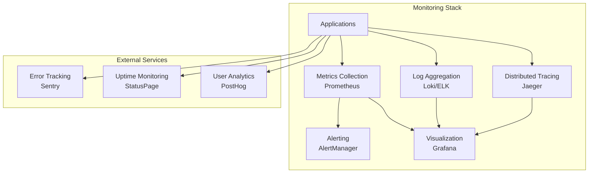

# Monitoring & Logging Guide

This guide covers comprehensive monitoring, logging, alerting, and observability strategies for the PowerPoint Translator App in production environments.

## 📊 Monitoring Overview

The application implements a **multi-layer monitoring strategy**:

- **Infrastructure Monitoring**: Docker containers, system resources, network
- **Application Monitoring**: Service health, performance metrics, business metrics
- **User Experience Monitoring**: Frontend performance, user sessions, errors
- **Security Monitoring**: Audit logs, security events, threat detection
- **Business Monitoring**: Usage analytics, conversion metrics, feature adoption



## 🏥 Health Monitoring

### Service Health Checks

**Standardized Health Check Response:**
```typescript
interface HealthResponse {
  status: 'healthy' | 'degraded' | 'unhealthy';
  timestamp: string;
  uptime: number;
  version: string;
  environment: string;
  services: {
    [serviceName: string]: {
      status: 'healthy' | 'unhealthy';
      responseTime?: number;
      lastCheck?: string;
      error?: string;
    };
  };
  metrics: {
    memory: {
      used: number;
      total: number;
      percentage: number;
    };
    cpu: {
      usage: number;
      load: number[];
    };
    disk: {
      used: number;
      total: number;
      percentage: number;
    };
    requests: {
      total: number;
      errorsLast5m: number;
      avgResponseTime: number;
    };
  };
}
```

**Frontend Health Check Implementation:**
```typescript
// app/api/health/route.ts
import { NextResponse } from 'next/server';
import { checkDatabaseConnection, checkExternalServices } from '@/lib/health';

export async function GET() {
  const startTime = Date.now();
  
  try {
    // Check dependencies
    const [dbStatus, servicesStatus] = await Promise.allSettled([
      checkDatabaseConnection(),
      checkExternalServices()
    ]);
    
    const health: HealthResponse = {
      status: 'healthy',
      timestamp: new Date().toISOString(),
      uptime: process.uptime(),
      version: process.env.npm_package_version || '1.0.0',
      environment: process.env.NODE_ENV || 'development',
      services: {
        database: {
          status: dbStatus.status === 'fulfilled' ? 'healthy' : 'unhealthy',
          responseTime: dbStatus.status === 'fulfilled' ? dbStatus.value.responseTime : undefined,
          error: dbStatus.status === 'rejected' ? dbStatus.reason.message : undefined
        },
        external: {
          status: servicesStatus.status === 'fulfilled' ? 'healthy' : 'unhealthy',
          responseTime: servicesStatus.status === 'fulfilled' ? servicesStatus.value.responseTime : undefined,
          error: servicesStatus.status === 'rejected' ? servicesStatus.reason.message : undefined
        }
      },
      metrics: await getSystemMetrics()
    };
    
    // Determine overall status
    const hasUnhealthyService = Object.values(health.services).some(s => s.status === 'unhealthy');
    if (hasUnhealthyService) {
      health.status = 'degraded';
    }
    
    const statusCode = health.status === 'healthy' ? 200 : 503;
    return NextResponse.json(health, { status: statusCode });
    
  } catch (error) {
    return NextResponse.json({
      status: 'unhealthy',
      timestamp: new Date().toISOString(),
      error: error.message
    }, { status: 503 });
  }
}

async function getSystemMetrics() {
  const memUsage = process.memoryUsage();
  const cpuUsage = process.cpuUsage();
  
  return {
    memory: {
      used: memUsage.heapUsed,
      total: memUsage.heapTotal,
      percentage: (memUsage.heapUsed / memUsage.heapTotal) * 100
    },
    cpu: {
      usage: (cpuUsage.user + cpuUsage.system) / 1000000, // Convert to seconds
      load: process.platform === 'linux' ? require('os').loadavg() : [0, 0, 0]
    },
    disk: await getDiskUsage(),
    requests: await getRequestMetrics()
  };
}
```

**Python Service Health Check:**
```python
# services/pptx-processor/app/api/routes/health.py
from fastapi import APIRouter, HTTPException
from pydantic import BaseModel
from typing import Dict, Optional
import time
import psutil
import asyncio

router = APIRouter()

class HealthMetrics(BaseModel):
    memory: Dict[str, float]
    cpu: Dict[str, float]
    disk: Dict[str, float]
    requests: Dict[str, int]

class ServiceHealth(BaseModel):
    status: str
    responseTime: Optional[float] = None
    error: Optional[str] = None

class HealthResponse(BaseModel):
    status: str
    timestamp: str
    uptime: float
    version: str
    environment: str
    services: Dict[str, ServiceHealth]
    metrics: HealthMetrics

@router.get("/health", response_model=HealthResponse)
async def health_check():
    start_time = time.time()
    
    try:
        # Check dependencies
        services_status = await check_dependencies()
        
        # Get system metrics
        metrics = get_system_metrics()
        
        # Determine overall status
        status = "healthy"
        if any(s.status == "unhealthy" for s in services_status.values()):
            status = "degraded"
        
        return HealthResponse(
            status=status,
            timestamp=time.time(),
            uptime=time.time() - start_time,
            version="1.0.0",
            environment=os.getenv("API_ENV", "development"),
            services=services_status,
            metrics=metrics
        )
        
    except Exception as e:
        raise HTTPException(status_code=503, detail={
            "status": "unhealthy",
            "timestamp": time.time(),
            "error": str(e)
        })

async def check_dependencies():
    """Check external service dependencies"""
    services = {}
    
    # Check Supabase connection
    try:
        start = time.time()
        # Actual Supabase health check
        response_time = (time.time() - start) * 1000
        services["supabase"] = ServiceHealth(
            status="healthy",
            responseTime=response_time
        )
    except Exception as e:
        services["supabase"] = ServiceHealth(
            status="unhealthy",
            error=str(e)
        )
    
    # Check LibreOffice
    try:
        start = time.time()
        # Test LibreOffice availability
        response_time = (time.time() - start) * 1000
        services["libreoffice"] = ServiceHealth(
            status="healthy",
            responseTime=response_time
        )
    except Exception as e:
        services["libreoffice"] = ServiceHealth(
            status="unhealthy",
            error=str(e)
        )
    
    return services

def get_system_metrics():
    """Get system performance metrics"""
    memory = psutil.virtual_memory()
    cpu_percent = psutil.cpu_percent(interval=1)
    disk = psutil.disk_usage('/')
    
    return HealthMetrics(
        memory={
            "used": memory.used,
            "total": memory.total,
            "percentage": memory.percent
        },
        cpu={
            "usage": cpu_percent,
            "load": psutil.getloadavg()[0] if hasattr(psutil, 'getloadavg') else 0
        },
        disk={
            "used": disk.used,
            "total": disk.total,
            "percentage": (disk.used / disk.total) * 100
        },
        requests=get_request_metrics()
    )
```

### Health Check Monitoring Script

**scripts/health-monitor.sh:**
```bash
#!/bin/bash

# Health monitoring script for all services
SERVICES=("frontend:3000" "pptx-processor:8000" "audit-service:4006" "share-service:3001")
LOG_FILE="/var/log/pptxtransed/health.log"
ALERT_WEBHOOK=${ALERT_WEBHOOK:-""}

check_service_health() {
    local service=$1
    local url="http://localhost:${service#*:}/health"
    local name=${service%:*}
    
    response=$(curl -s -w "%{http_code}" -o /tmp/health_${name}.json "$url" --max-time 10)
    http_code=${response: -3}
    
    if [ "$http_code" -eq 200 ]; then
        status=$(jq -r '.status' /tmp/health_${name}.json 2>/dev/null || echo "unknown")
        echo "$(date '+%Y-%m-%d %H:%M:%S') ✅ $name: $status" | tee -a "$LOG_FILE"
        return 0
    else
        echo "$(date '+%Y-%m-%d %H:%M:%S') ❌ $name: HTTP $http_code" | tee -a "$LOG_FILE"
        return 1
    fi
}

send_alert() {
    local message=$1
    
    if [ -n "$ALERT_WEBHOOK" ]; then
        curl -X POST "$ALERT_WEBHOOK" \
            -H "Content-Type: application/json" \
            -d "{\"text\": \"🚨 Health Alert: $message\"}"
    fi
}

main() {
    echo "$(date '+%Y-%m-%d %H:%M:%S') 🏥 Starting health check..." | tee -a "$LOG_FILE"
    
    failed_services=()
    
    for service in "${SERVICES[@]}"; do
        if ! check_service_health "$service"; then
            failed_services+=("${service%:*}")
        fi
        sleep 1
    done
    
    if [ ${#failed_services[@]} -gt 0 ]; then
        message="Services unhealthy: ${failed_services[*]}"
        echo "$(date '+%Y-%m-%d %H:%M:%S') 🚨 $message" | tee -a "$LOG_FILE"
        send_alert "$message"
        exit 1
    else
        echo "$(date '+%Y-%m-%d %H:%M:%S') ✅ All services healthy" | tee -a "$LOG_FILE"
        exit 0
    fi
}

# Create log directory if it doesn't exist
mkdir -p "$(dirname "$LOG_FILE")"

main "$@"
```

## 📊 Metrics Collection

### Prometheus Configuration

**prometheus/prometheus.yml:**
```yaml
global:
  scrape_interval: 15s
  evaluation_interval: 15s

rule_files:
  - "rules/*.yml"

alerting:
  alertmanagers:
    - static_configs:
        - targets:
          - alertmanager:9093

scrape_configs:
  - job_name: 'frontend'
    static_configs:
      - targets: ['frontend:9090']
    metrics_path: '/api/metrics'
    scrape_interval: 30s

  - job_name: 'pptx-processor'
    static_configs:
      - targets: ['pptx-processor:9091']
    metrics_path: '/v1/metrics'
    scrape_interval: 30s

  - job_name: 'audit-service'
    static_configs:
      - targets: ['audit-service:9092']
    metrics_path: '/metrics'
    scrape_interval: 30s

  - job_name: 'share-service'
    static_configs:
      - targets: ['share-service:9093']
    metrics_path: '/metrics'
    scrape_interval: 30s

  - job_name: 'docker'
    static_configs:
      - targets: ['docker-exporter:9323']

  - job_name: 'node'
    static_configs:
      - targets: ['node-exporter:9100']
```

### Application Metrics

**TypeScript Metrics Implementation:**
```typescript
// lib/metrics.ts
import client, { register, Counter, Histogram, Gauge } from 'prom-client';

// HTTP Request Metrics
export const httpRequestDuration = new Histogram({
  name: 'http_request_duration_seconds',
  help: 'Duration of HTTP requests in seconds',
  labelNames: ['method', 'route', 'status_code', 'service'],
  buckets: [0.1, 0.3, 0.5, 0.7, 1, 3, 5, 7, 10, 30]
});

export const httpRequestTotal = new Counter({
  name: 'http_requests_total',
  help: 'Total number of HTTP requests',
  labelNames: ['method', 'route', 'status_code', 'service']
});

// Business Metrics
export const activeUsers = new Gauge({
  name: 'active_users_total',
  help: 'Number of currently active users',
  labelNames: ['session_type']
});

export const translationSessions = new Counter({
  name: 'translation_sessions_total',
  help: 'Total number of translation sessions',
  labelNames: ['status', 'user_type']
});

export const fileUploads = new Counter({
  name: 'file_uploads_total',
  help: 'Total number of file uploads',
  labelNames: ['file_type', 'status', 'size_bucket']
});

export const processingJobs = new Gauge({
  name: 'processing_jobs_current',
  help: 'Current number of processing jobs',
  labelNames: ['status', 'job_type']
});

// System Metrics
export const memoryUsage = new Gauge({
  name: 'memory_usage_bytes',
  help: 'Memory usage in bytes',
  labelNames: ['type']
});

export const cpuUsage = new Gauge({
  name: 'cpu_usage_percent',
  help: 'CPU usage percentage'
});

// Error Metrics
export const errorRate = new Counter({
  name: 'errors_total',
  help: 'Total number of errors',
  labelNames: ['service', 'error_type', 'severity']
});

// Performance Metrics
export const databaseQueryDuration = new Histogram({
  name: 'database_query_duration_seconds',
  help: 'Database query duration in seconds',
  labelNames: ['query_type', 'table'],
  buckets: [0.001, 0.005, 0.01, 0.05, 0.1, 0.5, 1, 5]
});

// Collect default metrics (memory, CPU, etc.)
client.collectDefaultMetrics();

// Middleware for HTTP metrics
export const metricsMiddleware = (serviceName: string) => {
  return (req: Request, res: Response, next: NextFunction) => {
    const startTime = Date.now();
    
    res.on('finish', () => {
      const duration = (Date.now() - startTime) / 1000;
      const route = req.route?.path || req.path;
      const labels = {
        method: req.method,
        route,
        status_code: res.statusCode.toString(),
        service: serviceName
      };
      
      httpRequestDuration.labels(labels).observe(duration);
      httpRequestTotal.labels(labels).inc();
      
      // Track errors
      if (res.statusCode >= 400) {
        errorRate.labels({
          service: serviceName,
          error_type: res.statusCode >= 500 ? 'server_error' : 'client_error',
          severity: res.statusCode >= 500 ? 'high' : 'medium'
        }).inc();
      }
    });
    
    next();
  };
};

// Metrics endpoint
export async function getMetrics() {
  return await register.metrics();
}
```

### Custom Business Metrics

**Business Metrics Collector:**
```typescript
// lib/business-metrics.ts
class BusinessMetricsCollector {
  private static instance: BusinessMetricsCollector;
  
  static getInstance(): BusinessMetricsCollector {
    if (!BusinessMetricsCollector.instance) {
      BusinessMetricsCollector.instance = new BusinessMetricsCollector();
    }
    return BusinessMetricsCollector.instance;
  }
  
  // Track user activities
  trackUserLogin(userId: string, userType: string) {
    activeUsers.labels({ session_type: userType }).inc();
    
    // Track login by time of day for usage patterns
    const hour = new Date().getHours();
    loginsByHour.labels({ hour: hour.toString() }).inc();
  }
  
  trackUserLogout(userId: string, userType: string) {
    activeUsers.labels({ session_type: userType }).dec();
  }
  
  // Track session lifecycle
  trackSessionCreated(sessionType: string, userType: string) {
    translationSessions.labels({ 
      status: 'created', 
      user_type: userType 
    }).inc();
  }
  
  trackSessionCompleted(sessionType: string, userType: string, duration: number) {
    translationSessions.labels({ 
      status: 'completed', 
      user_type: userType 
    }).inc();
    
    sessionDuration.labels({ user_type: userType }).observe(duration);
  }
  
  // Track file operations
  trackFileUpload(fileName: string, fileSize: number, success: boolean) {
    const fileType = fileName.split('.').pop()?.toLowerCase() || 'unknown';
    const sizeBucket = this.getSizeBucket(fileSize);
    const status = success ? 'success' : 'failed';
    
    fileUploads.labels({ 
      file_type: fileType, 
      status,
      size_bucket: sizeBucket 
    }).inc();
    
    if (success) {
      uploadSize.observe(fileSize);
    }
  }
  
  // Track processing jobs
  trackJobStarted(jobType: string) {
    processingJobs.labels({ status: 'running', job_type: jobType }).inc();
  }
  
  trackJobCompleted(jobType: string, success: boolean, duration: number) {
    processingJobs.labels({ status: 'running', job_type: jobType }).dec();
    
    const status = success ? 'completed' : 'failed';
    processingJobs.labels({ status, job_type: jobType }).inc();
    
    if (success) {
      jobDuration.labels({ job_type: jobType }).observe(duration);
    }
  }
  
  private getSizeBucket(size: number): string {
    if (size < 1024 * 1024) return 'small';        // < 1MB
    if (size < 10 * 1024 * 1024) return 'medium';  // 1-10MB
    if (size < 50 * 1024 * 1024) return 'large';   // 10-50MB
    return 'xlarge';                                // > 50MB
  }
}

export const businessMetrics = BusinessMetricsCollector.getInstance();
```

## 📋 Structured Logging

### Centralized Logging Configuration

**lib/logger.ts:**
```typescript
import winston from 'winston';
import { Format } from 'logform';

interface LogContext {
  requestId?: string;
  userId?: string;
  sessionId?: string;
  operation?: string;
  duration?: number;
  [key: string]: any;
}

class Logger {
  private logger: winston.Logger;
  
  constructor() {
    const isDevelopment = process.env.NODE_ENV === 'development';
    const logLevel = process.env.LOG_LEVEL || (isDevelopment ? 'debug' : 'info');
    
    this.logger = winston.createLogger({
      level: logLevel,
      format: this.getFormat(isDevelopment),
      defaultMeta: {
        service: process.env.SERVICE_NAME || 'frontend',
        version: process.env.npm_package_version || '1.0.0',
        environment: process.env.NODE_ENV || 'development',
        hostname: process.env.HOSTNAME || 'localhost'
      },
      transports: this.getTransports(isDevelopment)
    });
  }
  
  private getFormat(isDevelopment: boolean): Format {
    if (isDevelopment) {
      return winston.format.combine(
        winston.format.timestamp(),
        winston.format.errors({ stack: true }),
        winston.format.colorize(),
        winston.format.printf(({ timestamp, level, message, ...meta }) => {
          return `${timestamp} [${level}]: ${message} ${
            Object.keys(meta).length ? JSON.stringify(meta, null, 2) : ''
          }`;
        })
      );
    }
    
    return winston.format.combine(
      winston.format.timestamp(),
      winston.format.errors({ stack: true }),
      winston.format.json()
    );
  }
  
  private getTransports(isDevelopment: boolean): winston.transport[] {
    const transports: winston.transport[] = [
      new winston.transports.Console()
    ];
    
    if (!isDevelopment) {
      // Production file logging
      transports.push(
        new winston.transports.File({
          filename: '/var/log/pptxtransed/error.log',
          level: 'error',
          maxsize: 50 * 1024 * 1024, // 50MB
          maxFiles: 10
        }),
        new winston.transports.File({
          filename: '/var/log/pptxtransed/combined.log',
          maxsize: 100 * 1024 * 1024, // 100MB
          maxFiles: 20
        })
      );
    }
    
    return transports;
  }
  
  info(message: string, context?: LogContext) {
    this.logger.info(message, context);
  }
  
  error(message: string, error?: Error, context?: LogContext) {
    this.logger.error(message, {
      ...context,
      error: error ? {
        name: error.name,
        message: error.message,
        stack: error.stack
      } : undefined
    });
  }
  
  warn(message: string, context?: LogContext) {
    this.logger.warn(message, context);
  }
  
  debug(message: string, context?: LogContext) {
    this.logger.debug(message, context);
  }
  
  // Performance logging
  logPerformance(operation: string, duration: number, context?: LogContext) {
    const level = duration > 5000 ? 'warn' : 'info'; // Warn if > 5s
    
    this.logger.log(level, 'Performance metric', {
      ...context,
      operation,
      duration,
      performanceCategory: this.getPerformanceCategory(duration)
    });
  }
  
  // Security logging
  logSecurity(event: string, context?: LogContext) {
    this.logger.warn('Security event', {
      ...context,
      securityEvent: event,
      timestamp: new Date().toISOString()
    });
  }
  
  // Business event logging
  logBusinessEvent(event: string, context?: LogContext) {
    this.logger.info('Business event', {
      ...context,
      businessEvent: event,
      timestamp: new Date().toISOString()
    });
  }
  
  private getPerformanceCategory(duration: number): string {
    if (duration < 100) return 'fast';
    if (duration < 1000) return 'normal';
    if (duration < 5000) return 'slow';
    return 'very_slow';
  }
}

export const logger = new Logger();

// Request logging middleware
export const requestLogger = (req: Request, res: Response, next: NextFunction) => {
  const startTime = Date.now();
  const requestId = req.headers['x-request-id'] || generateRequestId();
  
  // Add request ID to request object
  req.requestId = requestId;
  res.setHeader('x-request-id', requestId);
  
  // Log incoming request
  logger.info('HTTP Request started', {
    requestId,
    method: req.method,
    url: req.url,
    userAgent: req.get('User-Agent'),
    ip: req.ip,
    userId: req.user?.id
  });
  
  res.on('finish', () => {
    const duration = Date.now() - startTime;
    const level = res.statusCode >= 400 ? 'error' : 'info';
    
    logger[level]('HTTP Request completed', {
      requestId,
      method: req.method,
      url: req.url,
      statusCode: res.statusCode,
      duration,
      contentLength: res.get('content-length'),
      userId: req.user?.id
    });
    
    // Log performance if slow
    if (duration > 1000) {
      logger.logPerformance('HTTP Request', duration, {
        requestId,
        method: req.method,
        url: req.url
      });
    }
  });
  
  next();
};

function generateRequestId(): string {
  return `req_${Date.now()}_${Math.random().toString(36).substr(2, 9)}`;
}
```

### Log Aggregation with Docker

**Docker Compose Logging:**
```yaml
version: '3.8'

services:
  frontend:
    # ... service configuration
    logging:
      driver: "json-file"
      options:
        max-size: "10m"
        max-file: "3"
        labels: "service,environment"
    labels:
      - "service=frontend"
      - "environment=${NODE_ENV}"

  # Log aggregation with Loki
  loki:
    image: grafana/loki:latest
    ports:
      - "3100:3100"
    volumes:
      - loki_data:/loki
      - ./loki/loki-config.yml:/etc/loki/local-config.yaml
    networks:
      - monitoring

  # Log shipping with Promtail
  promtail:
    image: grafana/promtail:latest
    volumes:
      - /var/log:/var/log:ro
      - /var/lib/docker/containers:/var/lib/docker/containers:ro
      - ./promtail/promtail-config.yml:/etc/promtail/config.yml
    command: -config.file=/etc/promtail/config.yml
    networks:
      - monitoring
    depends_on:
      - loki

volumes:
  loki_data:

networks:
  monitoring:
    driver: bridge
```

## 🚨 Alerting & Notifications

### Alert Rules Configuration

**prometheus/rules/alerts.yml:**
```yaml
groups:
  - name: application.rules
    rules:
      - alert: ServiceDown
        expr: up == 0
        for: 1m
        labels:
          severity: critical
        annotations:
          summary: "Service {{ $labels.instance }} is down"
          description: "{{ $labels.instance }} has been down for more than 1 minute"

      - alert: HighErrorRate
        expr: (rate(http_requests_total{status_code=~"5.."}[5m]) / rate(http_requests_total[5m])) > 0.1
        for: 5m
        labels:
          severity: warning
        annotations:
          summary: "High error rate on {{ $labels.service }}"
          description: "Error rate is {{ $value | humanizePercentage }} on {{ $labels.service }}"

      - alert: HighResponseTime
        expr: histogram_quantile(0.95, rate(http_request_duration_seconds_bucket[5m])) > 5
        for: 5m
        labels:
          severity: warning
        annotations:
          summary: "High response time on {{ $labels.service }}"
          description: "95th percentile response time is {{ $value }}s on {{ $labels.service }}"

      - alert: HighMemoryUsage
        expr: (memory_usage_bytes{type="used"} / memory_usage_bytes{type="total"}) > 0.9
        for: 5m
        labels:
          severity: warning
        annotations:
          summary: "High memory usage on {{ $labels.instance }}"
          description: "Memory usage is {{ $value | humanizePercentage }} on {{ $labels.instance }}"

      - alert: ProcessingJobsStuck
        expr: processing_jobs_current{status="running"} > 0 and increase(processing_jobs_current{status="completed"}[30m]) == 0
        for: 30m
        labels:
          severity: critical
        annotations:
          summary: "Processing jobs appear to be stuck"
          description: "No jobs have completed in the last 30 minutes, but {{ $value }} jobs are running"

  - name: business.rules
    rules:
      - alert: NoUserActivity
        expr: increase(http_requests_total[1h]) == 0
        for: 1h
        labels:
          severity: warning
        annotations:
          summary: "No user activity detected"
          description: "No HTTP requests in the last hour - possible system issue"

      - alert: HighFileUploadFailureRate
        expr: (rate(file_uploads_total{status="failed"}[10m]) / rate(file_uploads_total[10m])) > 0.5
        for: 10m
        labels:
          severity: critical
        annotations:
          summary: "High file upload failure rate"
          description: "File upload failure rate is {{ $value | humanizePercentage }}"
```

### AlertManager Configuration

**alertmanager/alertmanager.yml:**
```yaml
global:
  smtp_smarthost: 'localhost:587'
  smtp_from: 'alerts@pptxtranslator.com'

route:
  group_by: ['alertname', 'service']
  group_wait: 10s
  group_interval: 10s
  repeat_interval: 1h
  receiver: 'default'
  routes:
    - match:
        severity: critical
      receiver: 'critical-alerts'
    - match:
        severity: warning
      receiver: 'warning-alerts'

receivers:
  - name: 'default'
    email_configs:
      - to: 'team@pptxtranslator.com'
        subject: '{{ range .Alerts }}{{ .Annotations.summary }}{{ end }}'
        body: |
          {{ range .Alerts }}
          Alert: {{ .Annotations.summary }}
          Description: {{ .Annotations.description }}
          Severity: {{ .Labels.severity }}
          Service: {{ .Labels.service }}
          Time: {{ .StartsAt.Format "2006-01-02 15:04:05" }}
          {{ end }}

  - name: 'critical-alerts'
    email_configs:
      - to: 'oncall@pptxtranslator.com'
        subject: '🚨 CRITICAL: {{ range .Alerts }}{{ .Annotations.summary }}{{ end }}'
    slack_configs:
      - api_url: '{{ .SlackWebhookURL }}'
        channel: '#alerts'
        title: '🚨 Critical Alert'
        text: '{{ range .Alerts }}{{ .Annotations.summary }}: {{ .Annotations.description }}{{ end }}'

  - name: 'warning-alerts'
    slack_configs:
      - api_url: '{{ .SlackWebhookURL }}'
        channel: '#monitoring'
        title: '⚠️ Warning Alert'
        text: '{{ range .Alerts }}{{ .Annotations.summary }}: {{ .Annotations.description }}{{ end }}'

inhibit_rules:
  - source_match:
      severity: 'critical'
    target_match:
      severity: 'warning'
    equal: ['alertname', 'service']
```

## 📈 Dashboards & Visualization

### Grafana Dashboard Configuration

**grafana/dashboards/application-overview.json:**
```json
{
  "dashboard": {
    "title": "PowerPoint Translator - Application Overview",
    "panels": [
      {
        "title": "Service Health",
        "type": "stat",
        "targets": [
          {
            "expr": "up",
            "legendFormat": "{{ instance }}"
          }
        ],
        "fieldConfig": {
          "defaults": {
            "mappings": [
              { "value": 1, "text": "UP", "color": "green" },
              { "value": 0, "text": "DOWN", "color": "red" }
            ]
          }
        }
      },
      {
        "title": "Request Rate",
        "type": "graph",
        "targets": [
          {
            "expr": "rate(http_requests_total[5m])",
            "legendFormat": "{{ service }} - {{ method }}"
          }
        ]
      },
      {
        "title": "Response Time (95th percentile)",
        "type": "graph",
        "targets": [
          {
            "expr": "histogram_quantile(0.95, rate(http_request_duration_seconds_bucket[5m]))",
            "legendFormat": "{{ service }}"
          }
        ]
      },
      {
        "title": "Error Rate",
        "type": "graph",
        "targets": [
          {
            "expr": "rate(http_requests_total{status_code=~\"5..\"}[5m]) / rate(http_requests_total[5m])",
            "legendFormat": "{{ service }}"
          }
        ]
      },
      {
        "title": "Active Users",
        "type": "stat",
        "targets": [
          {
            "expr": "active_users_total",
            "legendFormat": "{{ session_type }}"
          }
        ]
      },
      {
        "title": "Processing Jobs",
        "type": "graph",
        "targets": [
          {
            "expr": "processing_jobs_current",
            "legendFormat": "{{ status }} - {{ job_type }}"
          }
        ]
      }
    ]
  }
}
```

### Business Metrics Dashboard

**Dashboard for business KPIs:**
```json
{
  "dashboard": {
    "title": "PowerPoint Translator - Business Metrics",
    "panels": [
      {
        "title": "Daily Active Users",
        "type": "graph",
        "targets": [
          {
            "expr": "increase(translation_sessions_total{status=\"created\"}[1d])",
            "legendFormat": "New Sessions"
          }
        ]
      },
      {
        "title": "File Upload Success Rate",
        "type": "stat",
        "targets": [
          {
            "expr": "rate(file_uploads_total{status=\"success\"}[24h]) / rate(file_uploads_total[24h])",
            "legendFormat": "Success Rate"
          }
        ]
      },
      {
        "title": "Average Processing Time",
        "type": "stat",
        "targets": [
          {
            "expr": "avg(job_duration_seconds)",
            "legendFormat": "Avg Processing Time"
          }
        ]
      }
    ]
  }
}
```

## 🔧 Monitoring Automation

### Monitoring Setup Script

**scripts/setup-monitoring.sh:**
```bash
#!/bin/bash
set -e

echo "🔧 Setting up monitoring stack..."

# Create monitoring directories
mkdir -p monitoring/{prometheus,grafana,alertmanager,loki}
mkdir -p /var/log/pptxtransed

# Generate monitoring configuration
cat > monitoring/docker-compose.monitoring.yml << 'EOF'
version: '3.8'

services:
  prometheus:
    image: prom/prometheus:latest
    ports:
      - "9090:9090"
    volumes:
      - ./prometheus/prometheus.yml:/etc/prometheus/prometheus.yml
      - ./prometheus/rules:/etc/prometheus/rules
      - prometheus_data:/prometheus
    command:
      - '--config.file=/etc/prometheus/prometheus.yml'
      - '--storage.tsdb.path=/prometheus'
      - '--web.console.libraries=/etc/prometheus/console_libraries'
      - '--web.console.templates=/etc/prometheus/consoles'
      - '--storage.tsdb.retention.time=200h'
      - '--web.enable-lifecycle'

  grafana:
    image: grafana/grafana:latest
    ports:
      - "3001:3000"
    volumes:
      - grafana_data:/var/lib/grafana
      - ./grafana/dashboards:/var/lib/grafana/dashboards
      - ./grafana/provisioning:/etc/grafana/provisioning
    environment:
      - GF_SECURITY_ADMIN_PASSWORD=admin123
      - GF_USERS_ALLOW_SIGN_UP=false

  alertmanager:
    image: prom/alertmanager:latest
    ports:
      - "9093:9093"
    volumes:
      - ./alertmanager/alertmanager.yml:/etc/alertmanager/alertmanager.yml
      - alertmanager_data:/alertmanager

volumes:
  prometheus_data:
  grafana_data:
  alertmanager_data:

networks:
  default:
    external:
      name: pptxtransed-network
EOF

# Start monitoring stack
docker-compose -f monitoring/docker-compose.monitoring.yml up -d

echo "✅ Monitoring stack deployed!"
echo "📊 Grafana: http://localhost:3001 (admin/admin123)"
echo "📈 Prometheus: http://localhost:9090"
echo "🚨 AlertManager: http://localhost:9093"
```

---

**Last Updated**: Current  
**Version**: 1.0.0  
**Next Review**: Monthly Monitoring Review 