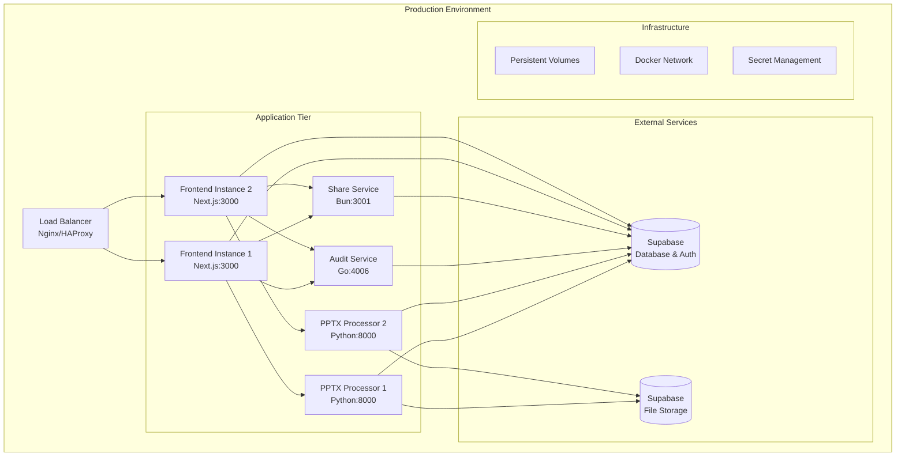

# Production Deployment Guide

This comprehensive guide covers production deployment strategies, environment management, scaling considerations, and operational best practices for the PowerPoint Translator App.

## 🚀 Production Overview

The application is designed for production deployment using a **containerized microservices architecture** with the following characteristics:

- **Container Orchestration**: Docker Compose (upgradeable to Kubernetes)
- **Service Isolation**: Each service in separate containers
- **Database**: External PostgreSQL (Supabase managed)
- **Storage**: Supabase Storage for file assets
- **Load Balancing**: Container-level with future reverse proxy support
- **Monitoring**: Health checks and logging
- **Security**: TLS termination, environment variable management

## 🏗️ Infrastructure Architecture



## 🐳 Production Docker Configuration

### Production Docker Compose

```yaml
# docker-compose.prod.yml
version: '3.8'

services:
  # Frontend Service - Multiple instances for HA
  frontend:
    image: pptxtransed/frontend:${VERSION:-latest}
    deploy:
      replicas: 2
      resources:
        limits:
          cpus: '1.0'
          memory: 1G
        reservations:
          cpus: '0.5'
          memory: 512M
      restart_policy:
        condition: on-failure
        delay: 5s
        max_attempts: 3
    environment:
      - NODE_ENV=production
      - NEXT_PUBLIC_SUPABASE_URL=${SUPABASE_URL}
      - NEXT_PUBLIC_SUPABASE_ANON_KEY=${SUPABASE_ANON_KEY}
      - NEXT_PUBLIC_AUDIT_SERVICE_URL=http://audit-service:4006
      - NEXT_PUBLIC_PPTX_PROCESSOR_URL=http://pptx-processor:8000
      - NEXT_PUBLIC_SHARE_SERVICE_URL=http://share-service:3001
      - JWT_SECRET=${JWT_SECRET}
    depends_on:
      audit-service:
        condition: service_healthy
      pptx-processor:
        condition: service_healthy
    networks:
      - pptxtransed-network
    healthcheck:
      test: ["CMD", "curl", "-f", "http://localhost:3000/api/health"]
      interval: 30s
      timeout: 10s
      retries: 3
      start_period: 60s

  # PPTX Processor - Multiple instances for processing load
  pptx-processor:
    image: pptxtransed/pptx-processor:${VERSION:-latest}
    deploy:
      replicas: 2
      resources:
        limits:
          cpus: '2.0'
          memory: 3G
        reservations:
          cpus: '1.0'
          memory: 1.5G
      restart_policy:
        condition: on-failure
        delay: 10s
        max_attempts: 3
    environment:
      - API_ENV=production
      - API_PORT=8000
      - API_HOST=0.0.0.0
      - LOG_LEVEL=info
      - LIBREOFFICE_PATH=/usr/bin/soffice
      - TEMP_UPLOAD_DIR=/app/uploads
      - TEMP_PROCESSING_DIR=/app/processing
      - SUPABASE_URL=${SUPABASE_URL}
      - SUPABASE_KEY=${SUPABASE_SERVICE_ROLE_KEY}
      - MAX_WORKERS=4
      - WORKER_TIMEOUT=300
    volumes:
      - pptx_uploads:/app/uploads
      - pptx_processing:/app/processing
    networks:
      - pptxtransed-network
    healthcheck:
      test: ["CMD", "curl", "-f", "http://localhost:8000/v1/health"]
      interval: 30s
      timeout: 15s
      retries: 3
      start_period: 90s

  # Audit Service - Single instance with HA readiness
  audit-service:
    image: pptxtransed/audit-service:${VERSION:-latest}
    deploy:
      replicas: 1
      resources:
        limits:
          cpus: '0.5'
          memory: 512M
        reservations:
          cpus: '0.25'
          memory: 256M
      restart_policy:
        condition: on-failure
        delay: 5s
        max_attempts: 3
    environment:
      - PORT=4006
      - LOG_LEVEL=info
      - JWT_SECRET=${JWT_SECRET}
      - CORS_ORIGIN=${FRONTEND_URL}
      - SUPABASE_URL=${SUPABASE_URL}
      - SUPABASE_SERVICE_ROLE_KEY=${SUPABASE_SERVICE_ROLE_KEY}
      - SUPABASE_JWT_SECRET=${SUPABASE_JWT_SECRET}
      - HTTP_TIMEOUT=30s
      - CACHE_JWT_TTL=5m
      - MAX_PAGE_SIZE=100
    networks:
      - pptxtransed-network
    healthcheck:
      test: ["CMD", "wget", "--spider", "http://localhost:4006/health"]
      interval: 30s
      timeout: 10s
      retries: 3
      start_period: 40s

  # Share Service
  share-service:
    image: pptxtransed/share-service:${VERSION:-latest}
    deploy:
      replicas: 1
      resources:
        limits:
          cpus: '0.5'
          memory: 512M
        reservations:
          cpus: '0.25'
          memory: 256M
      restart_policy:
        condition: on-failure
        delay: 5s
        max_attempts: 3
    environment:
      - PORT=3001
      - NODE_ENV=production
      - CORS_ORIGIN=${FRONTEND_URL}
      - SUPABASE_URL=${SUPABASE_URL}
      - SUPABASE_KEY=${SUPABASE_ANON_KEY}
      - SUPABASE_SERVICE_ROLE_KEY=${SUPABASE_SERVICE_ROLE_KEY}
    networks:
      - pptxtransed-network
    healthcheck:
      test: ["CMD", "curl", "-f", "http://localhost:3001/health"]
      interval: 30s
      timeout: 10s
      retries: 3
      start_period: 30s

  # Reverse Proxy (Optional - for advanced deployments)
  nginx:
    image: nginx:alpine
    ports:
      - "80:80"
      - "443:443"
    volumes:
      - ./nginx/nginx.conf:/etc/nginx/nginx.conf:ro
      - ./nginx/ssl:/etc/nginx/ssl:ro
    depends_on:
      - frontend
    networks:
      - pptxtransed-network
    restart: unless-stopped

networks:
  pptxtransed-network:
    driver: bridge
    ipam:
      config:
        - subnet: 172.20.0.0/16

volumes:
  pptx_uploads:
    driver: local
    driver_opts:
      type: none
      device: /opt/pptxtransed/uploads
      o: bind
  pptx_processing:
    driver: local
    driver_opts:
      type: none
      device: /opt/pptxtransed/processing
      o: bind
```

### Production Dockerfiles

**Optimized Frontend Dockerfile:**
```dockerfile
# Build stage
FROM node:18-alpine AS builder

WORKDIR /app

# Install dependencies
COPY package.json bun.lock ./
RUN npm install -g bun && bun install --frozen-lockfile

# Copy source and build
COPY . .
RUN bun run build

# Production stage
FROM node:18-alpine AS runner

WORKDIR /app

# Add non-root user
RUN addgroup --system --gid 1001 nodejs
RUN adduser --system --uid 1001 nextjs

# Install production dependencies
COPY package.json bun.lock ./
RUN npm install -g bun && bun install --production --frozen-lockfile

# Copy built application
COPY --from=builder --chown=nextjs:nodejs /app/.next/standalone ./
COPY --from=builder --chown=nextjs:nodejs /app/.next/static ./.next/static
COPY --from=builder --chown=nextjs:nodejs /app/public ./public

USER nextjs

EXPOSE 3000

ENV PORT 3000
ENV HOSTNAME "0.0.0.0"

CMD ["node", "server.js"]
```

**Optimized PPTX Processor Dockerfile:**
```dockerfile
FROM python:3.11-slim

# Install system dependencies including LibreOffice
RUN apt-get update && apt-get install -y \
    libreoffice \
    libreoffice-writer \
    libreoffice-calc \
    libreoffice-impress \
    curl \
    && rm -rf /var/lib/apt/lists/*

WORKDIR /app

# Install Python dependencies
COPY requirements.txt .
RUN pip install --no-cache-dir -r requirements.txt

# Copy application
COPY . .

# Create non-root user
RUN useradd --create-home --shell /bin/bash app
RUN chown -R app:app /app
USER app

# Create directories
RUN mkdir -p /app/uploads /app/processing

EXPOSE 8000

HEALTHCHECK --interval=30s --timeout=15s --start-period=90s --retries=3 \
  CMD curl -f http://localhost:8000/v1/health || exit 1

CMD ["uvicorn", "app.main:app", "--host", "0.0.0.0", "--port", "8000", "--workers", "4"]
```

## 🌍 Environment Management

### Environment Configuration

**Production Environment Variables (.env.production):**
```bash
# Application Environment
NODE_ENV=production
VERSION=1.0.0
FRONTEND_URL=https://app.pptxtranslator.com

# Supabase Configuration
SUPABASE_URL=https://your-project.supabase.co
SUPABASE_ANON_KEY=your-anon-key
SUPABASE_SERVICE_ROLE_KEY=your-service-role-key
SUPABASE_JWT_SECRET=your-jwt-secret

# Security
JWT_SECRET=your-super-secure-jwt-secret
ENCRYPTION_KEY=your-32-character-encryption-key

# Service URLs (internal)
AUDIT_SERVICE_URL=http://audit-service:4006
PPTX_PROCESSOR_URL=http://pptx-processor:8000
SHARE_SERVICE_URL=http://share-service:3001

# Performance & Scaling
MAX_UPLOAD_SIZE=52428800  # 50MB
MAX_CONCURRENT_JOBS=10
WORKER_TIMEOUT=300
CACHE_TTL=3600

# Monitoring & Logging
LOG_LEVEL=info
ENABLE_METRICS=true
METRICS_PORT=9090

# Feature Flags
ENABLE_SHARING=true
ENABLE_COMMENTS=true
ENABLE_EXPORT=true
ENABLE_AUDIT=true
```

### Secret Management

**Docker Secrets Configuration:**
```yaml
# docker-compose.prod.yml - secrets section
secrets:
  jwt_secret:
    file: ./secrets/jwt_secret.txt
  supabase_service_key:
    file: ./secrets/supabase_service_key.txt
  encryption_key:
    file: ./secrets/encryption_key.txt

services:
  frontend:
    secrets:
      - jwt_secret
      - supabase_service_key
    environment:
      - JWT_SECRET_FILE=/run/secrets/jwt_secret
      - SUPABASE_SERVICE_ROLE_KEY_FILE=/run/secrets/supabase_service_key
```

**Environment Setup Script:**
```bash
#!/bin/bash
# setup-production.sh

set -e

echo "🚀 Setting up production environment..."

# Create necessary directories
sudo mkdir -p /opt/pptxtransed/{uploads,processing,logs,backups}
sudo mkdir -p /opt/pptxtransed/secrets
sudo mkdir -p /opt/pptxtransed/config

# Set proper permissions
sudo chown -R $USER:docker /opt/pptxtransed
sudo chmod 755 /opt/pptxtransed
sudo chmod 700 /opt/pptxtransed/secrets

# Generate secrets if they don't exist
if [ ! -f /opt/pptxtransed/secrets/jwt_secret.txt ]; then
    echo "Generating JWT secret..."
    openssl rand -hex 32 > /opt/pptxtransed/secrets/jwt_secret.txt
fi

if [ ! -f /opt/pptxtransed/secrets/encryption_key.txt ]; then
    echo "Generating encryption key..."
    openssl rand -hex 32 > /opt/pptxtransed/secrets/encryption_key.txt
fi

# Set secret permissions
sudo chmod 600 /opt/pptxtransed/secrets/*

# Copy configuration files
cp docker-compose.prod.yml /opt/pptxtransed/
cp .env.production /opt/pptxtransed/.env

echo "✅ Production environment setup complete!"
echo "📝 Please update /opt/pptxtransed/.env with your specific values"
```

## 🔧 Deployment Procedures

### Automated Deployment Script

```bash
#!/bin/bash
# deploy.sh - Production deployment script

set -e

# Configuration
PROJECT_NAME="pptxtransed"
DEPLOY_DIR="/opt/pptxtransed"
BACKUP_DIR="/opt/pptxtransed/backups"
VERSION=${1:-latest}

# Colors for output
RED='\033[0;31m'
GREEN='\033[0;32m'
YELLOW='\033[1;33m'
NC='\033[0m' # No Color

log() {
    echo -e "${GREEN}[$(date +'%Y-%m-%d %H:%M:%S')] $1${NC}"
}

warn() {
    echo -e "${YELLOW}[$(date +'%Y-%m-%d %H:%M:%S')] WARNING: $1${NC}"
}

error() {
    echo -e "${RED}[$(date +'%Y-%m-%d %H:%M:%S')] ERROR: $1${NC}"
    exit 1
}

# Pre-deployment checks
pre_deployment_checks() {
    log "Running pre-deployment checks..."
    
    # Check if running as correct user
    if [ "$USER" != "deploy" ] && [ "$USER" != "root" ]; then
        warn "Not running as deploy user. Current user: $USER"
    fi
    
    # Check disk space
    AVAILABLE_SPACE=$(df /opt | awk 'NR==2 {print $4}')
    if [ "$AVAILABLE_SPACE" -lt 2000000 ]; then  # 2GB in KB
        error "Insufficient disk space. Available: ${AVAILABLE_SPACE}KB"
    fi
    
    # Check if Docker is running
    if ! docker info >/dev/null 2>&1; then
        error "Docker is not running or not accessible"
    fi
    
    # Check if required environment variables are set
    if [ ! -f "$DEPLOY_DIR/.env" ]; then
        error "Environment file not found: $DEPLOY_DIR/.env"
    fi
    
    log "✅ Pre-deployment checks passed"
}

# Create backup
create_backup() {
    log "Creating backup..."
    
    BACKUP_NAME="backup-$(date +'%Y%m%d-%H%M%S')"
    BACKUP_PATH="$BACKUP_DIR/$BACKUP_NAME"
    
    mkdir -p "$BACKUP_PATH"
    
    # Backup volumes
    if docker volume ls | grep -q "${PROJECT_NAME}_pptx_uploads"; then
        docker run --rm \
            -v "${PROJECT_NAME}_pptx_uploads:/source:ro" \
            -v "$BACKUP_PATH:/backup" \
            alpine tar czf /backup/uploads.tar.gz -C /source .
    fi
    
    # Backup configuration
    cp -r "$DEPLOY_DIR/.env" "$BACKUP_PATH/"
    cp -r "$DEPLOY_DIR/docker-compose.prod.yml" "$BACKUP_PATH/"
    
    # Cleanup old backups (keep last 7 days)
    find "$BACKUP_DIR" -type d -name "backup-*" -mtime +7 -exec rm -rf {} \;
    
    log "✅ Backup created: $BACKUP_PATH"
}

# Pull latest images
pull_images() {
    log "Pulling latest images..."
    
    docker-compose -f "$DEPLOY_DIR/docker-compose.prod.yml" pull
    
    log "✅ Images pulled successfully"
}

# Health check
health_check() {
    log "Performing health checks..."
    
    # Wait for services to be healthy
    local max_attempts=30
    local attempt=1
    
    while [ $attempt -le $max_attempts ]; do
        log "Health check attempt $attempt/$max_attempts"
        
        if docker-compose -f "$DEPLOY_DIR/docker-compose.prod.yml" ps | grep -q "Up (healthy)"; then
            local healthy_services=$(docker-compose -f "$DEPLOY_DIR/docker-compose.prod.yml" ps | grep -c "Up (healthy)")
            local total_services=$(docker-compose -f "$DEPLOY_DIR/docker-compose.prod.yml" ps | grep -c "Up")
            
            if [ "$healthy_services" -eq "$total_services" ]; then
                log "✅ All services are healthy"
                return 0
            fi
        fi
        
        sleep 10
        attempt=$((attempt + 1))
    done
    
    error "Health check failed after $max_attempts attempts"
}

# Rolling deployment
rolling_deployment() {
    log "Starting rolling deployment..."
    
    cd "$DEPLOY_DIR"
    
    # Deploy services one by one to minimize downtime
    local services=("audit-service" "share-service" "pptx-processor" "frontend")
    
    for service in "${services[@]}"; do
        log "Deploying $service..."
        
        # Scale up new instance
        docker-compose -f docker-compose.prod.yml up -d --scale $service=2 --no-recreate $service
        
        # Wait for health check
        sleep 30
        
        # Scale down old instance
        docker-compose -f docker-compose.prod.yml up -d --scale $service=1 --no-recreate $service
        
        log "✅ $service deployed successfully"
    done
}

# Zero-downtime deployment
zero_downtime_deployment() {
    log "Starting zero-downtime deployment..."
    
    cd "$DEPLOY_DIR"
    
    # Start new services alongside old ones
    docker-compose -f docker-compose.prod.yml up -d --scale frontend=2 --scale pptx-processor=2
    
    # Wait for new services to be healthy
    sleep 60
    
    # Switch traffic to new services and remove old ones
    docker-compose -f docker-compose.prod.yml up -d
    
    log "✅ Zero-downtime deployment completed"
}

# Post-deployment verification
post_deployment_verification() {
    log "Running post-deployment verification..."
    
    # Test endpoints
    local frontend_url="http://localhost:3000/api/health"
    local audit_url="http://localhost:4006/health"
    local pptx_url="http://localhost:8000/v1/health"
    local share_url="http://localhost:3001/health"
    
    for url in "$frontend_url" "$audit_url" "$pptx_url" "$share_url"; do
        if curl -f "$url" >/dev/null 2>&1; then
            log "✅ $url is responding"
        else
            error "❌ $url is not responding"
        fi
    done
    
    # Check resource usage
    docker stats --no-stream --format "table {{.Name}}\t{{.CPUPerc}}\t{{.MemUsage}}"
    
    log "✅ Post-deployment verification completed"
}

# Main deployment function
main() {
    log "🚀 Starting deployment version: $VERSION"
    
    pre_deployment_checks
    create_backup
    pull_images
    
    # Choose deployment strategy
    if [ "$2" = "rolling" ]; then
        rolling_deployment
    else
        zero_downtime_deployment
    fi
    
    health_check
    post_deployment_verification
    
    log "🎉 Deployment completed successfully!"
}

# Run main function
main "$@"
```

### CI/CD Pipeline Integration

**GitHub Actions Workflow (.github/workflows/deploy.yml):**
```yaml
name: Production Deployment

on:
  push:
    tags:
      - 'v*'
  workflow_dispatch:
    inputs:
      version:
        description: 'Version to deploy'
        required: true
        default: 'latest'

jobs:
  build-and-test:
    runs-on: ubuntu-latest
    steps:
      - uses: actions/checkout@v3
      
      - name: Setup Node.js
        uses: actions/setup-node@v3
        with:
          node-version: '18'
          
      - name: Install dependencies
        run: npm install -g bun && bun install
        
      - name: Run tests
        run: bun test
        
      - name: Build images
        run: |
          docker build -t pptxtransed/frontend:${{ github.sha }} .
          docker build -t pptxtransed/pptx-processor:${{ github.sha }} ./services/pptx-processor
          docker build -t pptxtransed/audit-service:${{ github.sha }} ./services/audit-service
          docker build -t pptxtransed/share-service:${{ github.sha }} ./services/share-service

  deploy:
    needs: build-and-test
    runs-on: ubuntu-latest
    if: startsWith(github.ref, 'refs/tags/')
    
    steps:
      - name: Deploy to production
        uses: appleboy/ssh-action@v0.1.5
        with:
          host: ${{ secrets.PROD_HOST }}
          username: ${{ secrets.PROD_USER }}
          key: ${{ secrets.PROD_SSH_KEY }}
          script: |
            cd /opt/pptxtransed
            export VERSION=${{ github.sha }}
            ./deploy.sh $VERSION rolling
```

## 📊 Monitoring & Observability

### Health Monitoring Setup

**Health Check Endpoints:**
```typescript
// Health check implementation
interface HealthStatus {
  status: 'healthy' | 'degraded' | 'unhealthy';
  timestamp: string;
  uptime: number;
  version: string;
  dependencies: {
    [key: string]: {
      status: 'healthy' | 'unhealthy';
      responseTime?: number;
      error?: string;
    };
  };
  metrics: {
    memory: {
      used: number;
      total: number;
      percentage: number;
    };
    cpu: {
      usage: number;
    };
    requests: {
      total: number;
      errorsLast5m: number;
      avgResponseTime: number;
    };
  };
}

// Frontend health check
app.get('/api/health', async (req, res) => {
  const startTime = Date.now();
  
  try {
    // Check dependencies
    const dependencies = await Promise.all([
      checkSupabase(),
      checkPPTXProcessor(),
      checkAuditService(),
      checkShareService()
    ]);
    
    const status: HealthStatus = {
      status: dependencies.every(d => d.status === 'healthy') ? 'healthy' : 'degraded',
      timestamp: new Date().toISOString(),
      uptime: process.uptime(),
      version: process.env.npm_package_version,
      dependencies: Object.fromEntries(dependencies.map(d => [d.name, d])),
      metrics: await getMetrics()
    };
    
    res.status(status.status === 'healthy' ? 200 : 503).json(status);
  } catch (error) {
    res.status(503).json({
      status: 'unhealthy',
      timestamp: new Date().toISOString(),
      error: error.message
    });
  }
});
```

### Application Metrics

**Prometheus Metrics Integration:**
```typescript
// metrics.ts
import client from 'prom-client';

// Custom metrics
const httpRequestDuration = new client.Histogram({
  name: 'http_request_duration_seconds',
  help: 'Duration of HTTP requests in seconds',
  labelNames: ['method', 'route', 'status_code'],
  buckets: [0.1, 0.3, 0.5, 0.7, 1, 3, 5, 7, 10]
});

const httpRequestTotal = new client.Counter({
  name: 'http_requests_total',
  help: 'Total number of HTTP requests',
  labelNames: ['method', 'route', 'status_code']
});

const activeUsers = new client.Gauge({
  name: 'active_users_total',
  help: 'Number of active users'
});

const processingJobs = new client.Gauge({
  name: 'processing_jobs_total',
  help: 'Number of processing jobs',
  labelNames: ['status']
});

// Middleware to collect metrics
export const metricsMiddleware = (req: Request, res: Response, next: NextFunction) => {
  const startTime = Date.now();
  
  res.on('finish', () => {
    const duration = (Date.now() - startTime) / 1000;
    const route = req.route?.path || req.path;
    
    httpRequestDuration
      .labels(req.method, route, res.statusCode.toString())
      .observe(duration);
      
    httpRequestTotal
      .labels(req.method, route, res.statusCode.toString())
      .inc();
  });
  
  next();
};

// Metrics endpoint
app.get('/metrics', async (req, res) => {
  res.set('Content-Type', client.register.contentType);
  res.end(await client.register.metrics());
});
```

### Log Aggregation

**Structured Logging Configuration:**
```typescript
// logger.ts
import winston from 'winston';

const logger = winston.createLogger({
  level: process.env.LOG_LEVEL || 'info',
  format: winston.format.combine(
    winston.format.timestamp(),
    winston.format.errors({ stack: true }),
    winston.format.json()
  ),
  defaultMeta: {
    service: 'frontend',
    version: process.env.npm_package_version,
    environment: process.env.NODE_ENV
  },
  transports: [
    new winston.transports.Console(),
    new winston.transports.File({ 
      filename: '/var/log/pptxtransed/error.log', 
      level: 'error' 
    }),
    new winston.transports.File({ 
      filename: '/var/log/pptxtransed/combined.log' 
    })
  ]
});

// Request logging middleware
export const requestLogger = (req: Request, res: Response, next: NextFunction) => {
  const startTime = Date.now();
  
  res.on('finish', () => {
    const duration = Date.now() - startTime;
    
    logger.info('HTTP Request', {
      method: req.method,
      url: req.url,
      statusCode: res.statusCode,
      duration,
      userAgent: req.get('User-Agent'),
      ip: req.ip,
      userId: req.user?.id,
      requestId: req.requestId
    });
  });
  
  next();
};
```

## 🔧 Scaling Strategies

### Horizontal Scaling

**Auto-scaling Configuration:**
```yaml
# docker-compose.scale.yml
version: '3.8'

services:
  frontend:
    deploy:
      replicas: 3
      update_config:
        parallelism: 1
        delay: 10s
        order: start-first
      restart_policy:
        condition: on-failure
        max_attempts: 3
      placement:
        constraints:
          - node.role == worker

  pptx-processor:
    deploy:
      replicas: 4  # CPU intensive workload
      update_config:
        parallelism: 2
        delay: 30s
      resources:
        limits:
          cpus: '2.0'
          memory: 3G
        reservations:
          cpus: '1.0'
          memory: 1.5G
```

### Load Balancing

**Nginx Load Balancer Configuration:**
```nginx
# nginx/nginx.conf
upstream frontend {
    least_conn;
    server frontend_1:3000 max_fails=3 fail_timeout=30s;
    server frontend_2:3000 max_fails=3 fail_timeout=30s;
    server frontend_3:3000 max_fails=3 fail_timeout=30s;
}

upstream pptx_processor {
    least_conn;
    server pptx-processor_1:8000 max_fails=2 fail_timeout=60s;
    server pptx-processor_2:8000 max_fails=2 fail_timeout=60s;
    server pptx-processor_3:8000 max_fails=2 fail_timeout=60s;
    server pptx-processor_4:8000 max_fails=2 fail_timeout=60s;
}

server {
    listen 80;
    server_name app.pptxtranslator.com;
    return 301 https://$server_name$request_uri;
}

server {
    listen 443 ssl http2;
    server_name app.pptxtranslator.com;

    ssl_certificate /etc/nginx/ssl/cert.pem;
    ssl_certificate_key /etc/nginx/ssl/key.pem;
    ssl_protocols TLSv1.2 TLSv1.3;
    ssl_ciphers ECDHE+AESGCM:ECDHE+AES256:ECDHE+AES128:!aNULL:!MD5:!DSS;
    ssl_prefer_server_ciphers on;

    # Security headers
    add_header Strict-Transport-Security "max-age=31536000; includeSubDomains" always;
    add_header X-Frame-Options DENY always;
    add_header X-Content-Type-Options nosniff always;

    # Main application
    location / {
        proxy_pass http://frontend;
        proxy_set_header Host $host;
        proxy_set_header X-Real-IP $remote_addr;
        proxy_set_header X-Forwarded-For $proxy_add_x_forwarded_for;
        proxy_set_header X-Forwarded-Proto $scheme;
        
        # WebSocket support
        proxy_http_version 1.1;
        proxy_set_header Upgrade $http_upgrade;
        proxy_set_header Connection "upgrade";
    }

    # API routes
    location /api/pptx/ {
        proxy_pass http://pptx_processor;
        proxy_set_header Host $host;
        proxy_set_header X-Real-IP $remote_addr;
        proxy_set_header X-Forwarded-For $proxy_add_x_forwarded_for;
        proxy_set_header X-Forwarded-Proto $scheme;
        
        # Increase timeouts for file processing
        proxy_connect_timeout 60s;
        proxy_send_timeout 300s;
        proxy_read_timeout 300s;
        
        # Increase max body size for file uploads
        client_max_body_size 50M;
    }
}
```

## 🔒 Security Hardening

### Container Security

**Docker Security Configuration:**
```yaml
# Security-hardened service configuration
services:
  frontend:
    security_opt:
      - no-new-privileges:true
    read_only: true
    tmpfs:
      - /tmp:noexec,nosuid,size=100m
      - /var/cache/nginx:noexec,nosuid,size=50m
    cap_drop:
      - ALL
    cap_add:
      - CHOWN
      - DAC_OVERRIDE
      - SETGID
      - SETUID
    user: "1001:1001"
```

### Network Security

**Firewall Configuration:**
```bash
#!/bin/bash
# firewall-setup.sh

# Allow SSH
ufw allow 22/tcp

# Allow HTTP and HTTPS
ufw allow 80/tcp
ufw allow 443/tcp

# Allow internal Docker network
ufw allow from 172.20.0.0/16

# Deny all other incoming traffic
ufw default deny incoming
ufw default allow outgoing

# Enable firewall
ufw --force enable
```

## 🚨 Disaster Recovery

### Backup Strategy

**Automated Backup Script:**
```bash
#!/bin/bash
# backup.sh - Automated backup script

BACKUP_DIR="/opt/backups/pptxtransed"
RETENTION_DAYS=30
DATE=$(date +%Y%m%d_%H%M%S)

# Create backup directory
mkdir -p "$BACKUP_DIR"

# Backup Docker volumes
docker run --rm \
  -v pptxtransed_pptx_uploads:/source:ro \
  -v "$BACKUP_DIR:/backup" \
  alpine tar czf "/backup/uploads_$DATE.tar.gz" -C /source .

# Backup configuration
tar czf "$BACKUP_DIR/config_$DATE.tar.gz" -C /opt/pptxtransed .env docker-compose.prod.yml

# Database backup (Supabase provides automatic backups)
# Log backup creation
echo "$(date): Backup created - uploads_$DATE.tar.gz, config_$DATE.tar.gz" >> /var/log/pptxtransed/backup.log

# Cleanup old backups
find "$BACKUP_DIR" -name "*.tar.gz" -mtime +$RETENTION_DAYS -delete

# Upload to remote storage (optional)
# aws s3 sync "$BACKUP_DIR" s3://your-backup-bucket/pptxtransed/
```

### Recovery Procedures

**Quick Recovery Script:**
```bash
#!/bin/bash
# recover.sh - Disaster recovery script

BACKUP_DIR="/opt/backups/pptxtransed"
RESTORE_DATE=${1:-latest}

if [ "$RESTORE_DATE" = "latest" ]; then
    UPLOADS_BACKUP=$(ls -t "$BACKUP_DIR"/uploads_*.tar.gz | head -1)
    CONFIG_BACKUP=$(ls -t "$BACKUP_DIR"/config_*.tar.gz | head -1)
else
    UPLOADS_BACKUP="$BACKUP_DIR/uploads_$RESTORE_DATE.tar.gz"
    CONFIG_BACKUP="$BACKUP_DIR/config_$RESTORE_DATE.tar.gz"
fi

echo "Restoring from backups:"
echo "  Uploads: $UPLOADS_BACKUP"
echo "  Config: $CONFIG_BACKUP"

# Stop services
docker-compose -f /opt/pptxtransed/docker-compose.prod.yml down

# Restore uploads
docker run --rm \
  -v pptxtransed_pptx_uploads:/target \
  -v "$BACKUP_DIR:/backup" \
  alpine sh -c "cd /target && tar xzf /backup/$(basename $UPLOADS_BACKUP)"

# Restore configuration
tar xzf "$CONFIG_BACKUP" -C /opt/pptxtransed

# Start services
docker-compose -f /opt/pptxtransed/docker-compose.prod.yml up -d

echo "Recovery completed!"
```

---

**Last Updated**: Current  
**Version**: 1.0.0  
**Next Review**: Quarterly Operations Review 