# Audit Service Integration Guide

**Status**: ⚠️ **NEEDS FIXES** - Critical Integration Issues Identified  
**Last Updated**: Post-Documentation Audit  
**Audit Date**: December 2024

## 🚨 Current State Assessment

### ❌ **Critical Issues Identified**
Based on comprehensive testing and documentation audit:

- **Repository Layer Failures**: `TestAuditRepository_FindBySessionID` has multiple test failures
- **Service Layer Failures**: `TestAuditService_GetAuditLogs` shows mock expectations not being met
- **Nil Pointer Exceptions**: Runtime panics occurring in test suite indicating unstable code
- **Incomplete Mock Implementation**: Mocking framework setup has gaps in expectation handling
- **Supabase Integration**: Repository tests suggest Supabase queries are not working as expected

### ✅ **What Actually Works**
- **Domain Layer**: All domain model tests pass (AuditEntry, PaginationParams, etc.)
- **Middleware Layer**: Authentication, error handling, and request middleware fully functional
- **JWT & Cache**: Token validation and caching systems working correctly
- **API Structure**: Server setup, routing, and basic HTTP handling operational
- **Frontend Client**: `AuditServiceClient` exists and is well-structured

## 🏗️ Architecture Overview

### Service Architecture

```mermaid
graph TB
    FE[Frontend App<br/>Next.js] --> AC[AuditServiceClient<br/>lib/api/audit-service.ts]
    AC --> AS[Audit Service<br/>Go/Gin - Port 4006]
    AS --> SB[(Supabase Database<br/>PostgreSQL)]
    
    subgraph "Audit Service Layers"
        H[Handlers Layer<br/>✅ Working]
        M[Middleware Layer<br/>✅ Working]
        S[Service Layer<br/>❌ Test Failures]
        R[Repository Layer<br/>❌ Test Failures]
    end
    
    AS --> H
    H --> M
    H --> S
    S --> R
    R --> SB
    
    style AS fill:#ffcccc
    style S fill:#ffcccc  
    style R fill:#ffcccc
    style H fill:#ccffcc
    style M fill:#ccffcc
```


### Data Flow (Intended vs Actual)

#### **Intended Data Flow**:
1. User performs action in editor (edit, save, export)
2. Frontend creates audit event via `AuditServiceClient.createAuditEvent()`
3. Audit service validates JWT token
4. Service layer processes event and stores in Supabase
5. Admin views history via `AuditServiceClient.getSessionHistory()`

#### **Actual Issues**:
- ❌ **Step 4 Failing**: Repository layer cannot fetch from Supabase
- ❌ **Step 5 Failing**: Service layer mock expectations not met
- ❌ **Step 3 Partially**: JWT validation works but service integration broken

## 📋 Integration Components

### 1. Frontend Integration ✅ **READY**

#### API Client (`lib/api/audit-service.ts`)
```typescript
// VERIFIED: Client is well-structured and ready
export class AuditServiceClient {
  // ✅ Ready: Session history fetching
  async getSessionHistory(sessionId: string, page = 1, limit = 50): Promise<AuditResponse>
  
  // ✅ Ready: Audit event creation  
  async createAuditEvent(sessionId: string, type: AuditAction, details?: any): Promise<void>
}
```

#### Environment Configuration
```bash
# Required in .env.local
NEXT_PUBLIC_AUDIT_SERVICE_URL=http://localhost:4006
```

#### Usage Pattern (Frontend Ready)
```typescript
// ✅ This pattern is ready to use once backend is fixed
import { AuditServiceClient } from '@/lib/api/audit-service';

const auditClient = new AuditServiceClient(userToken);

// Create audit event
await auditClient.createAuditEvent(sessionId, 'edit', {
  slide: slideNumber,
  text: 'updated'
});

// Fetch history
const history = await auditClient.getSessionHistory(sessionId);
```

### 2. Backend Service ⚠️ **NEEDS FIXES**

#### Current Service Structure
```
services/audit-service/
├── cmd/server/          # ✅ Server setup working
├── internal/
│   ├── handlers/        # ✅ HTTP handlers working (tests pass)
│   ├── middleware/      # ✅ Auth, CORS, logging working (tests pass)
│   ├── service/         # ❌ Business logic failing (tests fail)
│   └── repository/      # ❌ Database layer failing (tests fail)
├── pkg/
│   ├── jwt/            # ✅ Token validation working (tests pass)
│   └── cache/          # ✅ Token caching working (tests pass)
└── mocks/              # ❌ Mock generation incomplete
```

#### Critical Issues to Fix

##### **Repository Layer Failures**
```go
// ISSUE: Tests show empty results from Supabase queries
// File: internal/repository/audit_repository.go
func (r *auditRepository) FindBySessionID(ctx context.Context, sessionID string, limit, offset int) ([]domain.AuditEntry, error) {
    // ❌ Current implementation returning empty results
    // ❌ Mock expectations not being met
    // ❌ Supabase client integration broken
}
```

##### **Service Layer Mock Issues**  
```go
// ISSUE: Mock expectations not properly configured
// File: internal/service/audit_service_test.go
// ❌ GetSession() calls not being mocked correctly
// ❌ FindBySessionID() calls causing unexpected method panics
// ❌ Ownership validation failing due to nil pointer exceptions
```

### 3. Database Schema ✅ **READY**

#### Supabase Tables (Assumed Structure)
```sql
-- Audit Events Table
CREATE TABLE audit_events (
    id UUID PRIMARY KEY DEFAULT gen_random_uuid(),
    session_id UUID NOT NULL,
    user_id UUID NOT NULL,
    type VARCHAR(50) NOT NULL,
    details JSONB,
    ip_address INET,
    user_agent TEXT,
    created_at TIMESTAMP WITH TIME ZONE DEFAULT NOW()
);

-- Translation Sessions Table (for ownership validation)
CREATE TABLE translation_sessions (
    id UUID PRIMARY KEY,
    user_id UUID NOT NULL,
    created_at TIMESTAMP WITH TIME ZONE DEFAULT NOW()
);
```

## 🔧 Required Fixes

### Phase 1: Repository Layer Stabilization

#### 1.1 Fix Supabase Integration
```go
// File: internal/repository/audit_repository.go
// TODO: Debug why Supabase queries return empty results
func (r *auditRepository) FindBySessionID(ctx context.Context, sessionID string, limit, offset int) ([]domain.AuditEntry, error) {
    // REQUIRED: Add logging to debug Supabase query issues
    // REQUIRED: Verify table name and column mappings
    // REQUIRED: Test with real Supabase connection
}
```

#### 1.2 Fix Database Queries
- Verify table names match actual Supabase schema
- Add comprehensive logging for debugging
- Test connection with real Supabase credentials
- Verify column mappings and data types

### Phase 2: Service Layer Stabilization

#### 2.1 Fix Mock Testing
```go
// File: internal/service/audit_service_test.go
// TODO: Fix mock expectations to prevent panics
func TestAuditService_GetAuditLogs(t *testing.T) {
    // REQUIRED: Properly setup GetSession() mock expectations
    // REQUIRED: Prevent FindBySessionID() unexpected method calls
    // REQUIRED: Fix ownership validation nil pointer issues
}
```

#### 2.2 Add Proper Error Handling
- Implement graceful degradation when Supabase is unavailable
- Add retry mechanisms for transient failures
- Improve error messages for debugging

### Phase 3: Integration Testing

#### 3.1 End-to-End Testing
- Test with real Supabase database
- Verify frontend-to-backend data flow
- Test authentication and authorization
- Performance testing with multiple audit events

#### 3.2 Production Readiness
- Load testing
- Error monitoring
- Health check improvements
- Documentation completion

## 🚀 Integration Implementation Steps

### Step 1: Fix Repository Tests (IMMEDIATE)
```bash
cd services/audit-service
# Debug failing repository tests
go test ./internal/repository -v

# Expected outcome: All tests should pass
# Current status: FAILING - empty results from Supabase
```

### Step 2: Fix Service Tests (IMMEDIATE)
```bash
# Debug failing service tests  
go test ./internal/service -v

# Expected outcome: All mocks should work without panics
# Current status: FAILING - mock expectations not met
```

### Step 3: Test End-to-End (AFTER FIXES)
```bash
# Start audit service
cd services/audit-service
go run cmd/server/main.go

# Test from frontend
curl -H "Authorization: Bearer $JWT_TOKEN" \
     -X POST http://localhost:4006/api/v1/events \
     -d '{"sessionId":"test-123","type":"edit","details":{"slide":1}}'
```

### Step 4: Production Deployment (FINAL)
```bash
# Build and deploy with Docker
docker build -t audit-service .
docker run -p 4006:4006 audit-service
```

## 📊 Current Service Endpoints

### Available Endpoints ✅
- `GET /health` - Health check (working)
- `GET /docs/*` - Swagger documentation (working)
- `POST /api/v1/events` - Create audit event (handler ready, backend broken)
- `GET /api/v1/sessions/{sessionId}/history` - Get audit history (handler ready, backend broken)

### Authentication ✅
- JWT Bearer token validation (working)
- Share token validation (working)
- Token caching (working)
- CORS handling (working)

## 🔍 Testing Strategy

### Unit Tests Status
```bash
# Current test results (as of documentation audit):
✅ Domain layer: ALL PASS
✅ Handlers layer: ALL PASS  
✅ Middleware layer: ALL PASS
✅ JWT/Cache layer: ALL PASS
❌ Repository layer: MULTIPLE FAILURES
❌ Service layer: MULTIPLE FAILURES
```

### Integration Tests Required
- [ ] Database connection verification
- [ ] Full request-response cycle testing
- [ ] Authentication flow validation
- [ ] Error scenario handling
- [ ] Performance under load

## 🚨 Known Issues & Workarounds

### Issue 1: Repository Returns Empty Results
**Problem**: Supabase queries return empty arrays instead of actual data  
**Impact**: Audit history cannot be retrieved  
**Workaround**: None currently - requires code fix  
**Priority**: HIGH

### Issue 2: Service Layer Mock Failures
**Problem**: Test mocks have incorrect expectations causing panics  
**Impact**: Cannot verify business logic correctness  
**Workaround**: Skip service tests temporarily  
**Priority**: HIGH

### Issue 3: Nil Pointer Exceptions
**Problem**: Runtime panics in ownership validation  
**Impact**: Service crashes during certain operations  
**Workaround**: Add nil checks throughout service layer  
**Priority**: CRITICAL

## 📈 Integration Progress

### Completed ✅
- [x] Frontend API client implementation
- [x] Backend service structure and routing
- [x] Authentication and middleware layers
- [x] Domain models and types
- [x] Docker configuration
- [x] Documentation structure

### In Progress ⚠️
- [ ] Repository layer bug fixes (CRITICAL)
- [ ] Service layer test stabilization (HIGH)
- [ ] End-to-end integration testing (HIGH)

### Planned 📋
- [ ] Production deployment
- [ ] Performance optimization
- [ ] Advanced audit features
- [ ] Real-time audit streaming

## 🔗 Related Documentation

- [Audit Service README](../services/audit-service/README.md)
- [API Documentation](../api/audit-service-api.md)
- [Authentication Guide](./authentication.md)
- [Database Schema](../architecture/database-schema.md)

---

**⚠️ IMPORTANT**: This service requires critical fixes before production use. The frontend integration is ready, but the backend service layer needs immediate attention to resolve test failures and database integration issues. 