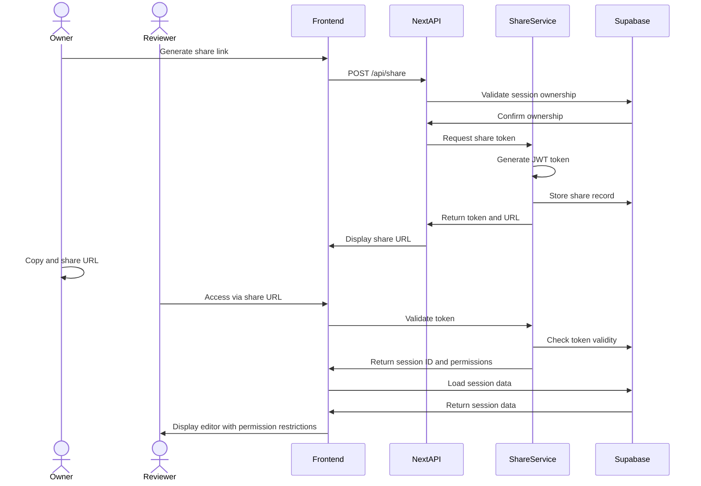

# Share Service Frontend Integration

This document outlines the integration between the Share Service and the frontend application.

## Overview

The Share Service provides a mechanism for session owners to generate secure share links (tokens) for reviewers to access sessions without requiring a full account. The service handles token generation, validation, and permission management.

## API Endpoints

| Endpoint | Method | Description | Request | Response |
|----------|--------|-------------|---------|----------|
| `/api/share` | POST | Generate a share link | `{ sessionId, permissions, expiresAt? }` | `{ shareToken, shareUrl }` |
| `/api/share/validate` | GET | Validate a share token | `token` (query param) | `{ valid, sessionId, permissions }` |
| `/api/share/list` | GET | List shares for a session | `sessionId` (query param) | `[{ id, sessionId, shareToken, permissions, expiresAt }]` |
| `/api/share/revoke` | DELETE | Revoke a share token | `{ shareId }` | `{ success }` |

## Frontend Integration

### 1. Zustand Store Slice

```typescript
// lib/store/slices/share-slice.ts

interface ShareState {
  shares: ShareRecord[];
  isLoading: boolean;
  error: string | null;
  
  // Actions
  generateShareLink: (sessionId: string, permissions: SharePermissions, expiresAt?: Date) => Promise<string>;
  listSessionShares: (sessionId: string) => Promise<void>;
  revokeShare: (shareId: string) => Promise<void>;
  clearShares: () => void;
}

export const createShareSlice = (set, get) => ({
  shares: [],
  isLoading: false,
  error: null,
  
  generateShareLink: async (sessionId, permissions, expiresAt) => {
    set({ isLoading: true, error: null });
    try {
      const response = await fetch('/api/share', {
        method: 'POST',
        headers: { 'Content-Type': 'application/json' },
        body: JSON.stringify({ sessionId, permissions, expiresAt }),
      });
      
      if (!response.ok) throw new Error('Failed to generate share link');
      
      const data = await response.json();
      return data.shareUrl;
    } catch (error) {
      set({ error: error.message });
      throw error;
    } finally {
      set({ isLoading: false });
    }
  },
  
  listSessionShares: async (sessionId) => {
    set({ isLoading: true, error: null });
    try {
      const response = await fetch(`/api/share/list?sessionId=${sessionId}`);
      
      if (!response.ok) throw new Error('Failed to fetch shares');
      
      const shares = await response.json();
      set({ shares });
    } catch (error) {
      set({ error: error.message });
    } finally {
      set({ isLoading: false });
    }
  },
  
  revokeShare: async (shareId) => {
    set({ isLoading: true, error: null });
    try {
      const response = await fetch('/api/share/revoke', {
        method: 'DELETE',
        headers: { 'Content-Type': 'application/json' },
        body: JSON.stringify({ shareId }),
      });
      
      if (!response.ok) throw new Error('Failed to revoke share');
      
      // Update the local state by removing the revoked share
      set(state => ({
        shares: state.shares.filter(share => share.id !== shareId)
      }));
    } catch (error) {
      set({ error: error.message });
      throw error;
    } finally {
      set({ isLoading: false });
    }
  },
  
  clearShares: () => set({ shares: [] }),
});
```

### 2. Types Definition

```typescript
// types/store/index.ts

export interface ShareRecord {
  id: string;
  sessionId: string;
  shareToken: string;
  permissions: SharePermissions;
  expiresAt?: string;
  createdAt: string;
}

export type SharePermissions = {
  read: boolean;
  comment: boolean;
  edit: boolean;
};
```

### 3. Next.js API Routes

```typescript
// app/api/share/route.ts

import { createRouteHandlerClient } from '@supabase/auth-helpers-nextjs';
import { cookies } from 'next/headers';
import { NextResponse } from 'next/server';

export async function POST(request: Request) {
  const { sessionId, permissions, expiresAt } = await request.json();
  
  // Validate user has access to this session
  const supabase = createRouteHandlerClient({ cookies });
  const { data: session, error: sessionError } = await supabase
    .from('sessions')
    .select('*')
    .eq('id', sessionId)
    .single();
    
  if (sessionError || !session) {
    return NextResponse.json({ error: 'Session not found' }, { status: 404 });
  }
  
  // Call the Share Service to generate a token
  const response = await fetch(`${process.env.SHARE_SERVICE_URL}/api/share`, {
    method: 'POST',
    headers: { 'Content-Type': 'application/json' },
    body: JSON.stringify({ sessionId, permissions, expiresAt }),
  });
  
  if (!response.ok) {
    return NextResponse.json(
      { error: 'Failed to generate share link' }, 
      { status: response.status }
    );
  }
  
  const shareData = await response.json();
  return NextResponse.json(shareData);
}
```

Similar route handlers would be implemented for other endpoints.

### 4. UI Components

#### Share Dialog Component

```typescript
// components/editor/share-dialog.tsx

'use client';

import { useState } from 'react';
import { useAppStore } from '@/lib/store';
import { Button } from '@/components/ui/button';
import { Dialog, DialogContent, DialogHeader, DialogTitle } from '@/components/ui/dialog';
import { Checkbox } from '@/components/ui/checkbox';
import { useToast } from '@/components/ui/use-toast';

export function ShareDialog({ 
  open, 
  onOpenChange, 
  sessionId 
}: { 
  open: boolean; 
  onOpenChange: (open: boolean) => void; 
  sessionId: string;
}) {
  const { generateShareLink, listSessionShares, shares, revokeShare, isLoading } = useAppStore(state => state);
  const { toast } = useToast();
  const [permissions, setPermissions] = useState({
    read: true,
    comment: false,
    edit: false,
  });
  const [shareUrl, setShareUrl] = useState('');
  
  // Load existing shares when dialog opens
  useEffect(() => {
    if (open) {
      listSessionShares(sessionId);
    }
  }, [open, sessionId, listSessionShares]);
  
  const handlePermissionChange = (permission: keyof typeof permissions) => {
    setPermissions(prev => ({
      ...prev,
      [permission]: !prev[permission]
    }));
  };
  
  const handleGenerateLink = async () => {
    try {
      const url = await generateShareLink(sessionId, permissions);
      setShareUrl(url);
      toast({
        title: 'Share link generated',
        description: 'Link has been copied to clipboard',
      });
      navigator.clipboard.writeText(url);
    } catch (error) {
      toast({
        title: 'Error',
        description: 'Failed to generate share link',
        variant: 'destructive',
      });
    }
  };
  
  const handleRevokeShare = async (shareId: string) => {
    try {
      await revokeShare(shareId);
      toast({
        title: 'Share revoked',
        description: 'The share link has been revoked',
      });
    } catch (error) {
      toast({
        title: 'Error',
        description: 'Failed to revoke share link',
        variant: 'destructive',
      });
    }
  };
  
  return (
    <Dialog open={open} onOpenChange={onOpenChange}>
      <DialogContent className="sm:max-w-md">
        <DialogHeader>
          <DialogTitle>Share Session</DialogTitle>
        </DialogHeader>
        
        <div className="space-y-4 py-4">
          <div className="space-y-2">
            <h3 className="text-sm font-medium">Permissions</h3>
            <div className="space-y-2">
              <div className="flex items-center space-x-2">
                <Checkbox 
                  id="read" 
                  checked={permissions.read} 
                  onCheckedChange={() => handlePermissionChange('read')}
                />
                <label htmlFor="read">Read (view slides)</label>
              </div>
              <div className="flex items-center space-x-2">
                <Checkbox 
                  id="comment" 
                  checked={permissions.comment} 
                  onCheckedChange={() => handlePermissionChange('comment')}
                />
                <label htmlFor="comment">Comment (add comments)</label>
              </div>
              <div className="flex items-center space-x-2">
                <Checkbox 
                  id="edit" 
                  checked={permissions.edit} 
                  onCheckedChange={() => handlePermissionChange('edit')}
                />
                <label htmlFor="edit">Edit (modify translations)</label>
              </div>
            </div>
          </div>
          
          <Button onClick={handleGenerateLink} disabled={isLoading}>
            Generate Share Link
          </Button>
          
          {shareUrl && (
            <div className="border p-2 rounded-md bg-muted">
              <p className="text-sm break-all">{shareUrl}</p>
            </div>
          )}
          
          {shares.length > 0 && (
            <div className="space-y-2">
              <h3 className="text-sm font-medium">Existing Shares</h3>
              <div className="space-y-2">
                {shares.map(share => (
                  <div key={share.id} className="flex justify-between items-center border p-2 rounded-md">
                    <div>
                      <p className="text-xs">
                        {share.permissions.read ? 'Read ' : ''}
                        {share.permissions.comment ? 'Comment ' : ''}
                        {share.permissions.edit ? 'Edit' : ''}
                      </p>
                      {share.expiresAt && (
                        <p className="text-xs text-muted-foreground">
                          Expires: {new Date(share.expiresAt).toLocaleDateString()}
                        </p>
                      )}
                    </div>
                    <Button 
                      variant="destructive" 
                      size="sm" 
                      onClick={() => handleRevokeShare(share.id)}
                      disabled={isLoading}
                    >
                      Revoke
                    </Button>
                  </div>
                ))}
              </div>
            </div>
          )}
        </div>
      </DialogContent>
    </Dialog>
  );
}
```

### 5. Access via Share Link

```typescript
// app/shared/[token]/page.tsx

import { redirect } from 'next/navigation';
import { createServerComponentClient } from '@supabase/auth-helpers-nextjs';
import { cookies } from 'next/headers';

export default async function SharedPage({ params }: { params: { token: string } }) {
  const { token } = params;
  
  // Validate the token
  const response = await fetch(`${process.env.SHARE_SERVICE_URL}/api/share/validate?token=${token}`);
  
  if (!response.ok) {
    // Token is invalid, redirect to error page
    redirect('/shared/invalid');
  }
  
  const { sessionId, permissions } = await response.json();
  
  // Store permissions in a cookie or session for use in the editor
  cookies().set('share_permissions', JSON.stringify(permissions), {
    httpOnly: true,
    sameSite: 'strict',
    maxAge: 60 * 60 * 24, // 1 day
  });
  
  // Redirect to the editor with special shared mode
  redirect(`/editor/${sessionId}?shared=true`);
}
```

### 6. Editor Integration

```typescript
// app/editor/[sessionId]/page.tsx

import { cookies } from 'next/headers';
import { createServerComponentClient } from '@supabase/auth-helpers-nextjs';
import EditorClient from '@/components/editor/editor-client';

export default async function EditorPage({ params, searchParams }: { 
  params: { sessionId: string },
  searchParams: { shared?: string }
}) {
  const { sessionId } = params;
  const isShared = searchParams.shared === 'true';
  
  let userRole = 'owner';
  let session = null;
  
  // Handle different auth cases
  if (isShared) {
    // User is accessing via share link
    const permissionsCookie = cookies().get('share_permissions');
    const permissions = permissionsCookie ? JSON.parse(permissionsCookie.value) : null;
    
    if (!permissions) {
      redirect('/shared/invalid');
    }
    
    // Determine role based on permissions
    if (permissions.edit) {
      userRole = 'reviewer';
    } else if (permissions.comment) {
      userRole = 'commenter';
    } else {
      userRole = 'viewer';
    }
    
    // Get session data
    const supabase = createServerComponentClient({ cookies });
    const { data, error } = await supabase
      .from('sessions')
      .select('*')
      .eq('id', sessionId)
      .single();
      
    if (error || !data) {
      redirect('/shared/invalid');
    }
    
    session = data;
  } else {
    // Normal authenticated access
    // ... existing authentication logic
  }
  
  return (
    <EditorClient 
      initialSession={session} 
      userRole={userRole} 
      isShared={isShared} 
    />
  );
}
```

## Security Considerations

1. **Token Validation**: All share tokens must be validated on each request
2. **Permission Enforcement**: UI should disable features based on permissions
3. **Audit Logging**: All actions via share links should be logged with the share token ID
4. **Expiration**: Tokens should have an expiration time (optional but recommended)
5. **Rate Limiting**: Implement rate limiting to prevent abuse

## Data Flow



## Implementation Checklist

- [ ] Create Share Service with Hono.js and Bun.js
- [ ] Implement token generation and validation
- [ ] Create Zustand store slice for share management
- [ ] Implement Next.js API routes for frontend integration
- [ ] Create UI components for share management
- [ ] Implement shared session access flow
- [ ] Add permission-based UI restrictions
- [ ] Integrate with audit logging
``` 