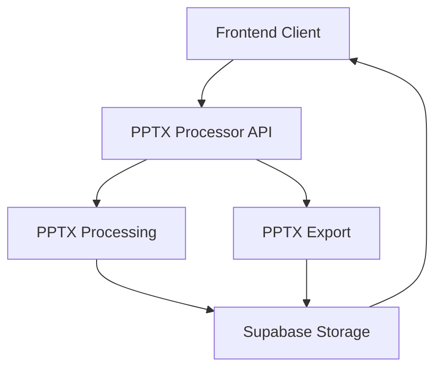

# PPTX Export Integration

This document outlines the technical requirements and implementation details for adding PowerPoint (PPTX) export functionality to the PowerPoint Translator application.

## Overview

The PPTX export feature allows users to convert their translated slide content back into a PowerPoint presentation file. This functionality will be integrated into the existing PPTX Processor service rather than creating a separate service to minimize development time and infrastructure complexity.

## Architecture

### Approach: Extending the PPTX Processor Service

The current architecture already includes a Python-based PPTX Processor service that:
- Handles PPTX file parsing
- Utilizes LibreOffice/UNO for document manipulation
- Integrates with Supabase for storage
- Manages asynchronous job processing

Extending this service to support export functionality leverages the existing infrastructure and reduces development time.



## Technical Requirements

### Backend (PPTX Processor Service)

1. **New API Endpoint**
   - Add `/v1/export` endpoint to handle PPTX export requests
   - Implement job queuing and status tracking consistent with existing patterns

2. **PPTX Generation**
   - Utilize python-pptx library for programmatic PPTX creation
   - Leverage existing LibreOffice/UNO integration for advanced formatting
   - Ensure text positioning accuracy based on original SVG coordinates

3. **Slide Reconstruction**
   - Retrieve original slide data and translated text from Supabase
   - Reconstruct slides maintaining original formatting and layout
   - Properly handle text positioning, fonts, and text box dimensions

4. **Media Handling**
   - Preserve images, shapes, charts, and other non-text elements
   - Maintain animations and transitions if possible

5. **Storage Integration**
   - Store generated PPTX files in Supabase storage
   - Generate secure, time-limited download URLs

### Frontend Integration

1. **API Client Extension**
   - Add `exportPptx` method to `PptxProcessorClient`
   - Implement proper error handling and timeout management

2. **UI Integration**
   - Connect existing export buttons to the new functionality
   - Add progress indication and notifications for export process
   - Implement download mechanism for completed exports

## Implementation Details

### 1. Backend Implementation

#### API Endpoint
```python
@router.post("/v1/export", response_model=ExportResponse)
async def export_pptx(
    session_id: str = Form(...),
    background_tasks: BackgroundTasks = BackgroundTasks(),
    token: str = Depends(get_token_from_header),
):
    """
    Endpoint to export translated slides as PPTX.
    Returns a job ID for tracking the export status.
    """
    try:
        # Validate the session exists and user has access
        validate_session_access(session_id, token)
        
        # Generate a unique job ID
        job_id = str(uuid.uuid4())
        
        # Initialize job status
        await create_job_status(
            job_id=job_id,
            session_id=session_id,
            status=ProcessingStatus.QUEUED,
            current_stage="Export queued"
        )
        
        # Add export task to background queue
        background_tasks.add_task(
            export_pptx_task,
            job_id=job_id,
            session_id=session_id
        )
        
        return ExportResponse(
            job_id=job_id,
            session_id=session_id,
            status=ProcessingStatus.QUEUED
        )
    except Exception as e:
        logger.error(f"Failed to queue export for session {session_id}: {str(e)}")
        raise HTTPException(
            status_code=500,
            detail=f"Failed to queue export: {str(e)}"
        )
```

#### PPTX Generation Core Function
```python
async def export_pptx_task(job_id: str, session_id: str):
    """
    Background task to generate PPTX from translated slides.
    """
    try:
        # Update job status to processing
        await update_job_status(
            job_id=job_id,
            status=ProcessingStatusResponse(
                job_id=job_id,
                session_id=session_id,
                status=ProcessingStatus.PROCESSING,
                progress=5,
                current_stage="Starting PPTX export"
            )
        )
        
        # Retrieve session data from Supabase
        session_data = await get_session_data(session_id)
        if not session_data:
            raise ValueError(f"Session data not found for {session_id}")
        
        # Get original PPTX file path or create new presentation
        if session_data.original_file_path:
            # If we have the original file, use it as a template
            original_pptx = await download_from_storage(
                session_data.original_file_path,
                bucket="original-files"
            )
            presentation = Presentation(original_pptx)
        else:
            # Create a new presentation
            presentation = Presentation()
        
        # Retrieve all slides for the session
        slides_data = await get_session_slides(session_id)
        
        # Process each slide
        for idx, slide_data in enumerate(slides_data):
            progress = 10 + int((idx / len(slides_data)) * 80)
            
            await update_job_status(
                job_id=job_id,
                status=ProcessingStatusResponse(
                    job_id=job_id,
                    session_id=session_id,
                    status=ProcessingStatus.PROCESSING,
                    progress=progress,
                    current_stage=f"Processing slide {idx+1} of {len(slides_data)}"
                )
            )
            
            # Generate or update the slide
            await process_export_slide(presentation, slide_data, idx)
        
        # Save the presentation to a temporary file
        temp_dir = tempfile.mkdtemp()
        output_path = os.path.join(temp_dir, f"{session_id}_translated.pptx")
        presentation.save(output_path)
        
        # Upload to Supabase storage
        export_url = await upload_file_to_supabase(
            file_path=output_path,
            bucket="exported-files",
            destination_path=f"{session_id}/translated.pptx"
        )
        
        # Update job status to completed
        await update_job_status(
            job_id=job_id,
            status=ProcessingStatusResponse(
                job_id=job_id,
                session_id=session_id,
                status=ProcessingStatus.COMPLETED,
                progress=100,
                current_stage="Export completed",
                completed_at=datetime.now(),
                result_url=export_url
            )
        )
        
        # Clean up temporary files
        shutil.rmtree(temp_dir, ignore_errors=True)
        
    except Exception as e:
        logger.error(f"Export failed for session {session_id}: {str(e)}", exc_info=True)
        await update_job_status(
            job_id=job_id,
            status=ProcessingStatusResponse(
                job_id=job_id,
                session_id=session_id,
                status=ProcessingStatus.FAILED,
                progress=0,
                current_stage=f"Export failed: {str(e)}",
                error=str(e)
            )
        )
```

#### Slide Processing Function
```python
async def process_export_slide(presentation, slide_data, slide_index):
    """
    Process a single slide for export.
    Updates or creates slide with translated text.
    """
    # If working with existing presentation and slide exists
    if slide_index < len(presentation.slides):
        slide = presentation.slides[slide_index]
    else:
        # Create a new slide with default layout
        slide = presentation.slides.add_slide(presentation.slide_layouts[0])
    
    # Process each text shape in the slide
    for shape_data in slide_data.shapes:
        # Skip non-text shapes
        if shape_data.type != "text":
            continue
            
        # Find matching shape in the slide by id or position
        target_shape = find_matching_shape(slide, shape_data)
        
        if target_shape:
            # Update existing shape text
            if hasattr(target_shape, "text_frame"):
                target_shape.text_frame.text = shape_data.translated_text
        else:
            # Create new text box if shape not found
            left = shape_data.x
            top = shape_data.y
            width = shape_data.width
            height = shape_data.height
            
            text_box = slide.shapes.add_textbox(left, top, width, height)
            text_box.text_frame.text = shape_data.translated_text
            
            # Apply text formatting if available
            if shape_data.text_properties:
                apply_text_formatting(text_box.text_frame, shape_data.text_properties)
```

### 2. Frontend Integration

#### PptxProcessorClient Extension
```typescript
// Add to lib/api/pptx-processor.ts

/**
 * Export translated presentation as PPTX
 */
async exportPptx(sessionId: string): Promise<ProcessingResponse> {
  try {
    const formData = new FormData();
    formData.append('session_id', sessionId);
    
    const fetchFunction = this.token ? fetchWithAuthAndCors : fetchWithCors;
    const fetchOptions: RequestInit = {
      method: 'POST',
      body: formData,
    };
    
    const response = this.token 
      ? await fetchWithAuthAndCors(`${PPTX_PROCESSOR_URL}/v1/export`, this.token, fetchOptions)
      : await fetchWithCors(`${PPTX_PROCESSOR_URL}/v1/export`, fetchOptions);
    
    if (!response.ok) {
      // Handle specific error status codes
      if (response.status === 401) {
        throw new Error('Authentication failed: Invalid or expired token');
      } else if (response.status === 400) {
        const error = await response.json();
        throw new Error(`Invalid request: ${error.detail || 'Bad request'}`);
      } else if (response.status === 404) {
        throw new Error('PPTX processor export endpoint not found');
      } else if (response.status === 503) {
        throw new Error('PPTX processor service is currently unavailable');
      } else {
        const error = await response.json();
        throw new Error(error.detail || 'Failed to export PPTX file');
      }
    }
    
    return response.json();
  } catch (error: any) {
    console.error('Error exporting PPTX:', error);
    
    // Check for network-related errors
    if (error instanceof TypeError && error.message.includes('fetch')) {
      console.error('PPTX processor service is unreachable');
      throw new Error('PPTX processor service is unreachable');
    }
    
    // Re-throw the error to be handled by the calling function
    throw error;
  }
}

/**
 * Get download URL for exported PPTX
 */
async getExportDownloadUrl(sessionId: string): Promise<string> {
  try {
    const fetchFunction = this.token ? fetchWithAuthAndCors : fetchWithCors;
    const response = await fetchFunction(
      `${PPTX_PROCESSOR_URL}/v1/export/${sessionId}/download`,
      this.token
    );
    
    if (!response.ok) {
      const error = await response.json();
      throw new Error(error.detail || 'Failed to get export download URL');
    }
    
    const data = await response.json();
    return data.download_url;
  } catch (error) {
    console.error('Error getting export download URL:', error);
    throw error;
  }
}
```

#### UI Integration - Editor Page
```typescript
// Update in app/editor/[sessionId]/page.tsx

// Import toast notifications
import { useToast } from "@/components/ui/use-toast";

// Add to SlideEditorPage component
const { toast } = useToast();
const [isExporting, setIsExporting] = useState(false);
const pptxProcessorClient = useMemo(() => new PptxProcessorClient(PPTX_PROCESSOR_URL), []);

// Update handleExport function
const handleExport = async () => {
  if (!canEdit) {
    toast({
      variant: "destructive",
      title: "Permission denied",
      description: "You don't have permission to export this session"
    });
    return;
  }

  if (!currentSessionDetails) return;
  
  try {
    setIsExporting(true);
    
    // Create audit event for export initiated
    createAuditEvent('export', {
      action: 'pptx_export_initiated',
      sessionId: currentSessionDetails.id,
      slideCount: slides.length,
    });
    
    // Start export process
    toast({
      title: "Export started",
      description: "Your presentation is being prepared for export. This may take a few minutes."
    });
    
    // Call export endpoint
    const response = await pptxProcessorClient.exportPptx(currentSessionDetails.id);
    
    // Set up polling for job status
    const jobId = response.job_id;
    const statusCheckInterval = setInterval(async () => {
      try {
        const statusResponse = await pptxProcessorClient.getProcessingStatus(jobId);
        
        if (statusResponse.status === 'completed') {
          clearInterval(statusCheckInterval);
          setIsExporting(false);
          
          // Get download URL
          const downloadUrl = await pptxProcessorClient.getExportDownloadUrl(currentSessionDetails.id);
          
          // Create audit event for export completed
          createAuditEvent('export', {
            action: 'pptx_export_completed',
            sessionId: currentSessionDetails.id,
            slideCount: slides.length,
          });
          
          // Show success notification with download link
          toast({
            title: "Export completed",
            description: "Your presentation is ready for download.",
            action: (
              <ToastAction altText="Download" onClick={() => window.open(downloadUrl, '_blank')}>
                Download
              </ToastAction>
            ),
          });
        } else if (statusResponse.status === 'failed') {
          clearInterval(statusCheckInterval);
          setIsExporting(false);
          
          // Create audit event for export failed
          createAuditEvent('export', {
            action: 'pptx_export_failed',
            sessionId: currentSessionDetails.id,
            error: statusResponse.error || 'Unknown error',
          });
          
          toast({
            variant: "destructive",
            title: "Export failed",
            description: statusResponse.error || "Failed to export presentation"
          });
        }
      } catch (error) {
        console.error("Error checking export status:", error);
      }
    }, 5000); // Check every 5 seconds
    
  } catch (error) {
    setIsExporting(false);
    console.error("Export failed:", error);
    
    toast({
      variant: "destructive",
      title: "Export failed",
      description: error instanceof Error ? error.message : "An unknown error occurred"
    });
  }
};

// Update Button in render
<Button 
  onClick={handleExport} 
  disabled={
    slidesLoading || 
    isSessionDetailsLoading || 
    currentSessionDetails?.status !== 'completed' ||
    !canEdit ||
    isExporting
  } 
  size="sm"
>
  {isExporting ? (
    <>
      <Loader2 className="mr-2 h-4 w-4 animate-spin" />
      Exporting...
    </>
  ) : "Export PPTX"}
</Button>
```

## Data Models

### Backend Models

```python
# Export response model
class ExportResponse(BaseModel):
    job_id: str
    session_id: str
    status: ProcessingStatus
    created_at: Optional[datetime] = Field(default_factory=datetime.now)
    message: Optional[str] = None

# Download URL response model
class DownloadUrlResponse(BaseModel):
    download_url: str
    expires_at: datetime
```

### Frontend Models

```typescript
// Add to types/api/pptx-processor.ts
export interface ExportResponse {
  job_id: string;
  session_id: string;
  status: ProcessingStatus;
  created_at?: string;
  message?: string;
}

export interface DownloadUrlResponse {
  download_url: string;
  expires_at: string;
}
```

## Technical Considerations

### LibreOffice Integration

The PPTX Processor service already has LibreOffice integration for converting PowerPoint to SVG. This same integration can be leveraged for the export functionality but with a different workflow:

1. For import: PPTX → LibreOffice → SVG + text extraction
2. For export: Translated data → python-pptx → PPTX file

Using the python-pptx library provides programmatic control over the PPTX generation, while LibreOffice can be used for any advanced formatting needs.

### Text Positioning

Accurate text positioning is critical for maintaining the original slide layout. The export process must use the coordinates and dimensions stored during the import process to ensure text appears in the correct position with proper formatting.

### Performance Optimization

Generating PPTX files can be resource-intensive. The implementation should:

1. Use background tasks for processing
2. Implement proper caching for frequently accessed data
3. Clean up temporary files after processing
4. Provide job status updates for frontend progress indication

### Security Considerations

1. Validate user permissions before allowing export
2. Generate time-limited download URLs
3. Implement proper error handling to prevent information leakage
4. Sanitize user input in all API endpoints

## Testing Plan

1. **Unit Testing**
   - Test PPTX generation functions
   - Test coordinate transformation and text positioning
   - Test error handling and edge cases

2. **Integration Testing**
   - Test end-to-end export flow
   - Verify text formatting and positioning accuracy
   - Test with various slide layouts and content types

3. **Performance Testing**
   - Test with large presentations (50+ slides)
   - Measure export time and resource usage

## Deployment Steps

1. **Service Updates**
   - Add new dependencies to requirements.txt
   - Implement new API endpoints and processing functions
   - Update Docker configuration if needed

2. **Frontend Updates**
   - Add export functionality to API client
   - Update UI components to handle export process
   - Add progress tracking and notifications

3. **Testing in Staging**
   - Deploy updates to staging environment
   - Verify end-to-end functionality
   - Test with various presentation types and sizes

4. **Production Deployment**
   - Deploy backend changes
   - Deploy frontend changes
   - Monitor for errors and performance issues

## Future Enhancements

1. **Batch Export**
   - Allow exporting multiple presentations at once

2. **Export Customization**
   - Allow users to customize export options (format, quality, etc.)

3. **Export History**
   - Track export history and allow re-downloading previous exports

4. **Format Variations**
   - Add support for exporting to other formats (PDF, ODP, etc.) 