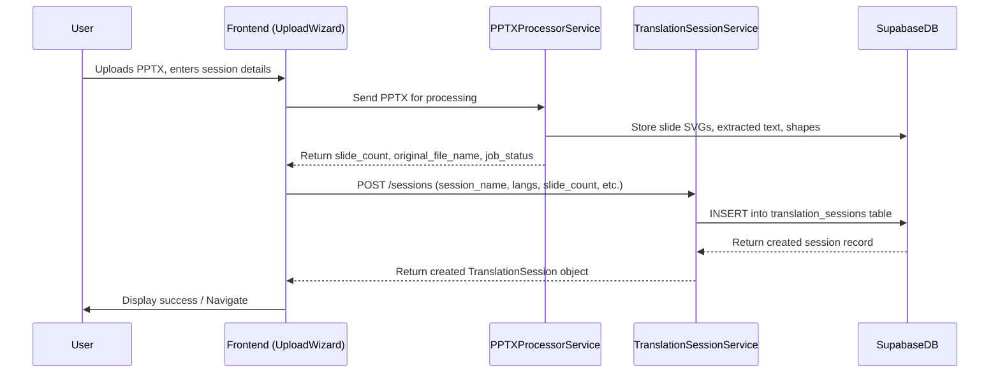
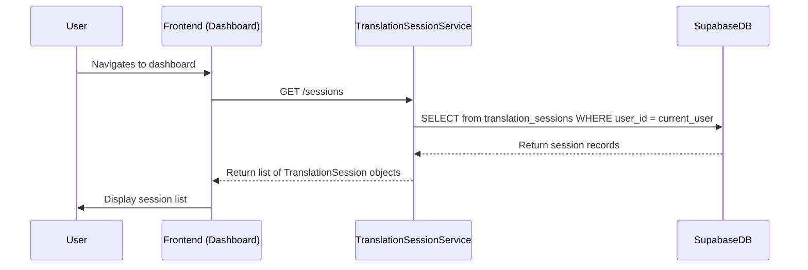

# TranslationSessionService Integration Guide

## 1. Overview and Purpose

The `TranslationSessionService` is a backend microservice responsible for managing the lifecycle and metadata of "translation sessions." A translation session represents a specific PowerPoint (PPTX) file that a user has uploaded for translation. This service enables users to track, organize, and manage their translation projects.

**Key Responsibilities:**

*   Storing and retrieving metadata for each translation session (e.g., name, original file name, source/target languages, status, slide count, owner).
*   Providing API endpoints for CRUD (Create, Read, Update, Delete) operations on translation sessions.
*   Ensuring that users can only access and manage their own translation sessions.
*   Interfacing with the frontend to populate dashboards and provide context to the slide editor.
*   Facilitating the creation of a session record after a PPTX file has been processed by the `PPTXProcessorService`.

**Technology Stack:**

*   **Framework:** Hono.js
*   **Runtime:** Bun.js
*   **Language:** TypeScript
*   **Database:** Supabase (PostgreSQL) via a dedicated `translation_sessions` table.
*   **Authentication:** Supabase JWTs (validated to identify and authorize users).

## 2. Supabase Integration

### 2.1. `translation_sessions` Table Schema

This table stores all metadata related to individual translation sessions.

```sql
-- Ensure the uuid-ossp extension is enabled if not already
-- CREATE EXTENSION IF NOT EXISTS "uuid-ossp";

-- Ensure the moddatetime extension is enabled if not already
-- CREATE EXTENSION IF NOT EXISTS "moddatetime";

CREATE TABLE public.translation_sessions (
  id uuid NOT NULL DEFAULT uuid_generate_v4(),
  user_id uuid NOT NULL,
  session_name text NOT NULL,
  original_file_name text NULL,
  source_language_code character varying(10) NOT NULL, -- e.g., "en", "en-US"
  target_language_codes text[] NOT NULL, -- e.g., '{"es", "fr-CA"}'
  status text NOT NULL DEFAULT 'draft'::text, -- Potential values: draft, in_progress, completed, archived
  slide_count integer NULL,
  created_at timestamptz NOT NULL DEFAULT now(),
  updated_at timestamptz NOT NULL DEFAULT now(),
  last_opened_at timestamptz NULL,
  CONSTRAINT translation_sessions_pkey PRIMARY KEY (id),
  CONSTRAINT translation_sessions_user_id_fkey FOREIGN KEY (user_id) REFERENCES auth.users(id) ON DELETE CASCADE
);

-- Add comments to table and columns for clarity
COMMENT ON TABLE public.translation_sessions IS 'Stores metadata for user-initiated translation projects (sessions).';
COMMENT ON COLUMN public.translation_sessions.user_id IS 'Owner of the translation session.';
COMMENT ON COLUMN public.translation_sessions.session_name IS 'User-defined name for the session.';
COMMENT ON COLUMN public.translation_sessions.original_file_name IS 'The original filename of the uploaded PPTX.';
COMMENT ON COLUMN public.translation_sessions.source_language_code IS 'Language code of the original presentation (e.g., BCP 47).';
COMMENT ON COLUMN public.translation_sessions.target_language_codes IS 'Array of language codes for translation targets (e.g., BCP 47).';
COMMENT ON COLUMN public.translation_sessions.status IS 'Current status of the translation session (e.g., draft, in_progress, completed, archived).';
COMMENT ON COLUMN public.translation_sessions.slide_count IS 'Total number of slides in the presentation.';
COMMENT ON COLUMN public.translation_sessions.last_opened_at IS 'Timestamp of when the session was last opened in the editor.';

-- Index for user_id to speed up queries filtering by user
CREATE INDEX idx_translation_sessions_user_id ON public.translation_sessions(user_id);

-- Trigger to automatically update updated_at timestamp
CREATE TRIGGER handle_updated_at BEFORE UPDATE ON public.translation_sessions
  FOR EACH ROW EXECUTE PROCEDURE moddatetime (updated_at);
```

### 2.2. Row-Level Security (RLS) Policies

RLS policies ensure data isolation and security.

```sql
ALTER TABLE public.translation_sessions ENABLE ROW LEVEL SECURITY;

-- Users can SELECT, UPDATE, DELETE their own translation sessions
CREATE POLICY "Users can manage their own translation sessions"
  ON public.translation_sessions FOR ALL
  USING (auth.uid() = user_id)
  WITH CHECK (auth.uid() = user_id);

-- Authenticated users can INSERT new sessions (user_id will be set to auth.uid() by the service)
CREATE POLICY "Authenticated users can create new sessions"
  ON public.translation_sessions FOR INSERT
  WITH CHECK (auth.role() = 'authenticated');

-- Note: The service itself will run with a service_role key or similar elevated privileges
-- to insert/update records on behalf of users, setting the user_id correctly.
-- Alternatively, if the service uses user JWTs directly for DB operations, the RLS policies above are sufficient.
-- For MVP, direct use of user JWTs via the Supabase client in the service is simpler.
```

## 3. API Specification

All API endpoints are hosted under a base path (e.g., `/api/v1/sessions`).
Authentication is handled by passing the Supabase JWT in the `Authorization` header (`Bearer <token>`). The service will validate this token.

### Common Structures

**TranslationSession Object:**
```typescript
interface TranslationSession {
  id: string; // uuid
  user_id: string; // uuid
  session_name: string;
  original_file_name?: string;
  source_language_code: string;
  target_language_codes: string[];
  status: 'draft' | 'in_progress' | 'completed' | 'archived';
  slide_count?: number;
  created_at: string; // ISO 8601 date-time
  updated_at: string; // ISO 8601 date-time
  last_opened_at?: string; // ISO 8601 date-time
}
```

### Endpoints

#### 1. Create Translation Session
*   **Method:** `POST`
*   **Path:** `/`
*   **Description:** Creates a new translation session record. Typically called after PPTX file processing is complete.
*   **Request Body:**
    ```typescript
    interface CreateSessionPayload {
      session_name: string;
      original_file_name?: string;
      source_language_code: string;
      target_language_codes: string[];
      slide_count?: number;
    }
    ```
    *(Validation: Zod schema on the server)*
*   **Response Body (Success 201):** `TranslationSession` object.
*   **Permissions:** Authenticated User. `user_id` is automatically set from the JWT.

#### 2. List User's Translation Sessions
*   **Method:** `GET`
*   **Path:** `/`
*   **Description:** Retrieves a list of all translation sessions owned by the authenticated user.
*   **Query Parameters (Optional):**
    *   `status?: string` (e.g., "draft", "in_progress")
    *   `sortBy?: string` (e.g., "updated_at_desc", "name_asc")
    *   `page?: number`
    *   `limit?: number`
*   **Response Body (Success 200):**
    ```typescript
    interface PaginatedSessions {
      items: TranslationSession[];
      total: number;
      page: number;
      limit: number;
    }
    // Or simply: TranslationSession[] for MVP
    ```
*   **Permissions:** Authenticated User.

#### 3. Get Translation Session Details
*   **Method:** `GET`
*   **Path:** `/:sessionId`
*   **Description:** Retrieves details for a specific translation session.
*   **Response Body (Success 200):** `TranslationSession` object.
*   **Permissions:** Authenticated User (must own the session).

#### 4. Update Translation Session
*   **Method:** `PUT` or `PATCH`
*   **Path:** `/:sessionId`
*   **Description:** Updates specified fields of a translation session (e.g., name, status, `last_opened_at`).
*   **Request Body:** Partial `TranslationSession` object (fields to update).
    ```typescript
    interface UpdateSessionPayload {
      session_name?: string;
      status?: 'draft' | 'in_progress' | 'completed' | 'archived';
      last_opened_at?: string; // ISO 8601
      // Other updatable fields as needed
    }
    ```
*   **Response Body (Success 200):** Updated `TranslationSession` object.
*   **Permissions:** Authenticated User (must own the session).

#### 5. Delete Translation Session
*   **Method:** `DELETE`
*   **Path:** `/:sessionId`
*   **Description:** Deletes a translation session. This should also handle related data if necessary (e.g., cleanup in Supabase Storage if files are directly linked, though for now, slide SVGs are likely managed separately).
*   **Response Body (Success 204 No Content or 200 with message):**
*   **Permissions:** Authenticated User (must own the session).

## 4. Frontend Integration

### 4.1. API Client (`lib/api/translationSessionApi.ts` or similar)
Create a dedicated API client module for interacting with the `TranslationSessionService`. This module will encapsulate fetch calls, error handling, and request/response typing.

Example function:
```typescript
// In lib/api/translationSessionApi.ts
import { supabase } from '@/lib/supabase/client'; // Assuming you get token from here

async function getSupabaseToken() {
  const { data: { session } } = await supabase.auth.getSession();
  return session?.access_token;
}

const API_BASE_URL = process.env.NEXT_PUBLIC_TRANSLATION_SESSION_SERVICE_URL || '/api/translation-sessions'; // Adjust as needed

export async function createSession(payload: CreateSessionPayload): Promise<TranslationSession> {
  const token = await getSupabaseToken();
  const response = await fetch(`${API_BASE_URL}/`, {
    method: 'POST',
    headers: {
      'Content-Type': 'application/json',
      'Authorization': `Bearer ${token}`,
    },
    body: JSON.stringify(payload),
  });
  if (!response.ok) {
    throw new Error('Failed to create session');
  }
  return response.json();
}

// ... other functions for list, getById, update, delete
```

### 4.2. Zustand Store (`lib/store/slices/translationSessionsSlice.ts` or update `sessionSlice.ts`)

A new Zustand slice (or an extension of an existing one) will manage:
*   List of user's translation sessions.
*   Loading states for session operations.
*   Error states.
*   The currently selected/active session's metadata (if needed globally).

**State Example:**
```typescript
interface TranslationSessionsState {
  sessions: TranslationSession[];
  currentSessionDetails: TranslationSession | null;
  isLoadingList: boolean;
  isLoadingDetails: boolean;
  error: string | null;
  // ... actions
  fetchSessions: () => Promise<void>;
  createSession: (payload: CreateSessionPayload) => Promise<TranslationSession | null>;
  // etc.
}
```

### 4.3. Dashboard Integration (`app/dashboard/page.tsx`)
*   Fetch and display the list of translation sessions using the Zustand store action.
*   Provide UI elements for:
    *   Creating a new session (linking to the `UploadWizard`).
    *   Opening a session in the editor (`/editor/[sessionId]`).
    *   Renaming a session (modal + API call).
    *   Deleting a session (confirmation + API call).
    *   Displaying session status, last opened, languages.

### 4.4. New Session Wizard (`app/dashboard/new-session/components/upload-wizard.tsx`) Workflow Update
1.  User uploads PPTX.
2.  File is sent to `PPTXProcessorService`.
3.  `PPTXProcessorService` processes the file, extracts slide data, SVGs, `slide_count`, and `original_file_name`.
4.  Frontend receives `slide_count` and `original_file_name` (and other necessary info) from `PPTXProcessorService`.
5.  User provides `session_name`, `source_language_code`, `target_language_codes`.
6.  Frontend calls `translationSessionApi.createSession` with the combined payload.
7.  On successful creation, the new session is added to the Zustand store, and the dashboard UI updates. User might be navigated to the editor or back to the dashboard.

### 4.5. Editor Integration (`app/editor/[sessionId]/page.tsx`)
*   On page load, fetch the specific session details using `translationSessionApi.getSessionById(sessionId)` and store/use them (e.g., display session name).
*   When the editor for a session is opened, make an API call to `translationSessionApi.updateSession(sessionId, { last_opened_at: new Date().toISOString() })`.
    *   If the session status is 'draft', this could also be a good time to update it to 'in_progress'.

## 5. Service Interaction

### 5.1. `PPTXProcessorService`
*   The `TranslationSessionService` does **not** directly call the `PPTXProcessorService`.
*   The frontend orchestrates the flow: `PPTXProcessorService` first, then `TranslationSessionService`.

### 5.2. `ShareService`
*   The `ShareService` will likely need to read session details from `TranslationSessionService` (or directly from the `translation_sessions` table if it has DB access and appropriate RLS/permissions) to validate that a session exists before creating share links for it.

### 5.3. `PPTXExportService` (Future)
*   This service will need to:
    1.  Fetch session metadata from `TranslationSessionService` (e.g., original file structure clues, target languages).
    2.  Fetch translated slide content (likely from the `slide_shapes` table).
    3.  Reconstruct the PPTX file.

## 6. Data Flow Diagrams

### 6.1. Creating a New Translation Session


### 6.2. Listing/Viewing Translation Sessions (Dashboard)


## 7. Key Design Decisions & Future Considerations

*   **Simplicity for MVP:** The initial version focuses on core CRUD and metadata management.
*   **Auto-saving Text:** Individual text shape translations are saved by existing editor mechanisms (directly to `slide_shapes` in Supabase). The `TranslationSessionService` is primarily concerned with the session's overall metadata and state, not granular sub-slide content for MVP.
*   **Decoupling:** The service is decoupled from the actual PPTX processing and slide content storage, focusing solely on the session entity.
*   **Future: Comprehensive Editor State:** Saving/restoring a more detailed editor snapshot (e.g., zoom, current slide, unsaved buffer across multiple shapes) is a future enhancement. This might involve the `TranslationSessionService` storing a JSON blob or a link to a state file.
*   **Future: Session Versioning:** Not in MVP scope, but could be added later.
*   **Scalability:** Hono.js on Bun.js is chosen for good performance. Standard database indexing and pagination will be used.

This document provides a foundational guide for the `TranslationSessionService`. It should be updated as development progresses and new requirements emerge. 