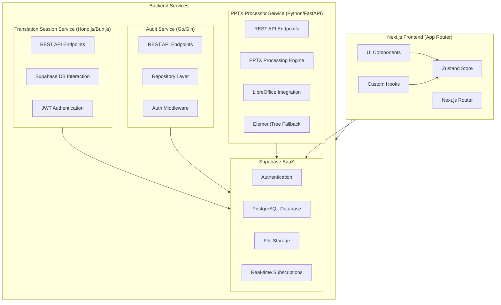

# System Patterns: PowerPoint Translator App

## 1. Architecture Overview

The PowerPoint Translator App follows a modern, distributed architecture with specialized components:



## 2. Application Patterns

### 2.1 Frontend Architecture

1. **Next.js App Router Structure:**
   - Page-based routing with nested route segments
   - Route handlers for API endpoints
   - Server and Client Components using the "use client" directive

2. **Component Hierarchy:**
   - Layout components for consistent page structure
   - UI components from shadcn/ui for consistent design
   - Page-specific components for specialized functionality
   - Shared components for common patterns

3. **State Management with Zustand:**
   - **Modular Slice Architecture:** (ENHANCED WITH ADVANCED FEATURES)
     - Separate store slices for different domains:
       - `session-slice.ts`: User session, roles, and permissions
       - `slides-slice.ts`: Slide data, current slide, and navigation
       - `edit-buffers-slice.ts`: Tracking unsaved text edits
       - `comments-slice.ts`: Comments on slides and shapes
       - `notifications-slice.ts`: System and comment notifications
       - `merge-slice.ts`: Merge operations and shape selection
       - `share-slice.ts`: Session sharing functionality
       - `translation-sessions-slice.ts`: Translation session management
       - `migration-slice.ts`: Schema migration handling
       - `network-slice.ts`: Online/offline state tracking
       - `offline-queue-slice.ts`: Queue for offline operations
       - `subscription-slice.ts`: Selective subscription management
     - Main store combines slices using Zustand's create function
   
   - **Store Structure:**
     ```
     lib/store/
     ├── index.ts            # Main store creation and exports
     ├── README.md           # Comprehensive documentation
     ├── types.ts            # Type definitions for all slices
     ├── slices/
     │   ├── session-slice.ts
     │   ├── slides-slice.ts
     │   ├── edit-buffers-slice.ts
     │   ├── comments-slice.ts
     │   ├── notifications-slice.ts
     │   ├── merge-slice.ts
     │   ├── share-slice.ts
     │   ├── translation-sessions-slice.ts
     │   ├── migration-slice.ts
     │   ├── network-slice.ts
     │   ├── offline-queue-slice.ts
     │   └── subscription-slice.ts
     ├── migrations/
     │   ├── index.ts        # Migration registry
     │   └── v2-add-comment-color.ts # Example migration
     └── utils/
         ├── network-listeners.ts    # Network event setup
         └── subscription-manager.ts # Subscription utilities
     ```
   
   - **Enhanced Store Features:**
     - **Schema Migration System**: Automatic migration handling for store structure changes
     - **Comprehensive Error Handling**: Standardized error states across all slices
     - **Offline Queue**: Automatic operation queueing during network outages
     - **Selective Subscriptions**: Performance-optimized real-time updates (fully implemented, tested, and documented)
     - **Network State Management**: Automatic online/offline detection
     - **Persistence**: Enhanced localStorage persistence with migration support
     - **Type Safety**: Comprehensive TypeScript definitions and conflict resolution

4. **Form Management:**
   - React Hook Form for form state
   - Zod for validation schema
   - Controlled components for complex inputs

5. **Navigation Patterns:**
   - Next.js `useRouter` for programmatic navigation
   - Link component for declarative navigation
   - Dynamic route parameters for session and slide IDs

### 2.2 Backend Architecture

1. **Microservice Pattern:**
   - Dedicated services for specific domains:
     - PPTX Processor Service for presentation processing
     - Audit Service for activity logging
   - Independent deployment and scaling
   - Domain-specific technology choices

2. **PPTX Processor Service Patterns:**
   - RESTful API with FastAPI
   - Background task processing with job management
   - **UNO API Integration**: Individual slide processing via unoserver connection
   - **Multi-slide Export**: 100% success rate using LibreOffice UNO API
   - Enhanced text extraction with translation-optimized metadata
   - **Fallback Strategy**: Graceful degradation to LibreOffice batch processing
   - **Production Architecture**: Clean, organized codebase structure
   - Job status tracking
   - Error handling and retries
   - **PPTX Export Functionality (NEW):**
     - Export API endpoints (`/v1/export`, `/v1/export/{session_id}/download`)
     - Background export job processing with status tracking
     - PPTX file generation from translated slide data
     - Secure download URL generation with expiration
     - Integration with existing job management system
     - End-to-end export workflow from frontend to download

3. **Audit Service Patterns:**
   - RESTful API with Gin
   - Repository pattern for data access
   - Middleware chain for request processing
   - JWT validation with caching
   - Structured logging
   - Error handling middleware

4. **Share Service Patterns (IN DEVELOPMENT):**
   - RESTful API with Hono.js
   - Bun.js runtime for performance
   - JWT-based token system for secure sharing
   - Permission-based access control
   - Middleware for token validation
   - Integration with Supabase for storage and authentication
   - Rate limiting for security

5. **Translation Session Service Patterns (NEW):**
   - RESTful API with Hono.js for managing translation session lifecycle and metadata.
   - Bun.js runtime for performance.
   - JWT-based authentication (Supabase JWTs) to identify users and authorize actions.
   - CRUD operations for translation sessions (create, read, update, delete).
   - Stores translation session metadata in a dedicated `translation_sessions` table in Supabase.
   - Interacts with the frontend to provide data for dashboards and the editor.
   - Simple business logic focused on core session management for MVP.

6. **Supabase Integration Patterns:**
   - Authentication via Supabase Auth
   - Database access via Supabase client
   - File storage in Supabase Storage
   - Row-level security (RLS) policies for data protection
   - Database triggers for audit events
   - Supabase client for browser and server

### 2.3 Data Flow Patterns

1. **Slide Processing & Session Creation Flow:**
   ```mermaid
   sequenceDiagram
       Client->>PPTX Service: Upload PPTX file
       PPTX Service->>UnoServer: Connect via UNO API bridge
       PPTX Service->>UnoServer: Export each slide individually to SVG
       UnoServer->>PPTX Service: Return individual SVG files (100% success)
       PPTX Service->>PPTX Service: Enhanced text extraction with coordinates
       PPTX Service->>Supabase Storage: Store all SVGs
       PPTX Service->>Supabase DB: Store slide & shape data with validation
       PPTX Service->>Client: Return job status & core slide info (slide_count, original_file_name)
       Client->>TranslationSessionService: Create Session (name, lang, slide_count, etc.)
       TranslationSessionService->>Supabase DB: Store session metadata in 'translation_sessions' table
       TranslationSessionService->>Client: Return created session
       Client->>Supabase DB: Query processed slides for editor
       Client->>Supabase Storage: Fetch SVGs for editor
       Client->>Client: Render slides with editable overlays
   ```

2. **Text Editing Flow:**
   ```mermaid
   sequenceDiagram
       User->>SlideCanvas: Click text shape
       SlideCanvas->>EditDialog: Open with shape data
       User->>EditDialog: Edit text
       EditDialog->>Store: Update edit buffer
       Store->>EditDialog: Reflect changes
       User->>EditDialog: Save changes
       EditDialog->>Store: Update slide shape text
       Store->>Supabase DB: Save changes
       Store->>AuditService: Log edit action
   ```

3. **PPTX Export Flow (NEW):**
   ```mermaid
   sequenceDiagram
       User->>Editor: Click "Export PPTX"
       Editor->>PptxClient: exportPptx(sessionId)
       PptxClient->>PPTX Service: POST /v1/export
       PPTX Service->>Background Job: Start export task
       PPTX Service->>Editor: Return job_id and status
       Editor->>Editor: Show loading state
       loop Status Polling
           Editor->>PptxClient: Check job status
           PptxClient->>PPTX Service: GET /v1/jobs/{job_id}
           PPTX Service->>Editor: Return job status
       end
       Background Job->>Supabase DB: Fetch session and slide data
       Background Job->>Background Job: Generate PPTX with translated text
       Background Job->>Supabase Storage: Store completed PPTX file
       Background Job->>PPTX Service: Update job status to completed
       Editor->>PptxClient: getExportDownloadUrl(sessionId)
       PptxClient->>PPTX Service: GET /v1/export/{session_id}/download
       PPTX Service->>Editor: Return secure download URL
       Editor->>User: Show download notification with link
       User->>Browser: Click download link
       Browser->>Supabase Storage: Download PPTX file
   ```

4. **Audit Logging Flow:**
   ```mermaid
   sequenceDiagram
       User->>Component: Perform action
       Component->>Hook: Call useAuditLog()
       Hook->>AuditService: Send log entry
       AuditService->>Auth: Validate JWT
       AuditService->>DB: Store log entry
       AuditService->>Component: Return success
       Component->>User: Action completed
   ```

### 2.4 Authentication & Authorization Patterns

1. **Authentication Flow:**
   - Supabase Auth for user management
   - JWT tokens for API authentication
   - Auth server middleware for validation
   - Protected routes in Next.js

2. **Role-Based Access:**
   - UserRole: owner, reviewer, viewer
   - Permission checking in components and API routes
   - Row-level security in Supabase

3. **Share Token System:**
   - Share tokens for reviewer access
   - Time-limited tokens with specific permissions
   - Token validation in middleware

## 3. Key Design Patterns

1. **Slice Pattern (State Management):**
   - Modular state management with Zustand slices
   - Each slice manages a specific domain
   - Slices combined into a single store
   - Custom hooks for accessing slices

2. **Migration Pattern (Schema Evolution):**
   - Version-based schema migration system
   - Sequential migration execution with rollback protection
   - Automatic migration detection and execution on store hydration
   - Migration registry for centralized management
   - Type-safe migration functions with error handling

3. **Offline-First Pattern:**
   - Automatic operation queueing during network outages
   - FIFO processing of queued operations on reconnection
   - Retry logic with exponential backoff
   - Persistent queue storage across app restarts
   - Network state detection with automatic recovery

4. **Error Recovery Pattern:**
   - Comprehensive error state tracking across all slices
   - Optimistic update reversal on operation failure
   - Standardized error handling with user-friendly messages
   - Error boundary integration with store error states
   - Automatic retry mechanisms for transient failures

5. **Selective Subscription Pattern:**
   - Dynamic subscription management for performance optimization (fully implemented, tested, and documented)
   - Channel-specific subscription activation/deactivation
   - Session-scoped subscriptions for multi-tenant environments
   - Automatic cleanup to prevent memory leaks
   - Filtered event handling for relevant updates only

6. **Persistence Pattern (State Storage):**
   - Using Zustand persist middleware with migration support
   - Selective state persistence via partialize
   - Version tracking for migration compatibility
   - Storage adapter pattern for different environments
   - Cross-session state survival with cleanup mechanisms

7. **Real-time Synchronization Pattern:**
   - Supabase real-time channels for database changes
   - Event-based subscription model with selective filtering
   - Channel management with lifecycle hooks
   - Handlers for different event types (INSERT, UPDATE, DELETE)
   - Component-level cleanup to prevent memory leaks

8. **Optimistic Updates Pattern:**
   - Immediate UI updates before server confirmation
   - Tracking pending/sync status with UI indicators
   - Error handling with fallback to previous state
   - Background server synchronization
   - Loading states with fallback UI

9. **Drag-and-Drop Pattern:**
   - Using @hello-pangea/dnd for smooth drag interactions
   - Droppable context for drop targets
   - Draggable components for interactive elements
   - Store integration for persistence of reordered items
   - Optimistic UI updates during drag operations
   - Server synchronization after reordering

10. **Repository Pattern (Audit Service):**
    - Abstracts data access logic
    - Enables swapping implementations
    - Centralizes query logic

11. **Middleware Pattern (API Services):**
    - Chainable request processing
    - Cross-cutting concerns (auth, logging, error handling)
    - Consistent request flow

12. **Background Processing Pattern (PPTX Service):**
    - Async task handling
    - Job status tracking
    - Retry mechanisms

13. **Hybrid Rendering Pattern (Frontend):**
    - SVG backgrounds from processed slides
    - HTML overlays for interactive elements
    - Position matching based on coordinates

14. **Event Sourcing (Audit Logging):**
    - Capturing all state-changing events
    - Reconstructing state from event log
    - Immutable event history

## 4. Communication Patterns

1. **API Communication:**
   - RESTful endpoints for service interaction
   - JSON payload format
   - HTTP status codes for error handling
   - Query parameters for filtering and pagination

2. **Real-time Updates:**
   - Supabase real-time subscriptions
   - Channel-based data segmentation
   - Optimistic local updates
   - Eventual consistency model
   - Error recovery mechanisms

3. **Error Handling:**
   - Consistent error response format
   - Client-side error handling with fallbacks
   - Detailed error logging
   - User-friendly error messages

## 5. Deployment Patterns

1. **Containerization:**
   - Docker for service packaging
   - Container orchestration for deployment
   - Environment-specific configurations

2. **CI/CD:**
   - Automated testing and building
   - Deployment pipelines
   - Environment promotion

3. **Environment Strategy:**
   - Development, staging, and production environments
   - Environment-specific configurations
   - Feature flags for controlled rollout

## 6. Testing Patterns

1. **Component Testing:**
   - React Testing Library for component tests
   - Mock store for state management testing
   - Snapshot testing for UI consistency

2. **API Testing:**
   - Integration tests for API endpoints
   - Mock external dependencies
   - Test coverage for critical paths

3. **End-to-End Testing:**
   - Cypress for full application testing
   - User journey testing
   - Visual regression testing
