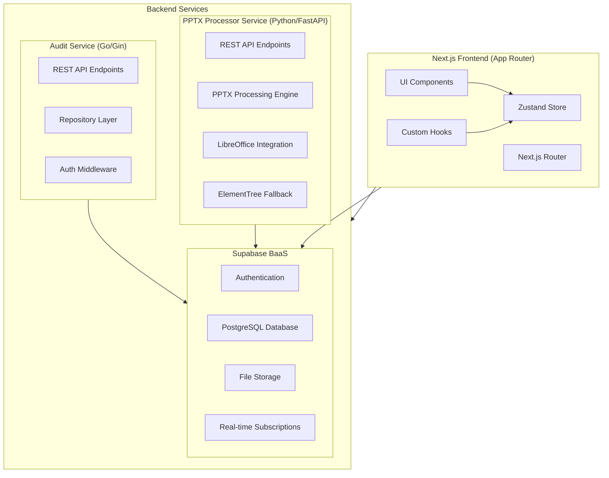

# System Patterns: PowerPoint Translator App

## 1. Architecture Overview

The PowerPoint Translator App follows a modern, distributed architecture with specialized components:



## 2. Application Patterns

### 2.1 Frontend Architecture

1. **Next.js App Router Structure:**
   - Page-based routing with nested route segments
   - Route handlers for API endpoints
   - Server and Client Components using the "use client" directive

2. **Component Hierarchy:**
   - Layout components for consistent page structure
   - UI components from shadcn/ui for consistent design
   - Page-specific components for specialized functionality
   - Shared components for common patterns

3. **State Management with Zustand:**
   - **Modular Slice Architecture:** (IMPLEMENTED)
     - Separate store slices for different domains:
       - `session-slice.ts`: User session, roles, and permissions
       - `slides-slice.ts`: Slide data, current slide, and navigation
       - `edit-buffers-slice.ts`: Tracking unsaved text edits
       - `comments-slice.ts`: Comments on slides and shapes
       - `notifications-slice.ts`: System and comment notifications
       - `merge-slice.ts`: Merge operations and shape selection
     - Main store combines slices using Zustand's create function
   
   - **Store Structure:**
     ```
     lib/store/
     ├── index.ts            # Main store creation and exports
     ├── README.md           # Documentation
     ├── types.ts            # Type definitions for all slices
     └── slices/
         ├── session-slice.ts
         ├── slides-slice.ts
         ├── edit-buffers-slice.ts
         ├── comments-slice.ts
         ├── notifications-slice.ts
         └── merge-slice.ts
     ```
   
   - **Store Integration:**
     - Custom hooks for accessing store state (useAppStore, useSession, useSlides, etc.)
     - Component integration using these hooks instead of local useState
     - Selective component re-rendering using state selectors
     - Middleware for devtools, persistence, and logging
   
   - **State Actions:**
     - Actions co-located with state in each slice
     - Consistent action naming: set*, update*, add*, remove*, toggle*, etc.
     - Actions include validation and side effect handling

4. **Form Management:**
   - React Hook Form for form state
   - Zod for validation schema
   - Controlled components for complex inputs

5. **Navigation Patterns:**
   - Next.js `useRouter` for programmatic navigation
   - Link component for declarative navigation
   - Dynamic route parameters for session and slide IDs

### 2.2 Backend Architecture

1. **Microservice Pattern:**
   - Dedicated services for specific domains:
     - PPTX Processor Service for presentation processing
     - Audit Service for activity logging
   - Independent deployment and scaling
   - Domain-specific technology choices

2. **PPTX Processor Service Patterns:**
   - RESTful API with FastAPI
   - Background task processing
   - File upload handling
   - SVG generation through LibreOffice
   - Text extraction via python-pptx
   - Job status tracking
   - Error handling and retries

3. **Audit Service Patterns:**
   - RESTful API with Gin
   - Repository pattern for data access
   - Middleware chain for request processing
   - JWT validation with caching
   - Structured logging
   - Error handling middleware

4. **Share Service Patterns (IN DEVELOPMENT):**
   - RESTful API with Hono.js
   - Bun.js runtime for performance
   - JWT-based token system for secure sharing
   - Permission-based access control
   - Middleware for token validation
   - Integration with Supabase for storage and authentication
   - Rate limiting for security

5. **Supabase Integration Patterns:**
   - Authentication via Supabase Auth
   - Database access via Supabase client
   - File storage in Supabase Storage
   - Row-level security (RLS) policies for data protection
   - Database triggers for audit events
   - Supabase client for browser and server

### 2.3 Data Flow Patterns

1. **Slide Processing Flow:**
   ```mermaid
   sequenceDiagram
       Client->>PPTX Service: Upload PPTX file
       PPTX Service->>PPTX Service: Process in background
       PPTX Service->>LibreOffice: Convert slides to SVG
       PPTX Service->>python-pptx: Extract text and coordinates
       PPTX Service->>Supabase Storage: Store SVGs
       PPTX Service->>Supabase DB: Store slide data
       PPTX Service->>Client: Return job status
       Client->>Supabase DB: Query processed slides
       Client->>Supabase Storage: Fetch SVGs
       Client->>Client: Render slides with editable overlays
   ```

2. **Text Editing Flow:**
   ```mermaid
   sequenceDiagram
       User->>SlideCanvas: Click text shape
       SlideCanvas->>EditDialog: Open with shape data
       User->>EditDialog: Edit text
       EditDialog->>Store: Update edit buffer
       Store->>EditDialog: Reflect changes
       User->>EditDialog: Save changes
       EditDialog->>Store: Update slide shape text
       Store->>Supabase DB: Save changes
       Store->>AuditService: Log edit action
   ```

3. **Audit Logging Flow:**
   ```mermaid
   sequenceDiagram
       User->>Component: Perform action
       Component->>Hook: Call useAuditLog()
       Hook->>AuditService: Send log entry
       AuditService->>Auth: Validate JWT
       AuditService->>DB: Store log entry
       AuditService->>Component: Return success
       Component->>User: Action completed
   ```

### 2.4 Authentication & Authorization Patterns

1. **Authentication Flow:**
   - Supabase Auth for user management
   - JWT tokens for API authentication
   - Auth server middleware for validation
   - Protected routes in Next.js

2. **Role-Based Access:**
   - UserRole: owner, reviewer, viewer
   - Permission checking in components and API routes
   - Row-level security in Supabase

3. **Share Token System:**
   - Share tokens for reviewer access
   - Time-limited tokens with specific permissions
   - Token validation in middleware

## 3. Key Design Patterns

1. **Slice Pattern (State Management):**
   - Modular state management with Zustand slices
   - Each slice manages a specific domain
   - Slices combined into a single store
   - Custom hooks for accessing slices

2. **Persistence Pattern (State Storage):**
   - Using Zustand persist middleware
   - Selective state persistence via partialize
   - LocalStorage for cross-session survival
   - Storage adapter pattern for different environments

3. **Real-time Synchronization Pattern:**
   - Supabase real-time channels for database changes
   - Event-based subscription model
   - Channel management with lifecycle hooks
   - Handlers for different event types (INSERT, UPDATE, DELETE)
   - Component-level cleanup to prevent memory leaks

4. **Optimistic Updates Pattern:**
   - Immediate UI updates before server confirmation
   - Tracking pending/sync status with UI indicators
   - Error handling with fallback to previous state
   - Background server synchronization
   - Loading states with fallback UI

5. **Drag-and-Drop Pattern:**
   - Using @hello-pangea/dnd for smooth drag interactions
   - Droppable context for drop targets
   - Draggable components for interactive elements
   - Store integration for persistence of reordered items
   - Optimistic UI updates during drag operations
   - Server synchronization after reordering

6. **Repository Pattern (Audit Service):**
   - Abstracts data access logic
   - Enables swapping implementations
   - Centralizes query logic

7. **Middleware Pattern (API Services):**
   - Chainable request processing
   - Cross-cutting concerns (auth, logging, error handling)
   - Consistent request flow

8. **Background Processing Pattern (PPTX Service):**
   - Async task handling
   - Job status tracking
   - Retry mechanisms

9. **Hybrid Rendering Pattern (Frontend):**
   - SVG backgrounds from processed slides
   - HTML overlays for interactive elements
   - Position matching based on coordinates

10. **Event Sourcing (Audit Logging):**
    - Capturing all state-changing events
    - Reconstructing state from event log
    - Immutable event history

## 4. Communication Patterns

1. **API Communication:**
   - RESTful endpoints for service interaction
   - JSON payload format
   - HTTP status codes for error handling
   - Query parameters for filtering and pagination

2. **Real-time Updates:**
   - Supabase real-time subscriptions
   - Channel-based data segmentation
   - Optimistic local updates
   - Eventual consistency model
   - Error recovery mechanisms

3. **Error Handling:**
   - Consistent error response format
   - Client-side error handling with fallbacks
   - Detailed error logging
   - User-friendly error messages

## 5. Deployment Patterns

1. **Containerization:**
   - Docker for service packaging
   - Container orchestration for deployment
   - Environment-specific configurations

2. **CI/CD:**
   - Automated testing and building
   - Deployment pipelines
   - Environment promotion

3. **Environment Strategy:**
   - Development, staging, and production environments
   - Environment-specific configurations
   - Feature flags for controlled rollout

## 6. Testing Patterns

1. **Component Testing:**
   - React Testing Library for component tests
   - Mock store for state management testing
   - Snapshot testing for UI consistency

2. **API Testing:**
   - Integration tests for API endpoints
   - Mock external dependencies
   - Test coverage for critical paths

3. **End-to-End Testing:**
   - Cypress for full application testing
   - User journey testing
   - Visual regression testing
