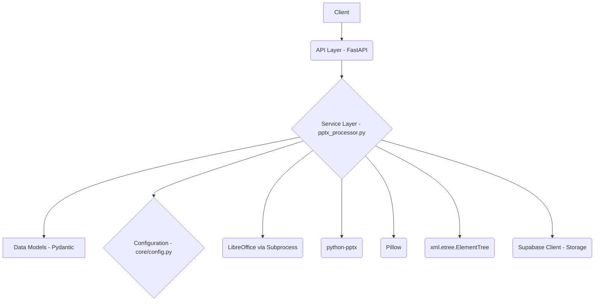
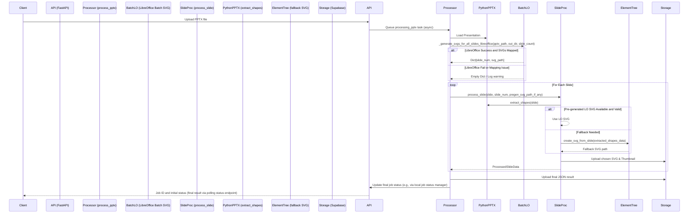

# System Patterns

## Architecture Overview

The PPTX Processor Service follows a clean architecture pattern with clear separation of concerns:

### Core Components
1.  **API Layer (`main.py`, `app/api/routes/`)**: Handles HTTP requests, enqueues processing tasks using FastAPI `BackgroundTasks`.
2.  **Service Layer (`app/services/pptx_processor.py`)**: Orchestrates the entire PPTX processing logic.
    *   Uses `app.core.config.settings` for configuration (e.g., `LIBREOFFICE_PATH`).
    *   Calls `_generate_svgs_for_all_slides_libreoffice` for batch SVG conversion.
    *   Calls `process_slide` for each slide.
3.  **SVG Generation Sub-System**:
    *   **Primary (`_generate_svgs_for_all_slides_libreoffice`)**: Uses LibreOffice (`soffice`) via `subprocess` to convert the entire PPTX to SVGs in one batch operation.
    *   **Fallback (`create_svg_from_slide`)**: Uses `python-pptx` (via `extract_shapes`) and `xml.etree.ElementTree` to generate SVGs if LibreOffice fails or is not configured.
4.  **Metadata Extraction (`extract_shapes`)**: Uses `python-pptx` to extract detailed information about shapes, text, styles, and images from each slide.
5.  **Thumbnail Generation (`create_thumbnail_from_slide_pil`)**: Uses Pillow, `python-pptx` (slide object), and extracted shape data to create PNG thumbnails.
6.  **Data Models (`app/models/schemas.py`)**: Pydantic models for request/response validation and structured data representation.
7.  **Storage (`app/services/supabase_service.py`)**: Handles uploading generated assets (SVGs, thumbnails, JSON results) to Supabase.

### Processing Pipeline (Optimized)

## Key Design Patterns

### Hybrid Conversion (Optimized)
-   **Primary Visuals**: Batch LibreOffice call for high-fidelity SVGs of all slides at once.
    -   `_generate_svgs_for_all_slides_libreoffice(presentation_path, output_dir, slide_count)`
-   **Fallback Visuals**: Per-slide ElementTree generation if LibreOffice fails/unavailable.
    -   `create_svg_from_slide(slide_shapes_data, file_path, ...)`
-   **Consistent Metadata**: `extract_shapes(slide, ...)` always uses `python-pptx`, ensuring uniform metadata regardless of the visual SVG source.

### Configuration-Driven Behavior
-   The availability and path of LibreOffice (`settings.LIBREOFFICE_PATH`) determine if the primary SVG generation path is attempted.

### Centralized Settings Management
-   `app.core.config.Settings` (Pydantic `BaseSettings`) loads configuration from `.env`, providing typed access throughout the application.

### Asynchronous Task Execution
-   FastAPI's `BackgroundTasks` for non-blocking PPTX processing.

### Robust Fallbacks
-   If batch LibreOffice fails, system gracefully attempts per-slide ElementTree SVG.
-   If all SVG generation for a slide fails, a minimal placeholder SVG is created (`create_minimal_svg`).

## Error Handling Strategy
-   **Subprocess Management**: Timeouts and error capturing for LibreOffice calls.
-   **File I/O**: Standard `try-except` blocks for file operations.
-   **SVG Mapping Logic**: Specific checks for LibreOffice output file count against slide count to ensure correct association.
-   **Logging**: Detailed logging at each significant step, especially around primary/fallback decisions and errors.

## Future Extensibility
-   The separation of concerns allows for easier addition of alternative SVG converters or metadata extractors.
-   The batch processing pattern for LibreOffice could be adapted if other tools offer similar efficient whole-presentation processing. 