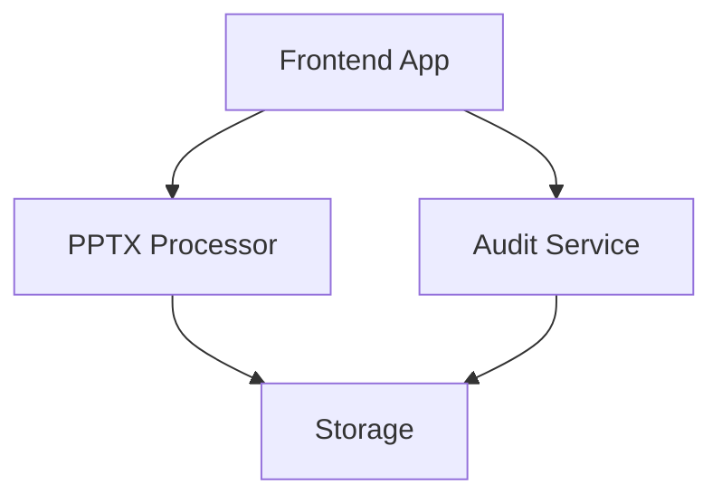

# Services

This directory contains the microservices that power the PowerPoint Translator application.

## Service Architecture

## Available Services

### PPTX Processor Service
- Location: `services/pptx-processor/`
- Purpose: Handles PowerPoint file processing, conversion, and slide extraction
- Key Features:
  - PPTX to SVG conversion
  - Text extraction
  - Layout preservation
  - Metadata extraction

### Audit Service
- Location: `services/audit-service/`
- Purpose: Provides audit logging and tracking for all operations
- Key Features:
  - Operation logging
  - User activity tracking
  - Error tracking
  - Performance monitoring

## Service Communication

Services communicate through:
1. REST APIs
2. Event-based messaging
3. Shared storage

## Development

Each service has its own:
- Configuration
- Dependencies
- Testing suite
- Documentation

## Running Services

See individual service READMEs for specific instructions:
- [PPTX Processor README](pptx-processor/README.md)
- [Audit Service README](audit-service/README.md)

## Adding New Services

To add a new service:
1. Create a new directory under `services/`
2. Follow the service template structure
3. Update this README
4. Add service documentation
5. Update the main application configuration 