# PPTX Processor Service Integration Guide

This guide provides comprehensive documentation for integrating with the PPTX Processor Service, designed specifically for development teams working on the PowerPoint Translator App.

## 🏗️ Architecture Overview

The PPTX Processor Service follows a simplified, single-path architecture optimized for translation workflows:

```mermaid
graph TD
    A[Frontend Upload] --> B[FastAPI Service]
    B --> C[LibreOffice Batch SVG]
    C --> D[Enhanced Text Extraction]
    D --> E[Supabase Storage]
    E --> F[Frontend Slidecanvas]
    
    subgraph "Processing Pipeline"
        C --> G[All Slides → SVG]
        D --> H[python-pptx Enhanced]
        H --> I[Translation Metadata]
    end
```



### Key Design Principles

1. **LibreOffice Only**: Single-path SVG generation, no fallbacks
2. **Translation-Optimized**: All metadata structured for translation workflows
3. **Frontend-First**: API responses designed for slidecanvas component
4. **Docker-Containerized**: Consistent deployment across environments

## 📡 API Reference

### Base URL
- Development: `http://localhost:8000`
- Production: `https://your-domain.com/pptx-processor`

### Authentication
The service integrates with Supabase authentication. Include the user's JWT token:

```typescript
const headers = {
  'Authorization': `Bearer ${supabaseAuthToken}`,
  'Content-Type': 'multipart/form-data'
};
```

## 🚀 Core API Endpoints

### 1. Process PPTX File

**Endpoint:** `POST /api/v1/process`

**Description:** Upload and process a PPTX file to generate SVGs and extract text metadata.

**Request:**
```typescript
const formData = new FormData();
formData.append('file', pptxFile);
formData.append('session_id', sessionId);
formData.append('source_language', 'en');
formData.append('target_language', 'es');

const response = await fetch('/api/v1/process', {
  method: 'POST',
  headers: {
    'Authorization': `Bearer ${token}`
  },
  body: formData
});
```

**Response:**
```typescript
interface ProcessResponse {
  job_id: string;           // For status tracking
  session_id: string;       // Session identifier
  status: 'QUEUED' | 'PROCESSING' | 'COMPLETED' | 'FAILED';
  message: string;
  estimated_completion_time?: string;
  slide_count?: number;     // Total slides in presentation
}
```

### 2. Check Processing Status

**Endpoint:** `GET /api/v1/status/{job_id}`

**Description:** Poll for processing status and progress updates.

**Response:**
```typescript
interface StatusResponse {
  job_id: string;
  session_id: string;
  status: 'QUEUED' | 'PROCESSING' | 'COMPLETED' | 'FAILED';
  progress: number;         // 0-100
  current_stage: string;    // Human-readable progress
  completed_at?: string;
  error_message?: string;
  results_url?: string;     // Available when completed
}
```

**Usage Pattern:**
```typescript
const pollStatus = async (jobId: string) => {
  const response = await fetch(`/api/v1/status/${jobId}`);
  const status = await response.json();
  
  if (status.status === 'COMPLETED') {
    // Process completed, fetch results
    return status;
  } else if (status.status === 'FAILED') {
    // Handle error
    throw new Error(status.error_message);
  } else {
    // Continue polling
    await new Promise(resolve => setTimeout(resolve, 2000));
    return pollStatus(jobId);
  }
};
```

### 3. Get Processing Results

**Endpoint:** `GET /api/v1/results/{session_id}`

**Description:** Retrieve the complete processed data for a session.

**Response:**
```typescript
interface ProcessingResults {
  session_id: string;
  status: 'COMPLETED';
  slides: ProcessedSlide[];
  metadata: {
    original_filename: string;
    slide_count: number;
    processing_time_ms: number;
    source_language?: string;
    target_language?: string;
  };
}
```

## 📊 Data Models

### ProcessedSlide
```typescript
interface ProcessedSlide {
  id: string;                    // Unique slide identifier
  session_id: string;            // Session reference
  slide_number: number;          // 1-based slide index
  svg_url: string;               // Supabase storage URL for SVG
  svg_content?: string;          // Optional inline SVG content
  original_width: number;        // Original slide width in pixels
  original_height: number;       // Original slide height in pixels
  thumbnail_url: string;         // Thumbnail image URL
  background_color?: string;     // Slide background color
  shapes: SlideShape[];          // Text elements for translation
  created_at: string;
  updated_at: string;
}
```

### SlideShape (Enhanced for Translation)
```typescript
interface SlideShape {
  id: string;                    // Unique shape identifier
  slide_id: string;              // Parent slide reference
  shape_type: 'text' | 'image' | 'table' | 'chart';
  
  // Content
  content: string;               // Original text content
  translated_content?: string;   // Translated text (if available)
  
  // Positioning (absolute coordinates)
  x: number;                     // Left position in pixels
  y: number;                     // Top position in pixels
  width: number;                 // Shape width in pixels
  height: number;                // Shape height in pixels
  
  // Text Properties
  font_size?: number;            // Font size in points
  font_family?: string;          // Font family name
  font_weight?: string;          // bold, normal, etc.
  font_style?: string;           // italic, normal, etc.
  text_align?: string;           // left, center, right, justify
  vertical_align?: string;       // top, middle, bottom
  color?: string;                // Text color (hex)
  
  // Translation Metadata
  is_title: boolean;             // Whether this is a slide title
  is_subtitle: boolean;          // Whether this is a subtitle
  text_length: number;           // Character count
  word_count: number;            // Word count
  paragraph_index?: number;      // Paragraph order on slide
  translation_priority: number;  // 1-10, higher = more important
  
  // Context
  placeholder_type?: string;     // PowerPoint placeholder type
  notes?: string;                // Additional context for translators
  
  created_at: string;
  updated_at: string;
}
```

## 🎨 Frontend Integration

### React Component Example

```tsx
import { useState, useEffect } from 'react';

interface PPTXProcessorProps {
  onProcessingComplete: (results: ProcessingResults) => void;
}

export const PPTXProcessor: React.FC<PPTXProcessorProps> = ({
  onProcessingComplete
}) => {
  const [isProcessing, setIsProcessing] = useState(false);
  const [progress, setProgress] = useState(0);
  const [currentStage, setCurrentStage] = useState('');

  const processFile = async (file: File, sessionId: string) => {
    setIsProcessing(true);
    
    try {
      // 1. Start processing
      const formData = new FormData();
      formData.append('file', file);
      formData.append('session_id', sessionId);
      
      const response = await fetch('/api/v1/process', {
        method: 'POST',
        body: formData
      });
      
      const result = await response.json();
      
      // 2. Poll for status
      const finalStatus = await pollStatus(result.job_id);
      
      // 3. Get results
      const results = await fetch(`/api/v1/results/${sessionId}`);
      const processedData = await results.json();
      
      onProcessingComplete(processedData);
      
    } catch (error) {
      console.error('Processing failed:', error);
    } finally {
      setIsProcessing(false);
    }
  };

  const pollStatus = async (jobId: string): Promise<StatusResponse> => {
    const response = await fetch(`/api/v1/status/${jobId}`);
    const status = await response.json();
    
    setProgress(status.progress);
    setCurrentStage(status.current_stage);
    
    if (status.status === 'COMPLETED') {
      return status;
    } else if (status.status === 'FAILED') {
      throw new Error(status.error_message);
    } else {
      await new Promise(resolve => setTimeout(resolve, 2000));
      return pollStatus(jobId);
    }
  };

  return (
    <div className="pptx-processor">
      {isProcessing && (
        <div className="processing-status">
          <div className="progress-bar">
            <div 
              className="progress-fill" 
              style={{ width: `${progress}%` }}
            />
          </div>
          <p>{currentStage}</p>
        </div>
      )}
    </div>
  );
};
```

### Slidecanvas Integration

```tsx
interface SlidecanvasProps {
  slide: ProcessedSlide;
  onTextClick: (shape: SlideShape) => void;
}

export const Slidecanvas: React.FC<SlidecanvasProps> = ({
  slide,
  onTextClick
}) => {
  return (
    <div className="slidecanvas" style={{
      width: slide.original_width,
      height: slide.original_height,
      position: 'relative'
    }}>
      {/* SVG Background */}
      
      
      {/* Interactive Text Overlays */}
      {slide.shapes.map(shape => (
        <div
          key={shape.id}
          className="text-overlay"
          style={{
            position: 'absolute',
            left: shape.x,
            top: shape.y,
            width: shape.width,
            height: shape.height,
            cursor: 'pointer',
            backgroundColor: 'transparent'
          }}
          onClick={() => onTextClick(shape)}
        >
          {/* Invisible overlay for click detection */}
        </div>
      ))}
    </div>
  );
};
```

## 🔄 State Management Integration

### Zustand Store Integration

```typescript
interface PPTXProcessingState {
  processingJobs: Map<string, ProcessingJob>;
  processedSessions: Map<string, ProcessingResults>;
  
  // Actions
  startProcessing: (file: File, sessionId: string) => Promise<void>;
  updateProgress: (jobId: string, progress: number, stage: string) => void;
  completeProcessing: (sessionId: string, results: ProcessingResults) => void;
  getSlide: (sessionId: string, slideNumber: number) => ProcessedSlide | undefined;
}

export const usePPTXStore = create<PPTXProcessingState>((set, get) => ({
  processingJobs: new Map(),
  processedSessions: new Map(),

  startProcessing: async (file: File, sessionId: string) => {
    const formData = new FormData();
    formData.append('file', file);
    formData.append('session_id', sessionId);
    
    const response = await fetch('/api/v1/process', {
      method: 'POST',
      body: formData
    });
    
    const result = await response.json();
    
    set(state => ({
      processingJobs: new Map(state.processingJobs).set(result.job_id, {
        jobId: result.job_id,
        sessionId,
        status: result.status,
        progress: 0
      })
    }));
    
    // Start polling
    pollJobStatus(result.job_id);
  },

  // ... other actions
}));
```

## 🔧 Configuration

### Environment Variables

```env
# Service Configuration
PPTX_PROCESSOR_URL=http://localhost:8000
PPTX_PROCESSOR_TIMEOUT=300000

# Processing Settings
MAX_FILE_SIZE_MB=50
SUPPORTED_FORMATS=pptx,ppt
CONCURRENT_UPLOADS=3

# Feature Flags
ENABLE_THUMBNAIL_GENERATION=true
ENABLE_TEXT_SEGMENTATION=true
ENABLE_TRANSLATION_HINTS=true
```

### Frontend Configuration

```typescript
// config/pptx-processor.ts
export const pptxProcessorConfig = {
  baseUrl: process.env.NEXT_PUBLIC_PPTX_PROCESSOR_URL || 'http://localhost:8000',
  timeout: 300000,
  maxFileSize: 50 * 1024 * 1024, // 50MB
  supportedFormats: ['pptx', 'ppt'],
  pollInterval: 2000,
  maxRetries: 3
};
```

## 🚨 Error Handling

### Error Types

```typescript
interface PPTXProcessorError {
  code: string;
  message: string;
  details?: any;
  recoverable: boolean;
}

// Common error codes
const ERROR_CODES = {
  FILE_TOO_LARGE: 'FILE_TOO_LARGE',
  UNSUPPORTED_FORMAT: 'UNSUPPORTED_FORMAT',
  LIBREOFFICE_FAILED: 'LIBREOFFICE_FAILED',
  PROCESSING_TIMEOUT: 'PROCESSING_TIMEOUT',
  STORAGE_ERROR: 'STORAGE_ERROR',
  INVALID_PPTX: 'INVALID_PPTX'
} as const;
```

### Error Handling Strategy

```typescript
const handleProcessingError = (error: PPTXProcessorError) => {
  switch (error.code) {
    case ERROR_CODES.FILE_TOO_LARGE:
      showErrorMessage('File is too large. Maximum size is 50MB.');
      break;
      
    case ERROR_CODES.UNSUPPORTED_FORMAT:
      showErrorMessage('Unsupported file format. Please upload a PPTX file.');
      break;
      
    case ERROR_CODES.LIBREOFFICE_FAILED:
      // Recoverable error - suggest retry
      showErrorMessage('Processing failed. Please try again.', {
        action: 'retry',
        recoverable: true
      });
      break;
      
    case ERROR_CODES.PROCESSING_TIMEOUT:
      showErrorMessage('Processing is taking longer than expected. Please check back later.');
      break;
      
    default:
      showErrorMessage('An unexpected error occurred. Please contact support.');
  }
};
```

## 📈 Performance Considerations

### File Size Limits
- Maximum file size: 50MB
- Recommended: < 20MB for optimal performance
- Large files may take 2-5 minutes to process

### Processing Time Estimates
- Small presentation (1-10 slides): 30-60 seconds
- Medium presentation (11-50 slides): 1-3 minutes
- Large presentation (51+ slides): 3-10 minutes

### Optimization Tips

1. **Polling Frequency**: Use 2-second intervals for status polling
2. **Caching**: Cache processed results in local storage
3. **Parallel Processing**: Process multiple files concurrently (max 3)
4. **Progress Feedback**: Always show progress to users
5. **Error Recovery**: Implement retry logic for recoverable errors

## 🧪 Testing

### Integration Test Example

```typescript
describe('PPTX Processor Integration', () => {
  test('should process PPTX file successfully', async () => {
    const file = new File([pptxBuffer], 'test.pptx', {
      type: 'application/vnd.openxmlformats-officedocument.presentationml.presentation'
    });
    
    const sessionId = 'test-session-123';
    
    // Start processing
    const response = await fetch('/api/v1/process', {
      method: 'POST',
      body: createFormData(file, sessionId)
    });
    
    const result = await response.json();
    expect(result.status).toBe('QUEUED');
    expect(result.job_id).toBeDefined();
    
    // Poll for completion
    const finalStatus = await pollUntilComplete(result.job_id);
    expect(finalStatus.status).toBe('COMPLETED');
    
    // Get results
    const results = await fetch(`/api/v1/results/${sessionId}`);
    const data = await results.json();
    
    expect(data.slides).toHaveLength(3);
    expect(data.slides[0].shapes).toBeDefined();
    expect(data.slides[0].svg_url).toMatch(/^https?:\/\//);
  });
});
```

## 📋 Deployment Checklist

### Development Environment
- [ ] Docker and Docker Compose installed
- [ ] Supabase project configured
- [ ] Environment variables set
- [ ] LibreOffice container working
- [ ] Storage buckets created

### Production Environment
- [ ] Container orchestration configured
- [ ] Load balancer setup
- [ ] Health checks enabled
- [ ] Monitoring and logging configured
- [ ] Backup and recovery tested
- [ ] Security review completed

## 📞 Support & Troubleshooting

### Common Issues

1. **"LibreOffice not found"**
   - Ensure Docker container includes LibreOffice
   - Check LIBREOFFICE_PATH environment variable

2. **"SVG generation failed"**
   - Verify LibreOffice can run in headless mode
   - Check file permissions and temp directory access

3. **"Processing timeout"**
   - Increase timeout settings
   - Check system resources (CPU, memory)

4. **"Storage upload failed"**
   - Verify Supabase credentials
   - Check storage bucket permissions

### Getting Help

- Review the [troubleshooting guide](../README.md#troubleshooting)
- Check service logs: `docker-compose logs pptx-processor`
- Monitor health endpoint: `GET /health`
- Contact the development team with job ID and session ID for specific issues

## 🔗 Related Documentation

- [API Reference](API.md) - Complete API documentation
- [Development Guide](DEVELOPMENT.md) - Local development setup
- [Deployment Guide](DEPLOYMENT.md) - Production deployment
- [Project Memory Bank](../memory-bank/) - Project context and decisions 