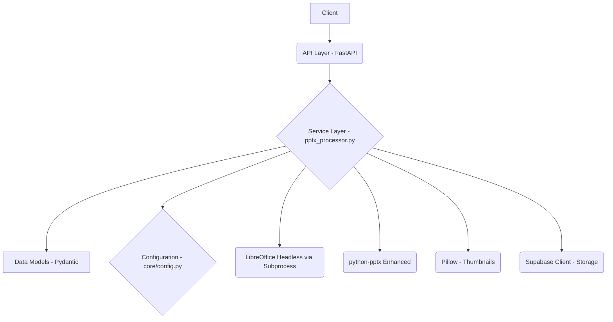
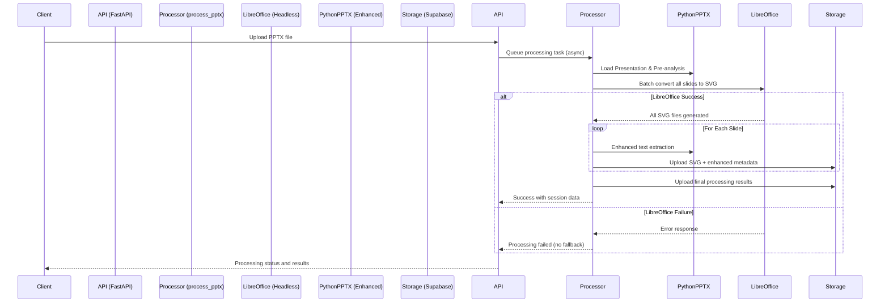

# System Patterns

## Architecture Overview

The PPTX Processor Service follows a simplified, single-path architecture with LibreOffice-only SVG generation:

### Core Components
1. **API Layer (`main.py`, `app/api/routes/`)**: Handles HTTP requests, enqueues processing tasks using FastAPI `BackgroundTasks`.
2. **Service Layer (`app/services/pptx_processor.py`)**: Orchestrates the simplified PPTX processing logic.
   - Uses `app.core.config.settings` for configuration (LibreOffice path, environment variables)
   - Calls `_generate_svgs_for_all_slides_libreoffice` for batch SVG conversion
   - Calls enhanced `process_slide` for each slide with optimized text extraction
3. **SVG Generation (LibreOffice Only)**:
   - **Primary and Only (`_generate_svgs_for_all_slides_libreoffice`)**: Uses LibreOffice (`soffice`) via `subprocess` to convert the entire PPTX to SVGs in one batch operation
   - **No Fallbacks**: Eliminated ElementTree and CairoSVG complexity
4. **Enhanced Text Extraction (`extract_shapes_enhanced`)**: Uses `python-pptx` with translation-optimized enhancements:
   - Precise coordinate calculations for frontend overlay positioning
   - Translation-optimized metadata structure
   - Text segmentation for better translation units
   - Cross-validation with LibreOffice SVG output
5. **Thumbnail Generation (`create_thumbnail_from_slide_pil`)**: Uses Pillow with enhanced slide data
6. **Data Models (`app/models/schemas.py`)**: Pydantic models optimized for translation workflows
7. **Storage (`app/services/supabase_service.py`)**: Handles uploading processed assets to Supabase

### Simplified Processing Pipeline

## Key Design Patterns

### Single-Path Processing (Simplified)
- **LibreOffice Only**: No fallback complexity, single reliable path for SVG generation
- **Fail Fast**: If LibreOffice fails, processing fails gracefully without attempting fallbacks
- **Enhanced Error Handling**: Comprehensive logging and error reporting for troubleshooting

### Translation-Optimized Text Extraction
- **Enhanced Coordinate Precision**: Improved coordinate calculations for accurate frontend overlay
- **Translation Metadata**: Structured data optimized for translation workflows
- **Text Segmentation**: Better text unit organization for translation services
- **Cross-Validation**: Ensure extracted coordinates match LibreOffice SVG output

### Docker-First Development
- **Containerized Environment**: LibreOffice pre-installed and configured for headless operation
- **Consistent Deployment**: Same environment from development to production
- **Linux Optimization**: Leveraging Linux-based LibreOffice for better reliability

### Configuration-Driven Behavior
- **LibreOffice Configuration**: Optimized command-line arguments for best SVG output
- **Environment Variables**: All configuration via environment variables for containerization
- **Performance Tuning**: Configurable timeouts and resource limits

### Frontend Integration Optimization
- **Slidecanvas Compatibility**: API responses designed specifically for frontend slidecanvas component
- **Translation Focus**: All metadata structured for optimal translation experience
- **Coordinate System**: Consistent coordinate system between LibreOffice SVG and extracted text

## Removed Patterns (Simplified Architecture)

### Eliminated Complexity
- **Hybrid Conversion**: Removed ElementTree fallback approach
- **Multiple SVG Sources**: Single LibreOffice path eliminates source confusion
- **Fallback Error Handling**: Simplified error handling without fallback attempts
- **Complex Dependencies**: Removed CairoSVG, Celery, Redis complexity

### Deprecated Functions
- `create_svg_from_slide()` - ElementTree-based fallback generation
- `create_minimal_svg()` - Placeholder SVG creation
- Complex error recovery with multiple generation attempts

## Error Handling Strategy
- **LibreOffice Focus**: Comprehensive error handling specifically for LibreOffice issues
- **Fail Fast**: If LibreOffice cannot generate SVGs, processing fails immediately
- **Detailed Logging**: Extensive logging for troubleshooting LibreOffice configuration issues
- **Graceful Failure**: Clean error responses without attempting unreliable fallbacks

## Enhanced Processing Features

### Text Extraction Improvements
- **Precise Coordinates**: Enhanced coordinate calculation for pixel-perfect overlay positioning
- **Font Information**: Detailed font family, size, and styling extraction
- **Text Boundaries**: Accurate text bounding box calculations
- **Translation Units**: Intelligent text segmentation for optimal translation workflows

### LibreOffice Optimization
- **Batch Processing**: Single command for all slides improves performance
- **Headless Configuration**: Optimized for containerized, headless operation
- **Output Quality**: Command-line arguments tuned for best SVG quality
- **Error Detection**: Comprehensive validation of LibreOffice output

## Integration Patterns

### Frontend Slidecanvas Integration
- **Coordinate Compatibility**: Ensure text coordinates work perfectly with SVG backgrounds
- **Metadata Structure**: Response format optimized for slidecanvas component needs
- **Translation Workflow**: Data structure supports efficient translation interface
- **Real-time Updates**: API designed for responsive frontend integration

### Docker Deployment
- **LibreOffice Pre-installation**: Container includes properly configured LibreOffice
- **Environment Variables**: All configuration via environment for easy deployment
- **Resource Management**: Proper resource limits and timeout configurations
- **Health Checks**: Container health validation including LibreOffice availability

## Future Extensibility
- **LibreOffice Versions**: Easy LibreOffice version upgrades in containerized environment
- **Text Extraction Enhancement**: Additional metadata fields can be easily added
- **Performance Optimization**: Parallel processing opportunities within single-path approach
- **Translation Integration**: Direct integration with translation services if needed 