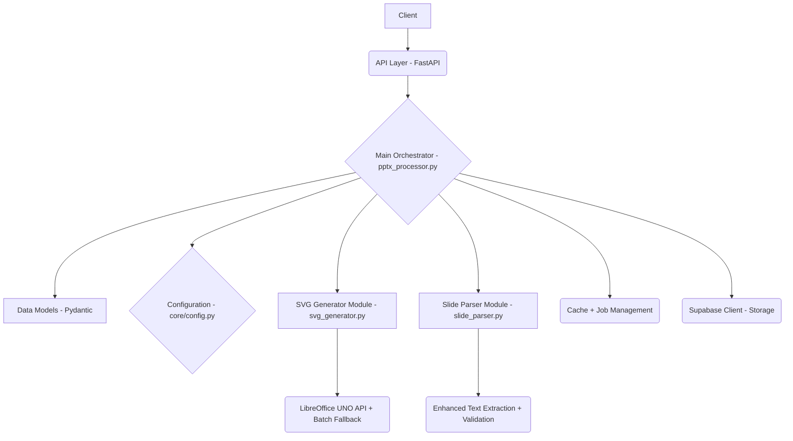
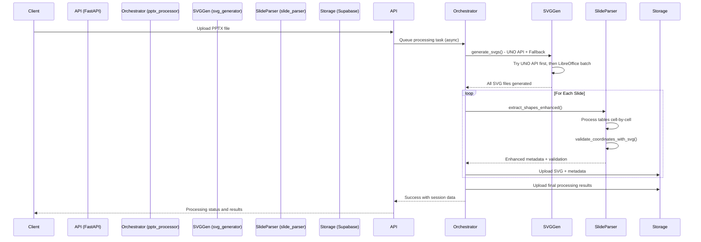

# System Patterns

## Architecture Overview

The PPTX Processor Service follows a modular, single-path architecture with LibreOffice-only SVG generation, now organized into focused, maintainable modules:



### Modular Architecture (Refactored)

The service has been refactored from a monolithic 600+ line file into three focused modules:

#### 1. **Main Orchestrator (`pptx_processor.py`)** - 546 lines
- **Responsibility**: High-level workflow coordination and job management
- **Functions**: `process_pptx()`, `process_slide_simplified()`, `queue_pptx_processing()`
- **Features**: Cache management, status tracking, error coordination
- **Integration**: Imports and coordinates between SVG generator and slide parser modules

#### 2. **SVG Generator Module (`svg_generator.py`)** - 253 lines
- **Responsibility**: All SVG generation using LibreOffice and UNO API
- **Functions**: 
  - `generate_svgs()` - Main entry point with dual strategy
  - `generate_svgs_via_uno_api()` - UNO API with retry mechanisms
  - `generate_svgs_via_libreoffice_batch()` - Batch conversion fallback
  - `validate_libreoffice_availability()` - System validation
- **Features**: Async retry decorator, comprehensive error handling, timeout management

#### 3. **Slide Parser Module (`slide_parser.py`)** - 423 lines
- **Responsibility**: Shape extraction, text processing, and coordinate validation
- **Functions**:
  - `extract_shapes_enhanced()` - Shape and table extraction with translation optimization
  - `validate_coordinates_with_svg()` - Complete coordinate validation pipeline
  - `create_thumbnail_from_slide_enhanced()` - Thumbnail generation
  - Helper functions for SVG analysis and text matching
- **Features**: Table cell extraction, fuzzy text matching, coordinate transformation

### Core Components (Modular)
1. **API Layer (`main.py`, `app/api/routes/`)**: Handles HTTP requests, enqueues processing tasks using FastAPI `BackgroundTasks`.
2. **Main Orchestrator (`pptx_processor.py`)**: Coordinates the processing workflow:
   - Uses `app.core.config.settings` for configuration
   - Delegates SVG generation to `svg_generator` module
   - Delegates shape extraction to `slide_parser` module
   - Manages caching, job status, and cleanup
3. **SVG Generation Module (`svg_generator.py`)**: Handles all SVG creation:
   - **Primary Strategy**: UNO API for individual slide processing with retry mechanisms
   - **Fallback Strategy**: LibreOffice batch conversion for reliability
   - **No ElementTree**: Removed complex fallback approaches
4. **Slide Parser Module (`slide_parser.py`)**: Handles all text and shape processing:
   - **Table Handling**: Identifies table shapes and iterates through each cell, creating a separate `SlideShape` for each cell
   - **Coordinate Validation**: Complete SVG text matching with fuzzy logic
   - **Enhanced Metadata**: Translation-optimized data structure
   - **Thumbnail Generation**: Uses Pillow with enhanced slide data
5. **Data Models (`app/models/schemas.py`)**: Pydantic models optimized for translation workflows
6. **Storage (`app/services/supabase_service.py`)**: Handles uploading processed assets to Supabase

### Modular Processing Pipeline



## Key Design Patterns

### Modular Separation of Concerns
- **SVG Generation**: Isolated in dedicated module with dual strategy implementation
- **Text Processing**: Dedicated module for shape extraction and validation
- **Orchestration**: Main processor focuses on workflow coordination
- **Clear Interfaces**: Well-defined function signatures between modules
- **Enhanced Maintainability**: Each module can be developed and tested independently

### Dual Strategy SVG Generation (Enhanced)
- **Primary (UNO API)**: Individual slide processing via UNO API with async retry decorator
- **Fallback (LibreOffice Batch)**: Batch conversion for reliability when UNO API fails
- **No Complex Fallbacks**: Removed ElementTree and other unreliable methods
- **Resilient Connections**: Implemented `async_retry` mechanism for `unoserver` connections

### Translation-Optimized Text Extraction (Enhanced)
- **Cell-Level Granularity for Tables**: Treats each table cell as an independent, translatable shape
- **Fuzzy Text Matching**: Advanced text matching with confidence scoring for coordinate validation
- **Enhanced Coordinate Precision**: Complete coordinate validation against SVG output
- **Translation Metadata**: Structured data optimized for translation workflows

### Error Handling Strategy (Modular)
- **Module-Specific Handling**: Each module has appropriate error handling for its domain
- **Retry Mechanisms**: Async retry decorator for transient UNO API failures
- **Graceful Degradation**: Fallback between SVG generation strategies
- **Comprehensive Logging**: Structured JSON logging with contextual data

### Docker-First Development
- **Containerized Environment**: LibreOffice pre-installed and configured for headless operation
- **Consistent Deployment**: Same environment from development to production
- **Linux Optimization**: Leveraging Linux-based LibreOffice for better reliability

### Configuration-Driven Behavior
- **LibreOffice Configuration**: Optimized command-line arguments for best SVG output
- **Environment Variables**: All configuration via environment variables for containerization
- **Performance Tuning**: Configurable timeouts and resource limits

### Frontend Integration Optimization
- **Slidecanvas Compatibility**: API responses designed specifically for frontend slidecanvas component
- **Translation Focus**: All metadata structured for optimal translation experience
- **Coordinate System**: Consistent coordinate system between LibreOffice SVG and extracted text

## Removed Patterns (Simplified Architecture)

### Eliminated Complexity
- **Hybrid Conversion**: Removed ElementTree fallback approach
- **Multiple SVG Sources**: Single LibreOffice path eliminates source confusion
- **Monolithic Code**: Broke down 600+ line file into focused modules
- **Complex Dependencies**: Removed CairoSVG, Celery, Redis complexity

### Deprecated Functions
- `create_svg_from_slide()` - ElementTree-based fallback generation
- `create_minimal_svg()` - Placeholder SVG creation
- Complex error recovery with multiple generation attempts

## Enhanced Processing Features

### Modular Text Extraction
- **Dedicated Module**: All text processing isolated in `slide_parser.py`
- **Table Cell Processing**: Granular extraction for translation
- **Coordinate Validation**: Complete SVG text matching pipeline
- **Fuzzy Matching**: Advanced text matching with confidence scoring

### Modular SVG Generation
- **Dedicated Module**: All SVG generation isolated in `svg_generator.py`
- **Dual Strategy**: UNO API primary with LibreOffice batch fallback
- **Retry Mechanisms**: Async retry for UNO API connections
- **Timeout Handling**: Proper timeout management for long-running operations

### Enhanced Reliability
- **Module Isolation**: Failures in one module don't affect others
- **Clear Error Boundaries**: Each module handles its own error scenarios
- **Testability**: Isolated modules enable comprehensive unit testing
- **Maintainability**: Smaller, focused files easier to understand and modify

## Integration Patterns

### Module Integration
- **Clean Imports**: Well-defined interfaces between modules
- **Function Delegation**: Main orchestrator delegates to appropriate modules
- **Error Propagation**: Proper error handling across module boundaries
- **Async Coordination**: Proper async/await patterns across modules

### Frontend Slidecanvas Integration
- **Coordinate Compatibility**: Ensure text coordinates work perfectly with SVG backgrounds
- **Metadata Structure**: Response format optimized for slidecanvas component needs
- **Translation Workflow**: Data structure supports efficient translation interface
- **Real-time Updates**: API designed for responsive frontend integration

### Docker Deployment
- **LibreOffice Pre-installation**: Container includes properly configured LibreOffice
- **Environment Variables**: All configuration via environment for easy deployment
- **Resource Management**: Proper resource limits and timeout configurations
- **Health Checks**: Container health validation including LibreOffice availability

## Code Quality Patterns

### Module Organization
```
app/services/
├── pptx_processor.py    (546 lines - Orchestration)
├── svg_generator.py     (253 lines - SVG Generation)
└── slide_parser.py      (423 lines - Text Processing)
```

### Function Distribution
- **SVG Generator**: 5 focused functions for SVG generation and validation
- **Slide Parser**: 8 functions for extraction, validation, and thumbnail generation  
- **Main Processor**: 4 main functions for orchestration and workflow management

### Testing Strategy
- **Unit Tests**: Each module can be tested independently
- **Integration Tests**: Test interaction between modules
- **Mock Support**: Modules can be mocked for isolated testing
- **Coverage**: Easier to achieve comprehensive test coverage

## Future Extensibility
- **Module Enhancement**: Each module can be enhanced independently
- **Performance Optimization**: Parallel processing opportunities within modular approach
- **Feature Addition**: New capabilities can be added as separate modules
- **Translation Integration**: Direct integration with translation services via dedicated modules

The modular architecture provides a solid foundation for maintainable, testable, and extensible PPTX processing capabilities. 