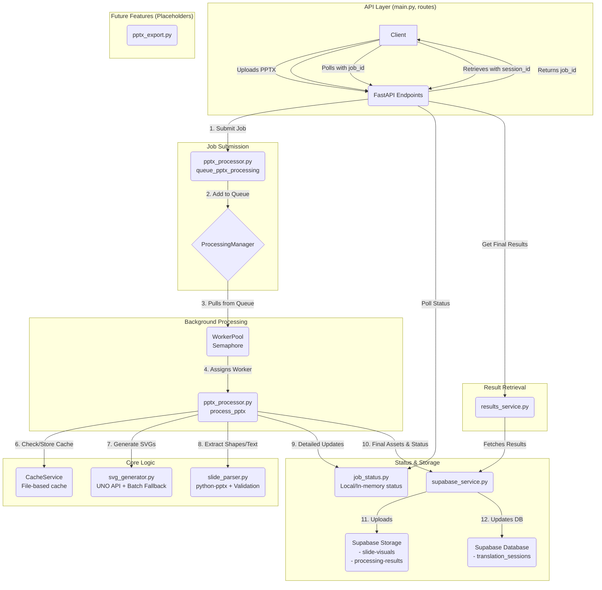
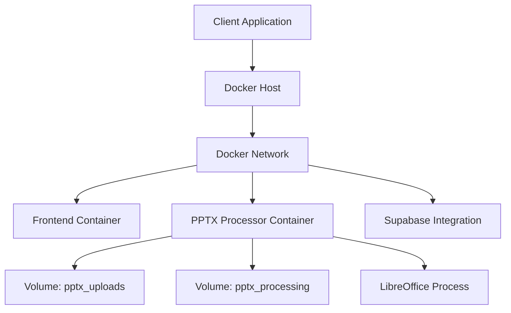

# System Patterns

## Architecture Overview (Updated)

The PPTX Processor Service follows a sophisticated, event-driven architecture designed for robust, concurrent processing. It leverages a worker pool, a job queue, caching, and a dual-channel status system to manage tasks efficiently. The monolithic service has been broken down into multiple, single-responsibility services.



### Core Components
1.  **API Layer (`main.py`, `app/api/routes/`)**: Handles HTTP requests. The `/process` endpoint accepts a PPTX file and initiates processing by calling `queue_pptx_processing`, returning a `job_id` to the client.

2.  **Processing Manager (`processing_manager.py`)**: A singleton service that manages an `asyncio.Queue` of processing jobs. It receives jobs from the API layer and dispatches them to the worker pool.

3.  **Worker Pool (`worker_pool.py`)**: Manages concurrency using an `asyncio.Semaphore`. It ensures that no more than `MAX_CONCURRENT_JOBS` are running at once.

4.  **Main Orchestrator (`pptx_processor.py`)**: Contains the core business logic.
    *   `queue_pptx_processing`: Submits a job to the `ProcessingManager`.
    *   `process_pptx`: The main function executed by a worker. It coordinates the entire workflow for a single PPTX file.

5.  **Cache Service (`cache_service.py`)**: A file-based caching layer. Before processing, the orchestrator checks this service for a cached result. If a PPTX with the same content and parameters has been processed before, the cached result is returned, saving significant processing time.

6.  **SVG Generator (`svg_generator.py`)**: Handles all SVG creation using a dual strategy for robustness:
    *   **Primary Strategy**: Uses the LibreOffice UNO API for fine-grained, individual slide conversion.
    *   **Fallback Strategy**: Uses a command-line batch conversion process if the UNO API fails.

7.  **Slide Parser (`slide_parser.py`)**: Responsible for all shape and text extraction from the PPTX file using `python-pptx`. It also validates the extracted text coordinates against the generated SVGs for accuracy.

8.  **Job Status Service (`job_status.py`)**: A local, in-memory status tracker with a file-based backup. It provides detailed, real-time progress updates (e.g., "Processing slide 5 of 20") and is used by the client to poll the status of a job.

9.  **Supabase Service (`supabase_service.py`)**: Manages all interaction with Supabase.
    *   **Storage**: Uploads final assets (SVGs, thumbnails, result JSONs) to Supabase Storage.
    *   **Database**: Updates the high-level status of the job (e.g., "completed", "failed") in the main `translation_sessions` table and stores all the final slide and shape data.

10. **Results Service (`results_service.py`)**: Handles retrieval of the final processing results. It first attempts to download a complete result JSON from Supabase storage. If that's not available, it reconstructs the result by querying all the necessary data from the database tables.

11. **PPTX Export Service (`pptx_export.py`)**: A **placeholder** service for a future feature that will generate a new PPTX file from translated text. This is not part of the main processing pipeline and is not implemented.

## Key Design Patterns

### Asynchronous Processing with Worker Pool
The system is designed to handle multiple requests concurrently without blocking. When a request comes in, it's quickly added to a queue and a `job_id` is returned. The `ProcessingManager` and `WorkerPool` handle the background execution, allowing the API to remain responsive.

### Dual-Channel Status Tracking
Two separate services are used for status updates to serve different needs:
- **Local/Real-time (`job_status.py`)**: For clients who need to poll for detailed, up-to-the-second progress information. This data is considered transient.
- **Persistent/High-Level (`supabase_service.py`)**: For storing the final, permanent outcome of a job in the main database. This is the source of truth for the application.

### Cache-Aside Strategy
The `CacheService` implements a cache-aside pattern. The application logic first checks the cache for the result. If it's a miss, it proceeds to fetch/generate the data, and then stores the result in the cache for future requests. This is highly effective for reducing redundant processing.

### Dual Strategy SVG Generation
To maximize reliability, SVG generation uses two methods:
- **Primary (UNO API)**: Preferred for its fine-grained control.
- **Fallback (LibreOffice Batch)**: A more robust, "blunt-force" method used if the primary method fails, ensuring a higher success rate.

### Resilient Result Retrieval
The `ResultsService` also uses a dual strategy. It first tries a fast retrieval by downloading a single JSON file. If that fails, it has a slower, but more robust, fallback of reconstructing the entire result from database records, ensuring data can be retrieved even if parts of the finalization process failed.

### Modular Separation of Concerns
Each service has a single, well-defined responsibility. This makes the system easier to understand, maintain, and test. For example, all Supabase interactions are isolated in `supabase_service.py`, and all caching logic is in `cache_service.py`.

### Configuration-Driven Behavior
Key parameters like the number of concurrent workers (`MAX_CONCURRENT_JOBS`) and cache directory (`CACHE_DIR`) are controlled via environment variables, allowing the application's behavior to be tuned without code changes.

## Removed Patterns (Simplified Architecture)

### Eliminated Complexity
- **Hybrid Conversion**: Removed ElementTree fallback approach
- **Multiple SVG Sources**: Single LibreOffice path eliminates source confusion
- **Monolithic Code**: Broke down 600+ line file into focused modules
- **Complex Dependencies**: Removed CairoSVG, Celery, Redis complexity

### Deprecated Functions
- `create_svg_from_slide()` - ElementTree-based fallback generation
- `create_minimal_svg()` - Placeholder SVG creation
- Complex error recovery with multiple generation attempts

## Enhanced Processing Features

### Modular Text Extraction
- **Dedicated Module**: All text processing isolated in `slide_parser.py`
- **Table Cell Processing**: Granular extraction for translation
- **Coordinate Validation**: Complete SVG text matching pipeline
- **Fuzzy Matching**: Advanced text matching with confidence scoring

### Modular SVG Generation
- **Dedicated Module**: All SVG generation isolated in `svg_generator.py`
- **Dual Strategy**: UNO API primary with LibreOffice batch fallback
- **Retry Mechanisms**: Async retry for UNO API connections
- **Timeout Handling**: Proper timeout management for long-running operations

### Enhanced Reliability
- **Module Isolation**: Failures in one module don't affect others
- **Clear Error Boundaries**: Each module handles its own error scenarios
- **Testability**: Isolated modules enable comprehensive unit testing
- **Maintainability**: Smaller, focused files easier to understand and modify

## Integration Patterns

### Module Integration
- **Clean Imports**: Well-defined interfaces between modules
- **Function Delegation**: Main orchestrator delegates to appropriate modules
- **Error Propagation**: Proper error handling across module boundaries
- **Async Coordination**: Proper async/await patterns across modules

### Frontend Slidecanvas Integration
- **Coordinate Compatibility**: Ensure text coordinates work perfectly with SVG backgrounds
- **Metadata Structure**: Response format optimized for slidecanvas component needs
- **Translation Workflow**: Data structure supports efficient translation interface
- **Real-time Updates**: API designed for responsive frontend integration
- **Client Library**: TypeScript client with comprehensive error handling
- **Status Polling**: Efficient status checking with exponential backoff

### Docker Deployment
- **LibreOffice Pre-installation**: Container includes properly configured LibreOffice
- **Environment Variables**: All configuration via environment variables for easy deployment
- **Resource Management**: Proper resource limits and timeout configurations
- **Health Checks**: Container health validation including LibreOffice availability
- **Multi-Stage Build**: Efficient build process with separated build and runtime environments
- **Security Best Practices**: Non-root user, minimized dependencies, proper permissions
- **Volume Management**: Persistent volumes with clear naming and organization

## Code Quality Patterns

### Module Organization
```
app/services/
├── pptx_processor.py    (546 lines - Orchestration)
├── svg_generator.py     (253 lines - SVG Generation)
└── slide_parser.py      (423 lines - Text Processing)
```

### Function Distribution
- **SVG Generator**: 5 focused functions for SVG generation and validation
- **Slide Parser**: 8 functions for extraction, validation, and thumbnail generation  
- **Main Processor**: 4 main functions for orchestration and workflow management

### Testing Framework
- **Pytest**: The core testing framework for all unit and integration tests.
- **Centralized Fixtures (`conftest.py`)**:
    - `test_settings`: A session-scoped fixture providing a consistent `Settings` object for all tests, ensuring test isolation and predictable configuration.
    - `app`: A session-scoped fixture that creates a FastAPI application instance for the entire test session, with settings overridden by `test_settings`.
    - `test_client`: A module-scoped `TestClient` instance for making requests to the application in tests, with the `ProcessingManager` automatically mocked to prevent background jobs from running.
- **Mocking Strategy**:
    - `mock_supabase_client` and `mock_supabase_service`: Fixtures to provide mock implementations of the Supabase client and services, preventing real API calls during tests.
    - `unittest.mock.patch`: Used extensively to mock specific functions and services at the test level, such as `psutil` for system health checks and `os.access` for storage checks.
- **Test Isolation**:
    - `tmp_path`: Pytest's built-in fixture is used in integration tests (`test_pptx_processing_logic.py`) to create temporary directories for file operations, ensuring that tests do not interfere with each other or leave artifacts on the file system.

### Deployment Architecture


## Future Extensibility
- **Module Enhancement**: Each module can be enhanced independently
- **Performance Optimization**: Parallel processing opportunities within modular approach
- **Feature Addition**: New capabilities can be added as separate modules
- **Translation Integration**: Direct integration with translation services via dedicated modules
- **Horizontal Scaling**: Multiple service instances behind load balancer
- **Advanced Monitoring**: Integration with Prometheus and Grafana
- **Translation Memory**: Add translation memory capabilities for efficiency

The modular architecture provides a solid foundation for maintainable, testable, and extensible PPTX processing capabilities with production-ready deployment configurations. 